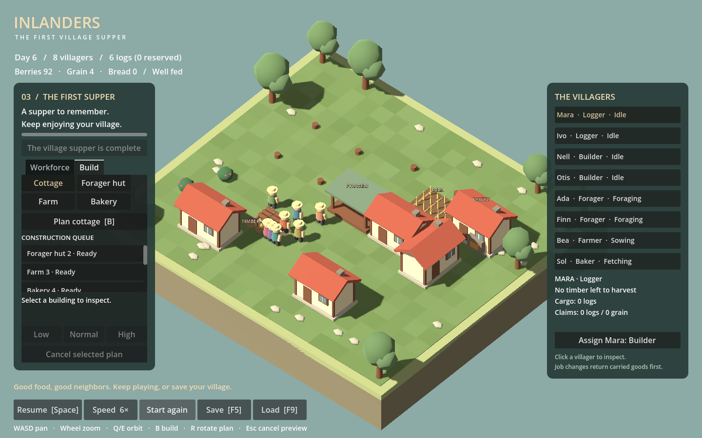

# Inlanders

A personal Windows town-building game inspired by Outlanders, built with **Godot 4.6 and C# / .NET 8**. Visuals and sound effects are generated procedurally, with no downloaded art or audio assets.



## Run from a fresh clone

In PowerShell:

```powershell
git clone https://github.com/simonfl/inlanders.git
cd inlanders
powershell -NoProfile -ExecutionPolicy Bypass -File Setup.ps1
.\Play.cmd
```

Setup downloads portable Godot 4.6 and .NET SDK 8.0.424 from their official distributions into `.tools`. It requires network access once. Afterwards, double-click **Play.cmd** to compile and play offline. No global Godot/.NET installation or PATH changes are required. On the original development machine the tools are already installed.

The launcher runs the Godot project directly; this repository does not contain an exported standalone executable. Downloaded tools, generated build files, test artifacts, and player saves are excluded from Git.

## Main menu

Launching opens a quiet, paused village behind the title screen:

- **Continue** restores the last settlement saved or opened, including Campaign, Free play, or Creative on either map. It opens paused. On older installations without a Continue snapshot, the newest existing settlement/campaign save is used.
- **Campaign** starts, resumes, or replays any available level and shows completed levels. Replay retains the preceding village, recoverable from Goals.
- **Free play** starts or resumes either map. Starting anew retains a separate previous-village copy, accessible through **Restore previous**; ordinary saving does not overwrite that copy.
- **Creative** starts or resumes either map with instant free buildings, no hunger, and all decorations unlocked. Production and hauling still use real resources. Select a finished building to remove it; stored goods return to the yard and villagers keep their cargo. Bridges cannot be removed if that would disconnect people or resources. Clearing trees is immediate and recovers existing timber. Newcomers need beds but no food reserve.
- **Settings** controls Effects, Nature, Music, music-only mute, and master mute; these are shared with in-game sound settings.
- **Quit** exits the game.

In game, use **Options → Return to main menu**. This saves the current settlement and updates `saves/continue.json` before returning; a failed save keeps the village open. F5 also updates Continue. Closing the window also saves the current session and Continue; a failed save keeps the window open. Free-play previous-village copies use `.before-new`; restoring one also keeps the replaced save as `.before-restore`.

Creative saves are separate in `saves/creative.json` and `saves/creative-three-clearings.json`, with the same previous-village recovery as Free play. F5/F9 and Options map switching preserve the mode. There is no supper objective or visitor trade in Creative; the Goals panel explains its rules. Housing and square breaks still affect happiness, while food needs receive a neutral full allowance.

## Campaign: five introductions and five working settlements

Choose **Campaign** on the title screen or **Goals [G]** in game. All buildings and tools remain available.

1. **A place to stay:** build a forager hut, deliver 24 fresh berries, and house eight villagers.
2. **Bread for the table:** add a farm and bakery; deliver 16 loaves. Meals do not erase progress.
3. **Room among the trees:** build a sawmill and lodge, house eight, and have loggers plant four trees. Marking spots alone does not count; maturity is not required.
4. **A place for everyone:** homes, farm, and bakery are already built and staffed. Add a village square, stock two loaves per person, then host supper from Goals.
5. **More for the table:** start with homes, a forager hut, 48 berries, and a farmer. Build a vegetable garden, deliver 16 vegetables, and serve two full meals with at least a quarter vegetable portions and a quarter other-food portions. Progress stays recorded; the gardener visit is optional.

6. **Across the river:** begin with eight housed residents. Choose a crossing and grow in two player-triggered stages: twelve residents with four east-bank beds, then sixteen with eight east-bank beds and an east-bank square. House everyone, including extra arrivals. For the final stage, at least half the village must have completed an east-bank square visit within the last two minutes.

Use **People** to invite pairs and **Goals** to start each assessment. Assessments use up to the last three minutes since they began: every current resident needs at least two closed meal requests, with no missed or skipped requests. At least a quarter of food actually eaten must be outside the dominant food, and fresh producer deliveries must cover eating and assessed demand. Food can come from either bank. Service recovers as the rolling window improves; the completed first proof stays recorded until you choose to expand. New arrivals restart an active assessment. Extra residents increase actual food, housing and recreation requirements. The [scenario notes](docs/ACROSS_THE_RIVER.md) explain the design and remaining playtest questions.

7. **Life by the lake:** the home shore has little spare land, two nearby timber trees, one berry patch and slowly replenishing fishing grounds. Choose where production and recreation belong; more space and timber lie around the lake. Deliver four fish, then use Goals to prepare expansion to twelve. House everyone; three quarters need recent home rest (four minutes, or five after an improved-home visit), and half need a recreation visit within two minutes. Start assessment when ready: demonstrate the same closed-request, mixed-diet and fresh-supply evidence as the river, while maintaining those living standards. Food can come from any mix of producers. Missed conditions show the supply shortfall and suggest improvements; nearby services can reduce travel. See [the difficulty review](docs/LAKE_DIFFICULTY_F11B2.md), or run `./Play.ps1 -LakeReviewSmokeTest` for a completed-village render check.

8. **Built to last:** build and support a gathering hall. Nearby stone supplies 8 of the required 12; use both outcrops for shorter hauling, or start at the distant one to save a camp. Build a sawmill and assign a sawyer and quarrier while keeping food work staffed. Once the hall is complete, start its assessment from Goals. House everyone, maintain recent hall visits for half the population (four-minute window), and keep closed meal requests reliable with fresh deliveries covering demand. Mixed diet and newcomers are optional. A closer square or garden can draw visitors away from the hall. Run `./Play.ps1 -QuarryCampaignSmokeTest` for both routes, recovery and rendered controls. The hall has a civic front gable, stone piers and roof lantern; `./Play.ps1 -HallArtSmokeTest` checks construction stages and actual visitors in all four orientations.

9. **The living woods:** bring four game to food storage, then prepare twelve housed residents. Keep at least four mature trees and two unclaimed game in each wood. Preserve both woods and harvest farther away, or selectively clear and invest in cultivation. Start the food assessment from Goals; actual meal requests and fresh deliveries count from that point, with no compulsory diet mix. If stock falls, pause hunting while other producers feed the village. If trees are lost, collect timber, clear roots, plant replacements and **preserve the planting orders** so loggers do not harvest them again. Saplings mature three in-game minutes after planting. Goals links directly to each wood and recovery tools. Run `./Play.ps1 -WoodsCampaignSmokeTest`; see [the implementation review](docs/WOODS_CAMPAIGN_REVIEW.md) for route evidence and pacing limits.

10. **A lasting village:** cross the channel and decide how to use scarce central land. Prepare twelve housed residents and assess food from Goals; then expand to twenty and assess meals, home rest and recreation. Both milestones stay earned while you prepare a shared supper with two unreserved central loaves per current resident. Meals keep eating bread; Goals → Inspect bread supply explains reserves and links production/storage controls. Extra residents increase service requirements during assessment and housing/supper requirements afterward. See [the finale review](docs/FINAL_CAMPAIGN_F11B6.md); run `./Play.ps1 -FinaleCampaignSmokeTest`.

The square costs six logs and needs no staff. Ordinary breaks use reachable ground within two tiles of the entrance; supper needs one reachable tile per villager within four tiles. Keep the frontage open; the table is a serving place, not assigned seating. Contextual hints can be dismissed, disabled, or reopened. Finishing a settlement lets you keep playing, continue, or replay; replay retains the previous village for restoration.

Docks and bridges have supported timber decks and open access. The striped canopy, side net and rope are decorative equipment; actual catches remain aboard or carried by fishers. `./Play.ps1 -ShoreArtSmokeTest` checks rotated construction, fishing/return, recovery and a required river crossing.

**Fishing:** Build an eight-log dock on dry shoreline, with an open water launch and a dry entrance opposite it. R turns the dock. Assign a Fisher in People. Each dock supports one boat; fishers prefer a full catch of up to four fish, then the closest reachable ground. Grounds share replenishing stocks. Catches count as food only after the boat returns and the fisher carries them to the pantry. Placement and the dock inspector show supply/access; pause recalls the boat before reassignment or demolition. Crossings cannot strand an active trip. Fish join normal meals and variety; three balanced foods still earn full variety credit. See [fishery measurements and campaign limits](docs/FISHERY_F26A.md). Run `./Play.ps1 -FishingSmokeTest` for the focused rendered check.

Save compatibility is not guaranteed during prototyping; use a fresh campaign for this revised sequence. If an old campaign cannot load, the Campaign menu offers **Start fresh campaign**.

Campaign saves live in `saves/campaign.json`, with a `.bak` of the previous write. Switching settlements, replaying, completing a level, and F5 save campaign progress; F9 restores the latest campaign save while in campaign mode. Use Continue or Campaign on the title screen to resume, paused. Closing the window saves current progress too. Periodic autosaves are separate from this F9 checkpoint. This is separate from the standalone manual save.

## A larger map: Three clearings

Open **Options [O] → Explore larger map** to start or resume a separate 32×32 landscape with an irregular outline, open building areas, 20 harvestable trees, and six berry patches. Eight villagers arrive with 64 berries. All buildings are available; the existing supper objective can give you a goal while you explore.

**Home** frames the whole map. WASD pans across its full extent, and the wheel zooms between building detail and a wide overview. Land ends at the visible stepped edge: missing cells cannot be built on, planted, or crossed. Tree/stump clearing is available; decorative landscaping is available; new Three clearings maps have two raised meadows. Buildings, fields and squares require level ground across their full footprint and entrance. Gentle slopes remain walkable and support paths, planting, and decorations; there is no uphill speed penalty. Riverbanks stay flat. Start a new map in Free play or Creative to use the authored hills.

F5/F9 use `saves/three-clearings.json` on this map. Entering it saves the village you leave; **Return to original map** in Options saves the larger village and restores the original standalone save. Campaign levels remain available through Goals. To resume the large map after relaunching, use Continue or Free play on the title screen. Existing saves retain their original terrain rather than expanding automatically.

### Water and bridges

New **Three clearings** maps include a narrow stream with visible banks. Start a new Three clearings village from Free play to see it; saved maps retain their terrain. The original clearing and five introductory campaign maps remain dry; Across the river has its own crossing.

Choose **Build → Place → Bridge**, point at a water tile, and use **R** to span the stream. Both ends need clear, level dry banks. The entrance marker shows where builders will work; they haul six logs there and finish construction before anyone can cross. Bridges shorten trips to the eastern grove. Ordinary buildings, planting, and paths require dry land.

You can cancel unfinished bridges; delivered logs become recoverable salvage on land. Completed bridges remain in place in normal play; Creative can remove them when access remains safe. Water and bridges are included in saves.

## Everyday meals and neighborhood pantries

Residents request one portion per minute at staggered times. They finish their current task, collect reserved food, carry it to a nearby seat, and eat. A request has a one-minute deadline; late eating restores nourishment but does not erase missed service. Inspect a resident's **Meals** explanation and **Show meal supply** link when food is stored but someone is missing meals. Long work, home or recreation trips can be the problem.

An optional **Neighborhood pantry** costs six logs and stores 24 edible portions. Producers can deliver directly without a hauler. Existing haulers replenish its target or return unreserved surplus to central storage; target zero drains through hauling while direct deposits and meals continue. Local food helps separated neighborhoods, but a compact village can use central storage well. Grain remains central. **Economy** lists food locations, claims, incoming deliveries and actual eating. Transfers are not fresh production.

Supper needs unreserved bread at central storage. If bread accumulates locally, lower that pantry's target and assign a hauler. Food promised to ordinary meals is already reserved. Newcomer reserve checks include all stored edible food, but enough stock does not guarantee short service trips.

## The first village supper

Eight villagers arrive with 24 berries. The objective is to **house everyone and stock two loaves per person** (16 for the starting eight), then click **Host supper** to gather everyone. The game continues after the celebration.

1. Open **Build** (button or **B**), select a **Forager hut**, then click a clear site. Start this early to replenish the initial food supply.
2. Build a **Farm** and a **Bakery**. A farmer sows grain, waits for it to ripen, harvests it, and hauls it to the pantry. A baker collects grain, bakes it, and carries bread back.
3. Build four **Cottages**, each housing two villagers. Cottages cost six logs; production costs vary in the Build catalog; the six initial harvestable alders provide 48 logs. Plant more alders when you want to expand. A **Lodge** is an alternative with four beds, costing twelve planks from a sawmill.
4. When everyone has shelter and two unreserved loaves per person are in central storage, open **Goals** and host the supper. Villagers return carried goods, gather, and celebrate before resuming their jobs. The Goals button shows **Ready** when you qualify.

The initial workforce is two loggers, two builders, two foragers, one farmer, and one baker. Change allocations with **+ / −** in **People** (button or **V**). Minus unassigns a worker. Plus uses an unassigned worker first, then transfers someone from another job. Select a villager on the map or in People to inspect their task, waiting reason, and cargo; choose any role in the inspector's job picker and press Assign. **Follow villager** tracks them until you pan, press Home, or clear selection. **Inspect workplace** opens their current work site.

Production inspectors show active workers, links to inspect them, and +/− Role controls. The + tooltip names the worker and current role that will be transferred. Staffing adjusts the village-wide job pool; workers are not permanently assigned to one building. Inspectors scroll to fit smaller windows.

### Vegetable gardens

Build a **Vegetable garden** for **4 logs** and assign a **Farmer**. One farmer can work each garden at a time; farmers share gardens and grain farms, taking ripe harvests before planting another crop.

Planting takes four work seconds. The garden then grows **8 vegetables in 60 simulation seconds**, with visible leaves and squash. Farmers harvest two at a time and carry baskets to the pantry; beds clear as the harvest progresses. Gardens replant automatically.

Vegetables are eaten directly, with no bakery. Meals share available berries, vegetables and bread as evenly as supply allows. Stored vegetables count toward food coverage and newcomer invitations; ripe crops and carried baskets count only after delivery. The top bar shows **VEG**, and Economy lists vegetables separately from grain.

This offers a simpler food source with fewer buildings and jobs; grain plus baking yields more food per crop. Supper still requires bread. Gardens are available in every campaign level, but existing campaign objectives remain unchanged. Growth, remaining harvest, and carrying workers persist in saves.

### Finding villagers, buildings, and supplies

**People [V]** shows each villager's name and role. Filter the roster to a role, Unassigned, or Idle; the count shows how many match. Newcomer invitations sit above the roster.

At the top of People, expand **Rest / recreation** to see who lacks recent completed visits. Filter for rest, recreation, either, or everyone; follow resident, home and current/last venue links to investigate. Counts come from actual visits. A square gives two minutes of recreation benefit, a hall four; new residents may simply be waiting for their first outing. The resident inspector also links to their recreation venue.

**Build [B]** has three sections. **Place** shows model thumbnails, purpose, material cost and staffing; choose a card to start a preview. **Landscape** contains planting, clearing, paths and decorations. **Existing** lists your buildings, with construction/completed filters and live status; select a row to inspect. Place and Existing share the Homes, Food, Industry, Storage & crossings, and Community categories. Selected-tool guidance and Cancel stay below the scrolling list; hover over the guidance for full details.

In **Economy [I]**, select a log storage location to move the camera there. Stockpile links also open its inspector so you can change the target or staffing. The timber-yard link centers the camera and clears the previous selection.

Filters only affect the view; they do not pause jobs, change assignments, or enter saves. Switching or loading a settlement resets them. Choose All villagers / All buildings / All sites to show everything again.

### Local log stockpiles

Timber-yard racks summarize reserves (up to 24 visible logs and 18 planks); use the HUD and Economy for exact quantities. Local stockpiles display their full 12-unit capacity.

Loose timber and salvage show up to 12 pieces. Larger piles have an exact quantity label, which follows the World labels preference. Loggers still collect every unit; clearing an exhausted stump works normally. Run `./Play.ps1 -LooseStockSmokeTest` for large-source collection and rendering checks.

Build a **Stockpile** for **4 logs** near timber production and construction. Each holds **12 logs or 12 planks**, one material at a time, and starts with a target of **6**. Choose its material in the inspector, including while it is under construction. Local logger/sawyer deposits and builder pickups need **no hauler**. Assign an optional **Hauler** to redistribute stocks. Use **− 2 target / + 2 target** to change the target from 0 to 12.

Producers drop timber at nearby matching storage with room. Builders collect near their work site; sawyers collect logs locally. Haulers carry two matching units at a time, refill targets from central storage or another pile's surplus, and return excess. Target **0** drains a stockpile; already committed loads finish. Producers may still deliver, so target zero does not close the pile. To change material, stop incoming production, drain it, and wait for committed trips to finish.

A pile is an investment: a nearby plank pile reduced travel for a remote mill/lodge cluster in the [logistics experiment](docs/LOGISTICS_F07B.md), while an awkward pile added work. Logs and Planks totals include central and local stores. Inspect stored, reserved and incoming counts; **Economy [I]** lists locations. The pile displays its actual logs or planks. Normal demolition evacuates stored goods before dismantling; Creative removal returns them immediately. Edible food can also use neighborhood pantries; grain stays central. Run `./Play.ps1 -PlankStorageSmokeTest` for the rendered check.

### Welcoming newcomers

Open **People [V] → Invite 2 newcomers**. You need two spare completed beds and stored berries/vegetables/bread for two full meals after the pair arrives: **ten beds and 20 food** for your first invitation. Grain and food still being carried or produced do not count. The food stays in storage for meals.

The pair joins near the timber yard, unassigned. Select them in People and choose their jobs. Keep adding housing and food to invite more pairs. Arrivals are optional in the five introductory campaigns and free play; Across the river requires expansion. Every new settlement starts with eight people.

Meals scale with population, as do Economy coverage and supper requirements. Supper needs two loaves and one clear reachable gathering tile per person, with everyone housed. Invitations are unavailable during supper. Save/load preserves newcomers and their work.

### Lighting and atmosphere

**Options → Atmosphere** switches between **soft daylight** and **golden hour**. The warmer evening preset casts longer shadows. Gentle tree-crown movement follows village time and stops when paused; disable it with **Foliage motion** for a still view.

**World labels** hides or shows floating building, yard, visitor and clearing labels. The same toggle is available in Watch mode. Placement entrance guidance remains visible. These visual preferences persist in saves/atmosphere.cfg across villages. They do not affect the simulation or introduce a day/night mechanic.

**Frame sync** is off by default for responsiveness. Enable it in Options if you notice tearing; display synchronization can reduce frame rate on some setups. It takes effect immediately and persists with visual preferences. It does not change village speed. The [F23d profile](docs/RENDERING_F23D.md) records the measured comparison and `./Play.ps1 -RenderIsolationSmokeTest` reproduces the settings and rendering checks.

### Watch the village

Press **H** or choose **Options → Watch village** to hide the HUD. A small bar keeps pause, speed, map framing, world labels, and **Manage** available. Camera movement and villager-follow keep working. Typing a saved-view name suspends camera shortcuts until you leave the text field.

Press **H**, **Esc**, or **Manage** to return. Build/People/Economy/Goals/Options shortcuts also bring management back. Watch mode cancels placement previews; map clicks do not select or build. Your existing selection is retained.

Choose **Clean view [Tab]** or press **Tab** while watching to hide the bar and all floating world labels for screenshots or quiet viewing. Tab restores the bar; H or Esc returns directly to management. Camera movement, follow and Space to pause still work. This temporary view preserves your world-label preference and resets when changing villages. Run `./Play.ps1 -WatchSmokeTest` to check Watch controls and clean view at 960/1440.

Choose **Orbit [J]** for a slow two-minute circle around the current focus. This stops following a resident and works while paused or in clean view, independently of village speed. J stops it; pan, wheel zoom, Q/E, Frame map or recalling a saved view takes over immediately. Returning to management or changing villages also stops the orbit. Watching does not overwrite saved views.

### Economy and shortages

Press **U** or choose **Economy → Survey map resources** to inspect fish grounds, stone outcrops and woodland habitat. Click a marker or choose a source in the inspector to see stock, reservations, recovery and access. Workplace links open related sites; **Back to source** returns to the resource. **U / Esc** finishes surveying. Placement and Watch mode also end it. See the [resource survey review](docs/RESOURCE_SURVEY_F21J.md).

Open **Economy [I]** or click a resource in the top bar. See available, reserved, carried, and workplace inventories, remaining construction demand, and full meals in storage. Food coverage counts only stored berries, vegetables, and bread and assumes no new deliveries.

The Economy badge counts current issues. Click a shortage message to open the relevant build, staffing or resume controls. If edible-food workplaces are paused, a low-food warning opens a workplace instead of asking for more staff. Idle-worker links show the actual waiting reason. Warnings clear as conditions improve; ordinary crop growth and full stock targets can leave workers idle without indicating a problem.

**Recent food flow** shows pantry deliveries by food type and meals eaten/required over the last 180 seconds of village time. Shorter sessions are marked as partial windows; a delivery rate appears after 60 seconds alongside current population demand. Starting stock, growing crops, food still in transit, supper and trades are not counted as ordinary food deliveries/meals. Missed food appears as eaten below required. History survives save/load; past output is not a forecast.

### Directing workplaces

Select a forager hut, farm, garden, bakery or sawmill to see whether it lacks staff/input, is growing, travelling, producing, collecting, paused or at its target. Source buttons move the camera to the pantry, timber yard or berry patch, or inspect a supplying stockpile; worker links show the person doing the work.

**Pause new work** stops new jobs at that building without changing village-wide roles. A job already claimed finishes, including its delivery. Planted crops continue to grow but wait for Resume before harvesting. A paused mill may retain half of a completed batch after its current two-plank delivery; Resume collects the rest. This lets a farmer tend gardens while leaving grain fields paused.

Expand the **resource target** button to set a threshold from 0–200 in steps of four, or choose **No limit**. Each workplace compares its target against village-wide stock and committed production: carried goods, workshop inputs/output, and growing/claimed crops. Target zero stops starting new production; existing crops and batches are still collected. A whole new crop/batch may take the total above its target. Paused crops and output still count, and other workplaces retain their own targets. Food workplaces begin unlimited; new sawmills begin at twelve planks. Use Pause when you want work at a specific site to stop regardless of stock.

### Food and work

- One game day lasts 60 simulation seconds. One food unit per villager is consumed each day, sharing available berries, vegetables and bread as evenly as supply allows. Raw grain is not edible.
- Berry bushes regenerate. A forager hut supports two foragers; each farm and bakery supports one active worker at a time.
- Farms show staked soil, dug beds, and timber edging during construction; forager huts gain posts, rafters, and a green canopy.
- Wheat grows from green shoots to golden ears. Harvested grain leaves matching columns of stubble, making the remaining crop visible.
- A planted crop takes 45 seconds to ripen and yields six grain; farmers carry up to four grain per harvest trip. Two grain bake into four loaves in ten seconds, and the baker delivers the whole batch. Keep the bakery close to the pantry to reduce travel.
- Missed meals reduce movement and work speed, down to 50% when everyone goes hungry. Nobody dies; food production can recover the settlement.
- Food physically travels from source to storage and from storage to production buildings. Goods in transit or still inside a bakery cannot be eaten or used for the supper.

### Construction management

Select a building on the map or in the **Build** menu's building list to open its inspector and change **Low / Normal / High** construction priority. New job claims favor higher priorities, then older plans. Already committed deliveries finish before workers choose another job.

Cancel an unfinished plan to release its claims. Carried timber returns to the yard; delivered timber remains as a salvage pile for loggers to collect. After collection, the site can be reused. Completed buildings cannot be cancelled.

The Build menu explains each building's purpose, staffing, recipes, and available materials. You can place plans before you have enough supplies; builders wait for materials. Translucent building previews turn green on legal spots and red on blocked ones, with a specific explanation below. An arrow marks the entrance; R turns the model, footprint, and entrance through all four sides; Shift+R turns back. Rotate before placing. Docks automatically keep their launch on water; bridges choose a reachable construction bank. Tree planting uses a sapling preview and stays active for repeated planting. Placement protects workers, entrances, and resource access, and recalculates routes around new plans. Border trees are decorative. Villagers can pass through one another.

### Supply routes

Open **Economy → Show supply routes** to see actual worker and boat trips. Gold routes carry goods; blue routes are empty trips to work or collect. Arrows point toward the destination. The list shows loads and remaining distance; select a resident to inspect their task. Routes hide in Watch mode and reset when changing settlements. Food goes to the central pantry; logs/planks can use local stockpiles. Run `./Play.ps1 -RoutesSmokeTest` for the rendered check.

### Woodland wildlife

Fresh Three clearings maps contain two marked habitats. Hunting lodges have timber frames, layered green roofs and side-mounted bows. Mature habitat trees have low leaf cover; representative deer appear only while unclaimed game remains. `./Play.ps1 -WoodsArtSmokeTest` checks all four lodge orientations and habitat recovery views. A six-log **Hunting lodge** supports one Hunter within eight tiles of a reachable habitat. Hunters reserve up to two game, spend ten work seconds hunting, then carry it to the pantry. Game is edible and contributes to the existing meal variety rule; every food type is not required.

Mature trees within five tiles of a habitat marker support its stock: two capacity and half a game per minute per tree, capped at twelve stock and three per minute. Lodges share the supply. Pause hunting to recover stock; preserve or regrow trees to maintain capacity. Clearing previews show the loss before you click. Saplings and ornamental trees do not replace mature habitat; the marked tracking clearing must remain open. See [the wildlife review](docs/WILDLIFE_F26C.md).

### Stone and the gathering hall

Start fresh Three clearings to find two finite stone outcrops. A quarry camp costs 6 logs and supports one quarrier; place it within four tiles of a reachable outcrop. Workers extract and carry stone to central storage. Pause/stock targets conserve the remaining deposit. Local stockpiles still hold logs or planks.

A gathering hall costs 8 planks + 12 stone. It serves eight residents with 12-second visits, four minutes of recreation benefit and two minutes between outings. Squares remain cheaper, quicker alternatives. Builders deliver and recover both materials physically. See [the prototype findings](docs/QUARRY_HALL_F26B1.md); run `./Play.ps1 -QuarrySmokeTest` for the rendered check.

### Work and deliveries

Workers reach, lift and lower real cargo during pickups and deliveries. Builders use a small work board with timed hammer strikes. These poses add no production delay; pausing freezes them. Run `./Play.ps1 -HandoffSmokeTest` for the focused check.

Farmers sow with a seed pouch, cut grain with a sickle and pick vegetables by hand. Poses follow actual work progress and reach remaining crops on rotated or partially harvested beds. Run `./Play.ps1 -FieldWorkSmokeTest` for contact, pause/reload, interruption and real-harvest checks.

Arrived square visitors face nearby companions with brief alternating gestures and quiet listening. Residents rest facing outward beside their home on a small stool. Visit rules are unchanged; `./Play.ps1 -SocialSmokeTest` checks the presentation, interruptions and saves.

### Renewable woodland

Loggers wind up and strike in time with actual chopping progress. Felled mature trees briefly tip into their timber piles; pausing freezes the action. This changes presentation, not work time or yield. Run `./Play.ps1 -LoggingSmokeTest` for the focused visual check.

In **Build**, choose **Plant alders**, or press **T**. Click open ground or a fully harvested stump to mark planting spots; press **Esc** when finished. Planting is free and protects the same worker routes and entrances as construction.

Loggers take clearing orders first, then plant marked spots before ordinary harvesting jobs. Already committed work and deliveries finish first. Each planting takes four work seconds, then the sapling grows over **three game days** into an alder yielding **eight logs**. Growth continues independently of staffing and hunger, but pauses with the game or while marked for clearing. Saplings visibly grow; hover over Logs in the top bar for clearing, planting, growth, and reservation counts.

Once all logs have been collected, you can mark the stump again for another cycle. For automatic renewal, open **Build → Landscape → Manage grove** and click or drag over up to **32 tree spots**. Existing loggers plant empty spots and replant exhausted stumps, using the same growth and harvest rules. Unsafe planting waits until access is available.

**Preserve trees** keeps chosen living trees or saplings standing; **Allow harvesting** releases them. Preserved trees have a green trunk band. **Remove grove spots** stops future replanting while leaving current trees and planting work. Explicit clearing overrides preservation and grove orders; buildings, paths and decorations replace grove spots where placed. Cancelling those orders does not restore previous woodland settings. Woodland settings persist in current saves. Run `./Play.ps1 -WoodlandSmokeTest` for the focused rendered check.

### Clear trees and stumps

Open **Build → Landscape → Clear trees & stumps**, or press **C**. Click a tree, sapling, planting marker, or exhausted stump to queue clearing. Amber crosses mark orders. Click a marked target again to cancel its order; **Esc** finishes using the tool without canceling queued work.

Assigned loggers prioritize these orders, harvest and physically haul existing timber, then spend four work seconds removing roots. The cell stays blocked until root work finishes; afterward it can be built on or replanted, subject to normal placement rules. Timber already being carried still travels to storage normally. Saplings and empty planting markers produce no timber. Clearing costs worker time, with no material charge.

Cancellation stops root removal or conflicting planting work, but does not undo cutting or an active timber delivery. Reassignment and save/load preserve orders and physical goods. Berry bushes, decorative border trees, buildings, and salvage piles are outside this tool; loggers already collect salvage automatically. Clearing is available on both original and larger maps.

### Sawmill and lodges

Build a **Sawmill** for six logs, then assign a **Sawyer** in People. Each mill supports one sawyer, who fetches two unreserved logs, saws them into four planks over ten work seconds, and delivers planks to nearby plank storage or the central yard in loads of two. Builders and sawyers share log reservations, so they cannot claim the same timber.

New mills start with a twelve-plank target, counting batches and shipments already on the way. Change the target in the inspector. A new four-plank batch starts below the target and may take the total above it. Pause the workplace to stop new jobs without reassigning the sawyer; current work finishes. Reassignment still returns carried materials and leaves unfinished batches at the mill.

A **Lodge** costs twelve planks and houses four villagers on the same footprint as a cottage. Builders reserve and deliver planks before construction starts. Lodges count toward the supper's housing objective. Cancelling an unfinished lodge leaves delivered planks as salvage for loggers to recover; this does not turn them back into logs.

Plank inventories, shipments, reservations, and sawmill batches survive save/load. Save backward compatibility is not guaranteed.

### Paths

Choose **Build → Landscape → Paint paths**, or press **P**, then click or drag across clear land. **Shift+P** selects removal; **Esc** finishes. Paths are free and appear immediately, with visible connections between neighboring tiles.

Villagers choose routes by travel cost and walk 25% faster toward paved tiles. Editing a path updates active routes without canceling jobs or changing cargo. Paths can cover entrances and collection points; they cannot cover trees, bushes, buildings, or missing land. Building or planting on a path replaces the covered tiles. Paths are saved with each settlement; older saves start without paths.

## Controls and saves

The compact top bar shows stored resources, housing, day, hunger, pause, and speed. The bottom bar opens **Build**, **People**, **Economy**, **Goals**, and **Options**; click the active menu again or press **Esc** to close it. Selecting a villager or building opens a single contextual inspector with the relevant actions. **Move camera here** centers the selected entity.

The default view has no open side panels. At widths below 1100 pixels, opening a menu replaces the inspector and selecting an entity replaces the menu. Menus scroll when needed. The interface keeps its text size as the window resizes, with a minimum window size of 960×640; layouts are checked at 960×640, 1280×720, and 1440×900.

Villagers have stepping feet, distinct work motions and tools, and occasional idle gestures. Carried timber appears as logs; berries, vegetables, grain, and bread use baskets with visible contents. These animations follow pause and game speed.

In **Options**, the **Effects** slider controls footsteps, work sounds, hauling, construction completion, and UI cues. **Nature** controls quiet wind and occasional birds. Press **M** or click **Mute sound** to mute all audio, retaining their volume settings. Work sounds stop while paused; nature ambience continues. Sounds use a limited number of voices and real-time repetition limits at faster game speeds.

Audio preferences persist in `saves/audio.cfg`, independently of settlement saves, resets, and loads. Effects are synthesized, and the original 96-second procedural music loop has independent volume and mute controls.

| Control | Action |
| --- | --- |
| Left click | Place a plan or select a villager/building |
| B | Open/close Build |
| V | Open/close People and workforce assignments |
| G | Open/close Goals and the supper objective |
| O | Open/close Options: save, load, restart, audio, and controls |
| T | Toggle repeat tree planting on open ground or exhausted stumps |
| C | Toggle clearing orders; click trees/stumps to mark or cancel |
| P / Shift+P | Paint / remove paths by clicking or dragging |
| R / Shift+R | Turn the unplaced building 90° forward / backward through all four sides |
| Esc | Cancel preview first; otherwise close the menu or inspector |
| Left drag / WASD | Pan (left click still selects; build tools keep left-drag painting) |
| Right or middle drag | Pan, including while building |
| Q / E | Orbit in quarter turns |
| Mouse wheel | Zoom |
| Space / Pause | Pause or resume |
| M | Mute/unmute all audio |
| Speed | Cycle 1×, 3×, 6× |
| F5 / Save | Save the current settlement |
| Home | Frame the full map |
| F9 / Load | Restore the saved settlement, paused |
| Start again | Restart paused and retain the live village; restore it from Options (campaign replay also remains in Goals) |

The original standalone manual save is `saves/settlement.json`; Three clearings uses `saves/three-clearings.json`. Previous saves are retained as `.bak`. Saves preserve terrain layout, simulation time, hunger, food inventories, crop growth, bakery batches, workers' positions/routes/tasks, reservations, construction, and supper progress. Workplace controls and recent food history also persist. This version requires save format 33; older development saves are rejected and can be discarded. Start a new settlement or use Start fresh campaign. Loading validates the save before replacing the live game. Camera position and playback speed remain local view settings. Autosaves run every two real minutes while a village is open, including paused edits, and skip unchanged snapshots. Map switches and campaign transitions/completion still save the session as described above. Save backward compatibility is not guaranteed during prototyping; incompatible or invalid development saves may be discarded instead of migrated.

**Recovery in Options:** Restore latest autosave, Restore previous autosave, Restore village before restart, and Undo last recovery. Recovery pauses the village and validates the file and its map/mode/level before replacing anything. F5 commits a recovered autosave to the manual checkpoint; F9 continues to load the manual/session checkpoint, not the periodic autosave. Returning to the menu, switching maps, campaign completion, and closing the window also update session checkpoints.

Two rolling snapshots live beside each sandbox save as `.autosave` and `.autosave.bak`; campaign snapshots use `campaign.json.level-N.autosave` and `.bak`, one pair per level. Autosaves update Continue without overwriting the manual save or campaign book. They stop on the title screen and use real elapsed time, independent of game speed. Restart retains the live pre-restart village even if you have not pressed F5. Restoring a recovery snapshot retains the replaced village for Undo last recovery. No old-save migration is provided.

**Demolition in normal play:** Select a completed building and choose **Order demolition**. The inspector shows material recovery and remaining housing before you click. Production, square visits, and beds stop immediately. Builders evacuate stored goods and ripe crops, spend 12 work seconds dismantling, then carry all construction timber to storage. Travel and hauling add to the time; assign builders in People. The plot stays occupied until recovery finishes. Growing crops and partial processing progress disappear with the building. You can cancel until dismantling begins; already hauled goods stay in storage. Bridge orders must preserve access, including any other bridge already ordered for demolition. Creative still removes buildings instantly.

The first version recovers 100% of construction materials: worker time and interrupted service are the cost of correcting a layout. Demolition progress and carried goods save exactly. Use `./Play.ps1 -ProductionSmokeTest` for focused rendered production, meals, and demolition checks, or the full HUD suite.

## Development

See the [feature roadmap](docs/ROADMAP.md) for shipped features and optional follow-ups. The first-version roadmap shipped; the second phase prioritizes visual identity, building balance, and player clarity. See the design review linked from the roadmap.

| File | Responsibility |
| --- | --- |
| `Simulation/Demolition.cs` | Builder-led evacuation, dismantling, cancellation and physical material recovery |
| `RecoveryUi.cs` | Rolling autosaves, recovery controls, session saving and window-close handling |
| `Simulation/Settlement.cs` | Fixed-step simulation, grid A*, placement, logging, construction, reservations |
| `Simulation/Food.cs`, `VegetableVisuals.cs` | Foraging, grain/vegetable farming, baking, meals, hunger, supper, and garden visuals |
| `Simulation/Woodland.cs` | Planting sites, sapling growth, renewable timber accounting |
| `Simulation/Clearing.cs`, `ClearingUi.cs` | Logger clearing orders, cancellation, root work, and clearing previews |
| `Simulation/Storage.cs`, `StorageUi.cs` | Local log stores, hauling reservations, target controls, and stockpile visuals |
| `Simulation/Sawmill.cs` | Sawyers, log-to-plank production, stock target, plank accounting |
| `Simulation/Saving.cs` | Versioned JSON saves, validation, file replacement/backup |
| `Simulation/Campaign.cs`, `CampaignUi.cs` | Authored campaign setups, objective definitions, tutorial hints, progress and resumable villages |
| `Simulation/Maps.cs`, `MapVisuals.cs` | Saved map dimensions/land cells, larger authored map, terrain instancing, camera overview and map switching |
| `Game.cs` | Input, actor views, scene lifecycle, simulation/render coordination |
| `Visuals.cs`, `FoodVisuals.cs`, `FieldVisuals.cs`, `ForagerVisuals.cs` | Procedural geometry, lighting, crops, pantry, open woodland shelter |
| `ArchitectureVisuals.cs`, `BakeryVisuals.cs` | Cottage/bakery forms, shared timber/roof/stone details and production stock displays |
| `BuildCatalog.cs`, `WorldLabels.cs` | Visual building catalog, drawer sections, tool footer, label preference and text-focus guard |
| `VillagerVisuals.cs` | Villager bodies, work tools, walking/idle poses, and cargo geometry |
| `SawmillVisuals.cs`, `LodgeVisuals.cs` | Working sawmill, lofted shared lodge, and plank geometry |
| `VillageAudio.cs`, `SoundSynthesis.cs`, `AudioUi.cs` | Procedural sounds, positional playback, ambience, volume controls, and preferences |
| `VillageDirectory.cs`, `SmokeDirectory.cs` | Workforce/building filters, live site summaries, storage location navigation and rendered checks |
| `Hud.cs`, `HudLayout.cs`, `PersistenceUi.cs` | Compact HUD, menus, responsive layout, contextual inspector, save/load feedback |
| `MainMenu.cs`, `SmokeMainMenu.cs` | Title screen, mode selection, last-settlement resume, sound settings, and transition checks |
| `Smoke.cs`, `Smoke3.cs`, `SmokeWoodland.cs`, `SmokeSawmill.cs` | Rendered interaction checks |
| `SmokeAudio.cs` | Live mixer, mute, volume persistence, PCM, and audio lifecycle checks |
| `SmokeHud.cs` | Window resizing, menu/inspector flows, scrolling, and input isolation |
| `Tests/Checks.cs`, `Tests/FoodChecks.cs`, `Tests/WoodlandChecks.cs`, `Tests/SawmillChecks.cs` | Simulation and persistence tests |

Simulation advances in fixed 0.1-second steps on one thread. Job claims reserve resources and destination capacity together. Harvesting, construction, and food production have explicit ownership/worker limits. Reassignment releases claims and returns cargo physically. `World.Validate()` checks resource accounting, ownership, capacity, live targets, and routes. The C# simulation has no Godot dependencies.

`NuGet.Config` uses packages bundled with the portable Godot download. The launch/test scripts scope .NET and app-data settings to their process. To work in the Godot editor, use the .NET executable in `.tools/godot/` with the environment configured in `Play.ps1`, and open `project.godot`. Scene content is generated in C# at runtime.

## Verification

```powershell
# Simulation, resource reservations, and save/load tests
powershell -NoProfile -ExecutionPolicy Bypass -File Test.ps1

# Also compile and exercise the actual rendered game
powershell -NoProfile -ExecutionPolicy Bypass -File Test.ps1 -Rendered

# Only build and run the focused audio checks
powershell -NoProfile -ExecutionPolicy Bypass -File Play.ps1 -AudioSmokeTest

# Only build and run the responsive HUD checks
powershell -NoProfile -ExecutionPolicy Bypass -File Play.ps1 -HudSmokeTest
```

Tests cover legal placements, competing workers, scarce timber, priorities, reassignment, cancellation/salvage, seeded stress runs, food conservation, hunger recovery, supper completion, exact save/load continuation through every food-production phase, corrupted saves, and disk backups. The rendered check exercises the UI, all building types, active-batch save/load, the supper gathering, and restoration of a completed scenario. Its saves and screenshots go to `artifacts/`, separate from player saves.

Audio checks inspect live Godot mixer output, muted silence, volume persistence, pause suppression, voice/cadence limits, PCM bounds, and the wind loop seam. They export WAV previews to `artifacts/f10-audio/` and use an isolated preferences file in `artifacts/`.

Campaign checks complete all six levels and verify planting, physical gathering, exact saves, persistent delivery milestones, and replay. Run the focused rendered check with `powershell -ExecutionPolicy Bypass -File Play.ps1 -CampaignSmokeTest`; `Test.ps1 -Rendered` includes it. Screenshots go to `artifacts/f11-*.png`; campaign smoke saves use isolated temporary files.

Map checks build in three distant clearings, harvest the outer groves, preserve exact saves, and reject invalid terrain. Run `powershell -ExecutionPolicy Bypass -File Play.ps1 -MapSmokeTest` for overview/camera, distant placement, fast simulation, and map-switching checks at 1440×900 and 960×640. This is also included in `Test.ps1 -Rendered`.

Clearing checks cover five saved/interrupted work phases, timber conservation, cancellation/replanting, saplings, concurrent workers on the larger map, and current-format saves. Run `powershell -ExecutionPolicy Bypass -File Play.ps1 -ClearingSmokeTest` for tool controls, order markers, hauling, root-work animation, and construction on reclaimed land. `Test.ps1 -Rendered` includes it.

The first roadmap shipped playable versions of the five-level campaign, Creative mode, raised terrain, logistics, social breaks, happiness, decoration, music, and the management UI. The second-phase roadmap addresses visual appeal, building roles and costs, player clarity, and deeper satisfaction; see docs/DESIGN_REVIEW.md for the assessment.

The first visual slice revises cottages, bakeries and sawmills while keeping their footprints and costs. See the [matched art comparison](docs/ART_REVIEW_F23A.md). Run `powershell -ExecutionPolicy Bypass -File Play.ps1 -ArtSmokeTest` to render a small working village, four camera directions at 960/1440, grayscale and construction sheets, plus workshop motion frames under `artifacts/`. The check verifies stock and activity presentation; visual appeal still needs player judgment.

Run `powershell -ExecutionPolicy Bypass -File Play.ps1 -CatalogSmokeTest` for the visual catalog, Place/Landscape/Existing navigation, pinned guidance, text-entry camera behavior, persisted label visibility and Watch controls at 960/1440. These checks also run with `-HudSmokeTest`.

Villagers take short breaks at completed village squares between jobs and deliveries. Each square welcomes up to four visitors; each villager waits at least a minute after a visit before returning. Select a square to see visitors. Breaks pause with the simulation and survive saving; hosting supper takes priority.

**Seating gardens** cost four logs, reserve one planted tile and welcome two visitors on stools in nearby open space. Find them under Build's community category. They give the same six-second break and two-minute recreation benefit as a square; squares serve twice as many visitors for six logs. Use gardens for spare neighborhood plots, and keep their entrance and nearby walking space clear. They need no staff and are separate from decorative flowers. See the [seating garden comparison](docs/SEATING_GARDEN_F25C.md).

**Decorative landscaping:** Build → Landscape → Decorate offers free flowers, shrubs, low fences, ornamental trees, and pebble ground cover. Choose an item, click Place decoration, then click repeatedly on the map; R rotates and Esc finishes. Use Remove decorations to clear a tile before building there. Solid decorations preserve access and redirect walking; pebble cover stays walkable with no speed bonus. Decorative trees supply no timber. Cottages use three stable roof colours.

**Music:** An original 96-second procedural piece combines soft plucked notes and sustained chords. It loops gently and continues while paused, in menus, and across settlement changes. Options and main-menu Settings share independent Music volume and mute controls; M mutes all audio. Preferences are saved locally.

**Happiness:** People shows village happiness. Select a villager and expand their mood button below the work controls to see the score: starting optimism, meals, village food variety based on portions actually eaten at the last meal, an assigned home, recent home rest, and a completed square break in the past two minutes. Cheerful villagers wave while idle; unsettled villagers look down. Happiness adds no productivity penalty.

Meal variety is a village-wide result, not an individual diet history. Economy and the resident mood explanation show the last meal's portions. For eight residents, 7 berries + 1 vegetable earns 4/20 variety, 4 berries + 4 vegetables earns 16/20, and 3 berries + 3 vegetables + 2 bread earns 20/20. Each resident still needs only one food unit; shortages use every available edible portion. A single food type can feed everyone but gives no variety bonus.

**Saved camera views:** Options has three named view slots. Enter an optional name and press Set to store the current focus, zoom, and orbit; Set replaces that slot and × clears it. Press 1–3 to recall, or Ctrl+1–3 to store, including in Watch mode. Recall stops camera-follow but preserves selection. Save the village to keep its views between sessions.

**A gardener's visit:** From day 3, a finished forager hut attracts a gardener. Look for the yard marker and Goals → Visitor. Trade 8 stored berries to unlock freely placeable decorative sunflowers, leave the offer pending, or decline this visit. The card shows food remaining after the trade. There is no deadline; declining has no penalty, and the visitor is never required for campaign progress.

Building investment values and reproducible economy comparisons are recorded in the [F24 balance review](docs/BALANCE_REVIEW_F24.md). The [F24b follow-up](docs/BALANCE_REVIEW_F24B.md) covers food transport and stockpile payback. Run `./Test.ps1 -Balance` to repeat the comparisons.

F21h workplace checks: `./Test.ps1` covers pause/resume, batch and crop commitments, food-flow history and current-format saves. Run `./Play.ps1 -ProductionSmokeTest` for the focused rendered workplace controls and actual-meal feedback checks; the full HUD suite includes it too.

F19b recovery checks: ./Play.ps1 -MenuSmokeTest exercises rolling snapshots, map/mode/level isolation, F9 checkpoints, restart and undo, relaunch recovery, and successful/failed window-close saving.

**Rendering profile:** `./Play.ps1 -RenderingSmokeTest` measures the river village, 36 decorations and a prolonged paused placement preview. Fixed building/decoration pieces now share material batches while retaining their geometry and workshop animations. See [the F23c rendering review](docs/RENDERING_F23C.md) for local before/after measurements and remaining limits.

**Homes and rest:** Residents automatically take available beds and keep their home assignment. Select a resident to see rest/recreation reasons, show their home, or preview and move to another home with a spare bed. Homes list their residents. Between jobs, residents take a short seated rest beside home about every three minutes; recent rest counts for four minutes. The first visits are staggered. Home assignment and recent rest contribute 10 satisfaction points each; no fatigue penalty is added. Demolition releases households, and interrupted visits do not count as completed rest. Run `./Play.ps1 -HomeSmokeTest` for the focused rendered check; see [the F25a review](docs/HOME_LIFE_F25A.md) for tuning and measured layout tradeoffs.

Home comfort: build a carpenter workshop (6 logs), assign a carpenter, then select an occupied cottage or lodge and choose **Improve home** (4/8 planks). Residents keep using the home during delivery and installation. Improved visits still take six seconds; their rest benefit lasts five minutes and the next visit is due after four. Cancel unfinished orders to recover materials physically. See [the prototype review](docs/HOME_COMFORT_F25B2.md) and [working comparisons](docs/HOME_COMFORT_COMPARISON.md). Improvements now have shutters on all sides; their modest travel benefit remains optional, with no campaign requirement.

Campaign Goals: river/lake conditions have **Why?** explanations with resident inspection, relevant place links and build previews. **Track while playing** keeps one count visible with Goals closed. Food assessment shows current request, variety and fresh-delivery evidence. Tracking is temporary and does not alter saves. See [the campaign goals guide](docs/CAMPAIGN_GOALS_F21L.md).

Original finale design experiments (the integrated campaign is now level ten): run ./Test.ps1 -FinaleDecision for route comparisons or ./Play.ps1 -FinalePrototypeSmokeTest for rendered fixtures. See [the decision brief](docs/LASTING_VILLAGE_F11B5.md).

Bread investigation: Goals → Inspect bread supply opens recent bread deliveries/eating, central and local reserves, and bakery/pantry links. Run ./Play.ps1 -BreadSupplySmokeTest; see [the service review](docs/BREAD_SERVICE_F21N.md).
