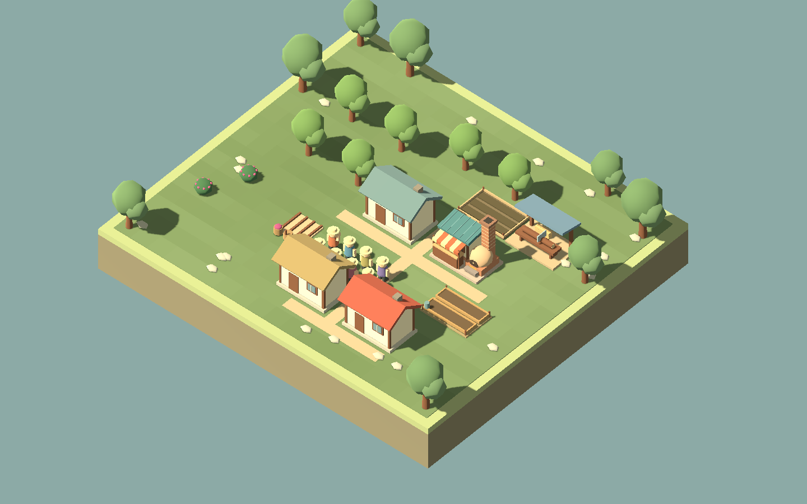
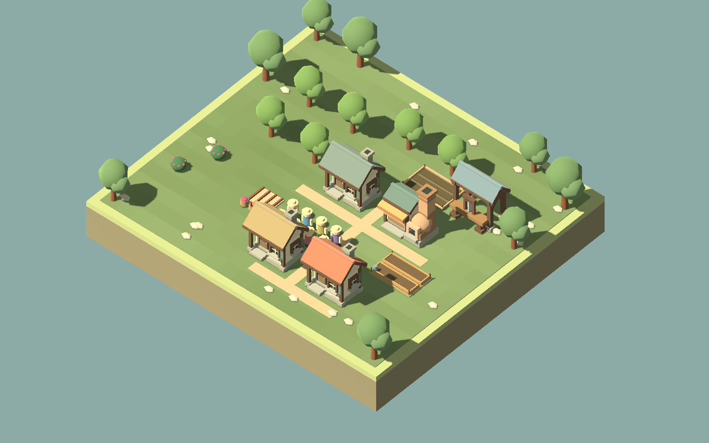

# F23a: the first building family

Implementation ready for visual feedback. This is a proposed direction, not an accepted final art style.

The comparison uses the same paused Creative settlement, camera size 23, 1440×900 viewport, daylight and hidden world labels. The before capture uses the building geometry from `f6c6a7b`; the after capture uses the new geometry. Terrain, paths, camera and simulation starting state are identical. Original bakery/sawmill stock props appeared even when empty; the new workshops correctly start empty.

| Before | Proposed direction |
| --- | --- |
|  |  |

- **Cottage:** deeper porch corner, thick roof and ridge, framed dark windows on front/sides/rear, substantial chimney and separate stone wall feet/steps.
- **Bakery:** broad oven masonry and chimney beside a lower shop, genuinely recessed serving space, a simpler canopy, grain sacks and bread matching actual input/output buffers. Oven glow indicates an actively baking worker.
- **Sawmill:** heavy posts and diagonal braces, pitched roof over the rear bay, exposed cutting bench and reciprocating saw. Logs/planks match actual buffers; saw movement follows batch progress and stops with the simulation or interrupted work.

Costs, footprints, construction timing and production rules have not changed. All four construction stages and rotated models are covered in the presentation sheet. The lodge retains its original cottage-based model pending F23b; it deliberately does not inherit the new cottage under its old overlaid roof.

## Evidence and remaining decisions

`Play.ps1 -ArtSmokeTest` creates a working village through normal Creative placement and production. It checks actual bakery/sawmill buffer display, baking/idle glow and working/paused saw movement, then captures all four camera directions at 960×640 and 1440×900, grayscale and construction stages. The screenshots are for human inspection, not image-based assertions. Extra working/stocked images, twenty 100 ms simulation motion frames and a settlement snapshot are written under ignored `artifacts/f23a-*`. The local review also includes an assembled `artifacts/f23a-working.gif`.

The source review and captures show stronger openings and more distinct building forms. They also expose unfinished surroundings: bright paths, repetitive ground patches, tray-like fields, and a lodge now less substantial than the cottage. Those remain explicit F23b concerns. Fine material texture, a more irregular roof profile, and whether the proportions feel inviting are still matters for feedback; do not assume more geometry automatically improves them.

Build and art checks passed. The broad HUD suite passed all interaction assertions but its first run crashed during Godot C# shutdown. After explicitly disposing the temporary roof mesh builder, the repeated full HUD suite passed and exited cleanly. That is evidence for the final run, not proof that every shutdown issue is eliminated; investigate further if it recurs.

Before extending the style, judge whether the cottage feels inviting, the bakery reads as a working shop, and the sawmill has a convincing open structure. If the scene still feels too rigid or plain, iterate these three together. F21g UI work can proceed independently while that judgment is pending. The larger campaign and balance work remain in the roadmap; this visual slice does not validate their pacing or enjoyment.
