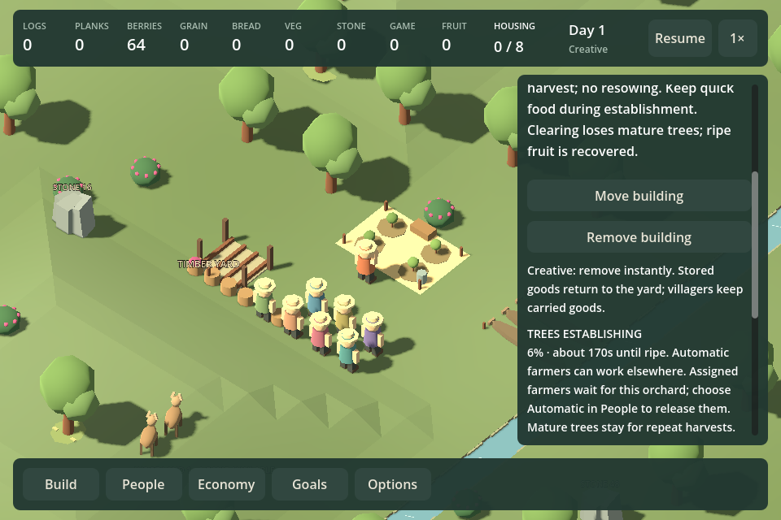
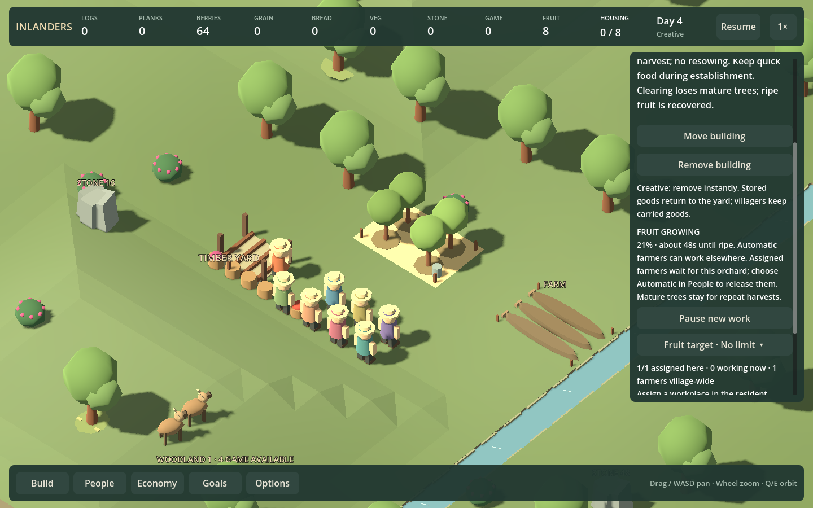

# F21u — orchard assignment guidance and continuation evidence

September 12, 2026. Follow-up to the checkpoint-five whole-project review.

The orchard's growth report used to say farmers could work elsewhere without qualification. It now distinguishes Automatic farmers from workers assigned to that orchard, and directs the player to choose Automatic in People to release an assigned worker. This applies to both the initial establishment and mature repeat-growth reports. Assignment behavior, workplace slots, production costs and growth times are unchanged.

The existing workplace, stone-storage and bush-relocation continuation helpers now advance the original world and one reload for 100 identical 0.1-second ticks, validating both and comparing their complete saved state after each tick. Previously they compared two reloads, which could miss a difference from the original runtime. The stronger cases passed without exposing a save defect. This is bounded evidence for those fixtures, not proof of every possible save state.

Because the stronger helper advances the actual fixture, stone cancellation/removal branches retain snapshots from the specific claimed/pickup/carry phase before continuation. The bush's immediate repeated-move check remains before time advances. This preserves the original interruption coverage rather than silently testing a later phase.

## Verification

- `./Test.ps1 -WorkplaceAssignment`: all supported workplace types, boat handoff, carpenter work, assignment changes, strict waiting and current-format continuation pass. Added establishment and mature-growth cases keep another field unsown while its only farmer is bound to the orchard; choosing Automatic gets it sown before the orchard ripens.
- `./Test.ps1 -StoneStorage`: original-versus-reload continuation passes for local extraction, builder claims, hauling pickup/cargo and recovery fixtures, alongside existing capacity, cancellation, removal and material checks.
- `./Test.ps1 -BushRelocation`: original-versus-reload continuation passes after walking/picking/cargo relocation fixtures, including resumed foraging and deliveries.
- `./Play.ps1 -PeopleKeyboardSmokeTest`: generates the orchard fixtures through the assignment checks, then exercises the existing People keyboard regression and orchard inspector/release controls at 960×640 and 1440×900. The full growth guidance fits in the scrolled inspector; selecting Automatic and Apply through the UI lets the farmer sow another field during growth. Build has zero warnings/errors.

These are simulation and scripted rendered UI checks. The still images below show the actual inspector, not a mockup. They do not replace the pending ordinary-interface campaign observation or human enjoyment feedback.

## Roadmap reassessment

F21u is delivered as playable checkpoint 7; the tests alone are not another checkpoint. No new system or save migration is justified. Next is F11d/F18d: ordinary-interface campaign observation and a controlled finale comparison separating bread capacity from placement. Sound/music listening and native long-frame attribution remain open. The next periodic whole-project review remains checkpoint 10, including the visual/audio role.
