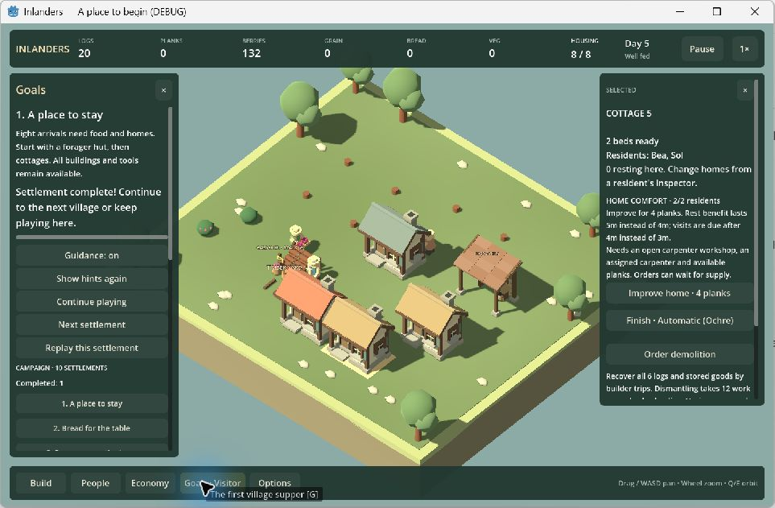
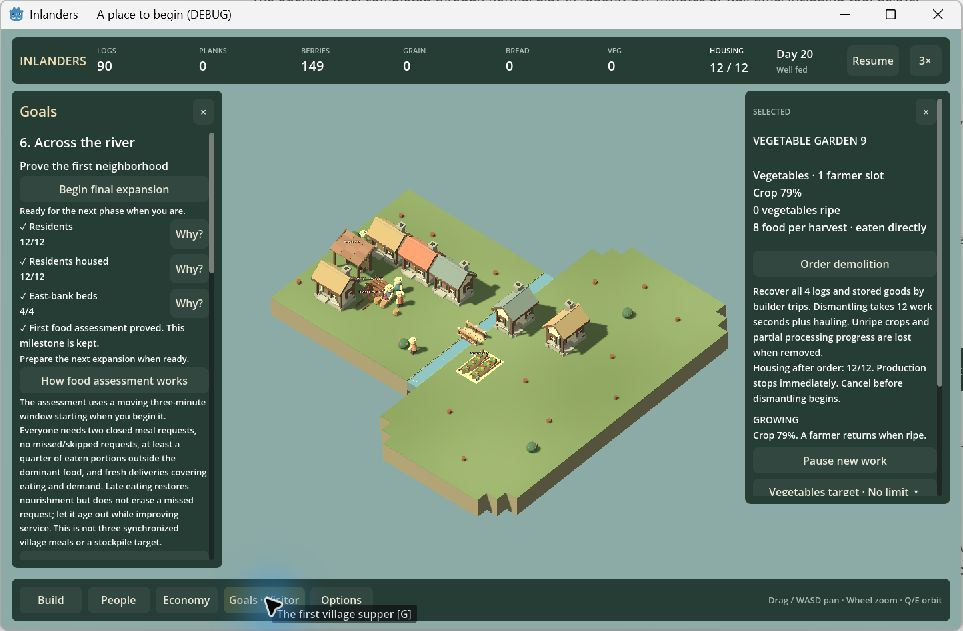
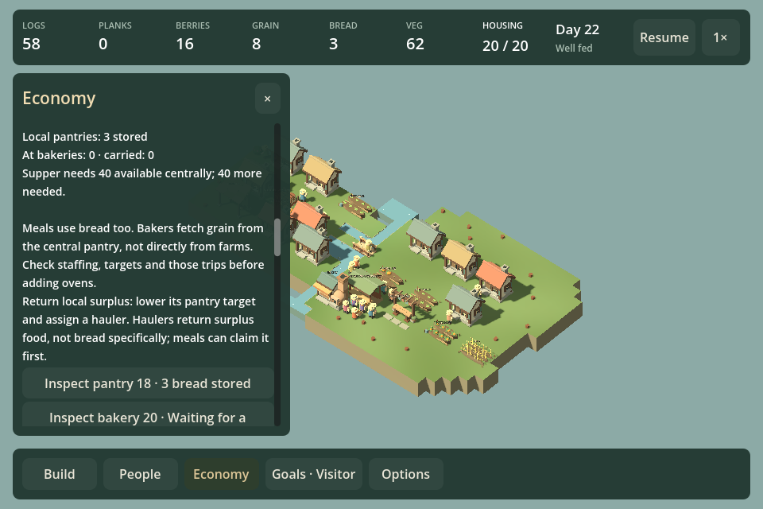

# F11d / F18d — observed play and finale alternatives

September 12, 2026. Follow-up to the checkpoint-five whole-project review. This chunk combines ordinary-interface observation with a separate controlled simulation experiment. Only an evidenced bread-guidance correction is implemented; no prices, quotas, production speeds or required buildings changed.

## Ordinary campaign observation

The previous native capture failure was resolved by selecting the returned game window and bringing it to the foreground. Capture initially returned the occluding Codex surface; no inputs were sent to that surface. Once activated, the actual game could be observed and operated. Some captures still took tens of seconds. The review-owned game was closed and its process/window disappearance verified afterward.

The session used the existing Windows build at `e55b74b`, normal campaign controls, and no injected goods, placements, progress or simulation ticks. The reviewer already knows the project, so this is informed agent play, not a naive player study. An obsolete campaign save was replaced through the menu's offered Start fresh campaign action; personal saves are disposable.

**Level 1:** placed a forager hut and four cottages, resumed work, watched construction and berry delivery, and checked Goals. Hut and fresh-delivery objectives reached their targets before housing finished. The level visibly completed at 8/8 housed; Continue playing and Next settlement were offered. Observed completion was roughly 336 seconds after entering, including UI-tool delays and some concurrent analysis, all at 1×. The actual completion occurred between observations. This is not a human completion-time estimate.

Placement refusals for a walking resident, map edge, stump and resource access allowed recovery by choosing another plot. The latter exposed a remaining clarity issue: apparently bare land can protect a resource entrance, and the generic refusal does not identify its exact tile. The newly improved terrain feedback does not cover ordinary building placement.

**Level 6:** selected Across the river through the campaign list. Found Bridge under Storage & crossings; the dry-bank refusal explicitly suggested rotation, and R produced a legal crossing. Built it, then two eastern cottages and invited two pairs through People. Goals made the first assessment available at 12 residents and four eastern beds.

After beginning assessment, the food table exposed the missing variety. Its explanation distinguished closed meal requests, actual food eaten and continuing supply. Built a vegetable garden near the bridge. Its No staff report directed the player to People; assigning a farmer produced harvested and delivered vegetables. Other-food portions rose from 6/37 (insufficient) to 10/36 (sufficient), and Goals then marked the first food milestone as kept and enabled final expansion. River observation covered roughly 13 minutes of wall time, including tool delays, paused preparation and concurrent analysis. It began at 1×; following the user's sensible suggestion, it switched to 3× for production/assessment waits. Future sessions should use higher speed for waits and pause for inspection.

This is useful evidence for the build → staff → observe → recover loop. It does not establish enjoyment, full level-six completion, all campaign layouts, audio quality or first-time comprehension. Introductory completion and a later assessment were actually observed; later recovery no longer rests entirely on scripts.

## Matched finale experiment

`Tests/FinaleAlternativesReview.cs` is an opt-in experiment (`./Test.ps1 -FinaleAlternatives`). It first earns both level-ten assessments through ordinary simulation commands. All arms start from the same saved state: 20 residents, 20 beds, two loggers, three builders, two foragers, six farmers, two bakers and five unassigned residents. Meals and breaks remain active. The three central housing replacements/clearances are paid equally before the split; this deliberately isolates production arrangement rather than comparing the entire housing strategies. Common preparation reaches the split at 1,077 simulated seconds, after earning the expanded assessment at 664 seconds.

Farm positions: central (-2,0), eastern (22,7). Bakery positions: central (1,5), second (-6,4); eastern (8,10), second (22,0). One-versus-two ovens holds the labor budget fixed, leaving the second baker without a second slot in one-oven arms. New production costs 12 logs for a farm/one bakery or 20 logs for farm/two bakeries. Construction and hauling are real. A candidate second eastern site at (18,10) was rejected because it protects resource access; the final experiment uses the legal site above.

Each arm runs to the same 1,800-second horizon from the split. Times below are simulated seconds after that split, including construction. No supper is consumed in the trend arm; a separate copy at first readiness actually hosts supper and verifies campaign completion. Raw sampled results are retained in [comparison data](data/finale-alternatives.json).

| Farm | Bakery | Ovens | Construction ready | First supper reserve | Central bread at horizon | Baked / eaten |
| --- | --- | ---: | ---: | ---: | ---: | ---: |
| Central | Central | 1 | 58 | 955 | 90 | 216 / 126 |
| Central | Central | 2 | 85 | 753 | 110 | 240 / 130 |
| Central | Eastern | 1 | 146 | Not reached | 0 | 132 / 131 |
| Central | Eastern | 2 | 238 | Not reached | 23 | 200 / 173 |
| Eastern | Central | 1 | 124 | 1,748 | 39 | 156 / 116 |
| Eastern | Central | 2 | 140 | 1,539 | 46 | 168 / 121 |
| Eastern | Eastern | 1 | 146 | Not reached | 0 | 136 / 132 |
| Eastern | Eastern | 2 | 231 | Not reached | 0 | 156 / 155 |

All four central-bakery arrangements actually complete the campaign in their supper branches (approximately 987, 785, 1,783 and 1,567 seconds respectively). The eastern-farm/one-central-bakery arm falls back to 39 available bread at the final observation after having reached the required 40 earlier: ordinary meals continue consuming the reserve. At sampled points, the successful central-bakery arms have no missed/skipped requests and continuing fresh supply. Some eastern-bakery arms show temporary missed/skipped meals or supply shortfalls; all recover reliable/fresh meals by the final sample. Final snapshots alone would hide those interruptions.

**Finding:** two bakeries and a central farm are not prerequisites. A remote farm plus one central bakery is viable, but slower. The tested eastern bakery positions materially reduce output relative to consumption, even with central grain accumulated (70 grain remains in the central-farm/one-eastern-bakery arm). Source inspection confirms that every grain pickup is from the central pantry, followed by a trip to the oven. Farm adjacency does not supply a bakery directly. This is evidence about these arrangements and current routing, not proof that every eastern bakery is unviable or a native performance measurement.

## Recovery with one change at a time

All recovery arms start from the identical stalled central-farm/one-eastern-bakery state, retain the same farm, population and role budget, and run another 1,800 seconds. [Recovery data](data/finale-recovery.json) preserves the samples.

| Change | Recovery/construction time | New construction / recovered building timber | First reserve | Final central bread |
| --- | ---: | --- | ---: | ---: |
| Keep arrangement | None | 0 / 0 logs | Not reached | 0 |
| Add second eastern oven | 89s | 8 / 0 logs | Not reached | 24 |
| Demolish eastern oven, rebuild centrally | 177s | 8 / 8 logs | 1,121s | 83 |

Demolition uses existing physical recovery, hauling and construction; it is not a free Move command. Building timber is recovered, but trips, dismantling and rebuilding take time and production is interrupted. This resolves the previous capacity/location confound for this fixture. Adding capacity improves the reserve, but the location-only correction achieves readiness with one oven.

## Change and next work

Bread-supply guidance now explains the central grain pickup and advises checking staffing, targets and trips before adding ovens. Build and the existing rendered bread investigation pass at 960/1440, including links into bakery/pantry controls, actual local delivery, surplus return and current saves. The comparison verifies actual supper completion for alternative arrangements. No broad balance change is justified by these results.

F11d/F18d is delivered as playable checkpoint 8 because the investigation resulted in visible guidance, not because tests/reviews independently count. Keep human enjoyment and broader campaign pacing open. Add F21v as a bounded follow-up: identify the exact resource-access blocker in normal building placement and test plot, entrance, rotation and compact-screen feedback without relaxing protection. Sound/music listening and native long-frame attribution remain ahead in the reviewed queue. The next periodic whole-project review stays checkpoint 10.
