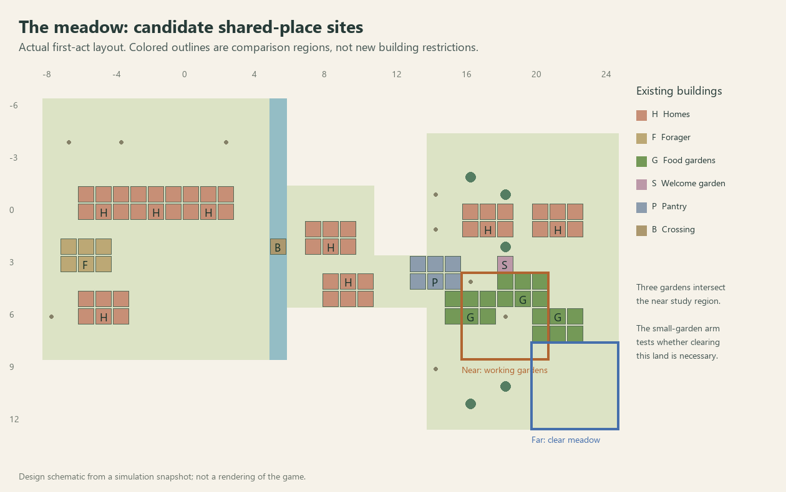

# F27c2 — competing land-use design probe

September 13, 2026. Follows the [checkpoint-ten synthesis](REVIEW_CHECKPOINT_10.md). This chunk specifies and tests the next spatial decision before adding a new player flow. It does not deliver a commons feature, another campaign level, or establish human enjoyment.

## Candidate and intended pleasure

Act one is the existing meadow settlement: cross the river, establish local food production and homes, welcome eight neighbors, and prepare the village. Preserve its unrestricted catalog and viable early-arrival routes. Start the comparison at the first successful provisioning outcome, not after accumulating an oversized surplus.

Act two proposes a shared outdoor place in that same village. The near option takes desirable ground currently producing food; replacement production moves farther out. The far option retains the productive core, at the expense of journeys to the shared place. The intended payoff is seeing a different village emerge: working gardens around the center versus an inhabited center with gardens outside it. The difference must persist in actual routines, not an invisible score.

Candidate near study area: x=16..20, z=4..8, with a venue around (18,6). Candidate far area: x=20..24, z=8..12, with a venue around (22,11). These are **comparison regions, not shipped building restrictions**. No map expansion, new resource, new need, resident increase or changed yield is part of this probe. They test productive ground rather than inventing a woodland resource on this map.

All eighteen buildings remain available. A compulsory square, a required five-by-five empty patch or a high attendance quota cannot be used to exclude an otherwise successful small-garden solution. A larger gathering ground needs a distinct visible purpose before it deserves new mechanics. Simultaneous shared dining is a possible later function, not an approved addition or an excuse for a footprint now.

The actual first-act welcome garden is at (18,3); all three food gardens intersect the proposed near region. Half the residents still live west of the crossing, so neither candidate can be called close to everyone.

## Four explicit plans

| Plan | Construction/change | What it tests |
| --- | --- | --- |
| Stay stable | No second project | Is the new activity worth choosing at all? Existing village remains the control. |
| Near, replace production | Build replacement gardens outside the near area first, physically recover overlapping structures, clear remaining trees/stumps, then build an ordinary square inside it | Real cost and consequences of transforming useful ground. Removed structures and replacement positions are recorded. |
| Far, preserve production | Build an ordinary square inside the far area, retaining existing production | Whether keeping local food is worth the different leisure journeys. |
| Small nearby garden | Add a seating garden within five tiles of the near center, leaving existing production untouched | The obvious unrestricted-catalog alternative. If it provides the useful result cheaply, reject the forced commons dilemma instead of banning it. |

Both square routes use current prices, visitor slots, routes, meals and recovery. The near route replaces displaced production before building the square: an informed player is allowed to avoid famine. Neither route changes the first welcome's history or pretends another welcome is a distinct second act. No timer or new win condition is introduced.

## Evidence contract

`--commons-land` prepares the first act through ordinary construction, food production, arrivals and welcome, saves one common state, then branches all four plans. Setup times are reported separately. Every branch receives the same 1,200 simulated seconds after its construction; the recorded food-trip subset and leisure travel are actual routed person-time, not straight-line distance. The food subset covers field, pantry-transfer and meal trips; it excludes berry-picking travel and is not a total transport-cost measure. Track food stocks, hungry person-time, current meal evidence, visits to the added venue and distinct visitors. Save each prepared and final state and verify exact continuation. Named artifacts identify the plan and phase.

The test cannot establish desirability from visit counts: residents currently choose automatic destinations. A farther square attracting visitors may simply consume time; a nearby one doing the same more cheaply may dominate it. Nor does a successful scripted plan prove discovery, satisfying pacing or visual appeal. Source hashes and the common-state hash travel with the result.

The small placement helper searches nearest legal candidates across all four facings before moving farther away. It records requested/actual cells, facing, region and displacement. Exact and facing-first policies are explicit for future comparisons; existing historical comparisons retain their prior behavior. It orders candidates before expensive permission/path checks, avoiding exhaustive checks after a valid candidate is already available.

## Results and decision

**Reject the compulsory near-versus-far commons objective under the current venue rules.** There is a measurable journey tradeoff between the two prescribed square plans, but no reason to force that pair on the player. The catalog already provides better ways to add a nearby gathering place without clearing the productive core. This rejects this implementation of act two, not local logistics or every possible land-use situation.

| Plan | Setup, simulated seconds | Stored food, start → end of observation | Hungry person-seconds | Added-venue visits / distinct residents | Leisure travel, person-seconds |
| --- | ---: | ---: | ---: | ---: | ---: |
| Stay stable | 0 | 73 → 148 | 0 | — | 1,758.7 |
| Near, replace three gardens | 344.1 | 76 → 173 | 0 | 144 / 16 | 2,057.7 |
| Far, retain three gardens | 79.8 | 71 → 158 | 0 | 118 / 16 | 3,180.5 |
| Small nearby garden | 29.4 | 71 → 145 | 2.4 | 115 / 16 | 2,326.9 |

Each observation lasts 1,200 simulated seconds after preparation; all four end with reliable current meal evidence. The small garden has two visitor slots versus the squares' four, so attendance counts are not a capacity-matched quality comparison. Its brief 2.4 hungry person-seconds are retained in the report rather than rounded into a zero-hunger claim. Raw final food stocks are not a throughput ranking: setup durations and starting reserves differ. A resident automatically visiting a venue is not evidence that a human prefers the layout.

A follow-up using the **same verified first-act state** finds and physically builds a square at **(18,8), rotation 1**, with all three food gardens intact. It takes **73.0 simulated seconds**. Exact saved continuation passes. This footprint extends beyond the arbitrary near study rectangle; its center is only two tiles from (18,6). Requiring the whole structure to remain inside that rectangle would invent the need to displace production. This follow-up verifies construction and retained production, not another twenty-minute attendance comparison.

The near/far plans are viable arrangement options. They do not yet earn a compulsory campaign dilemma, and doing nothing remains economically successful. Do not ban the garden, tighten the rectangle, increase visitor quotas, or change square prices to rescue this objective. Keep the experiments as evidence and retain ordinary placement freedom.

## Next bounded design bet

Before building a project screen or rolling out campaign levels, prototype a **shared outdoor meal with actual simultaneous places**, compared with the current staggered venue visits. This is a candidate activity using existing residents and edible food, not a new need, producer, compulsory building or larger food target. The question is whether gathering together produces a legible, lasting shared place worth arranging.

Allow players to choose the location and retain every building. Count real reachable unoccupied places for actual residents, not a mandatory five-by-five land reservation. Existing clever layouts must remain valid. Food and people must physically reach the chosen place; cancellation must recover held goods, and declining the activity must leave the village viable. Avoid another attendance assessment or repeating the welcome with different text. The prototype must show the activity and its occupied space before new campaign UI or a win rule is accepted.

Compare compact existing space with a farther open area; observe the actual gathering and return to work. If both can be arranged without sacrificing production, keep that result and evaluate it as expressive village-making rather than calling it a difficult land dilemma. If the activity adds only waiting or service administration, cut it and revisit the second act. The mandatory campaign-land-choice hypothesis remains unproven.

## Reproduction and limits

Run the simulation test executable with `--commons-land`, then `--commons-bypass`. The latter requires a completed comparison, verifies its source hashes and common-state hash, and uses the same placement helper. Output is in `artifacts/commons-land-comparison`: common first act, recorded placements, prepared/final branch saves, results, provenance manifest, and the free-square check. The four-arm run took 344.1 wall seconds on this machine; this is not native game performance or a player completion-time estimate.

The first run was interrupted after the stable control to improve the informed plan: replacement production now precedes demolition. Validation runs periodically and at phase boundaries; each saved phase also compares exact continuation. Only the completed rerun is reported above. Original gameplay source remains unchanged from `44149f3`; these are simulation-side design probes. No native play, game rendering, audio listening or human enjoyment assessment occurred in this chunk. The diagram is a snapshot-derived schematic.

The placement helper has now been reused by the main comparison and the independent free-square construction check. Both exercise nearest-first/all-facing search and record displacement. Exact/facing-first policies are available but not claimed as independently verified; historic comparisons were not rewritten. This is a bounded evidence aid, not a general scenario editor. Count remains ten; this design probe is not a playable campaign outcome.
