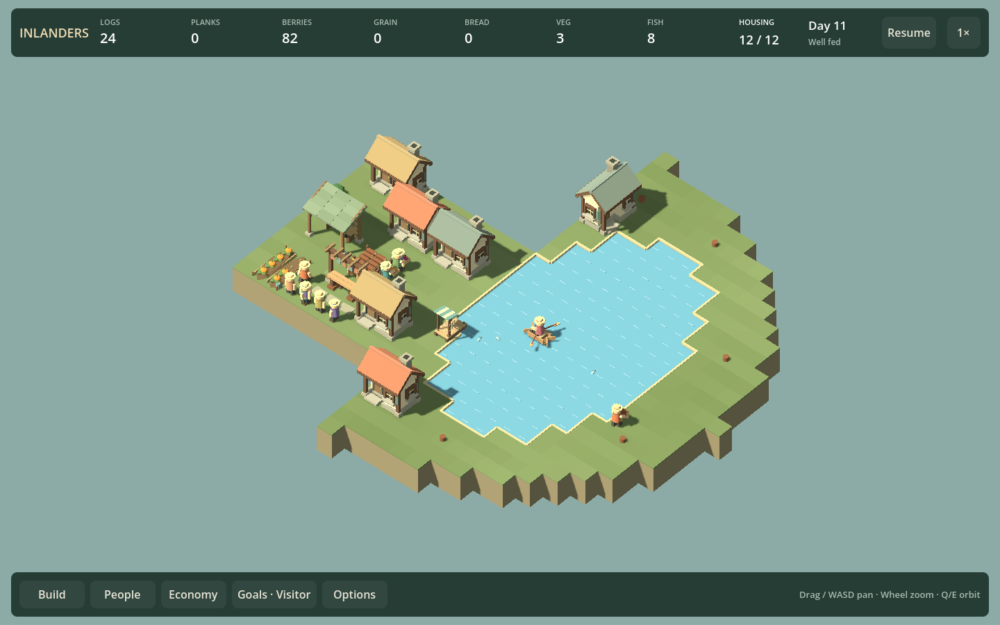
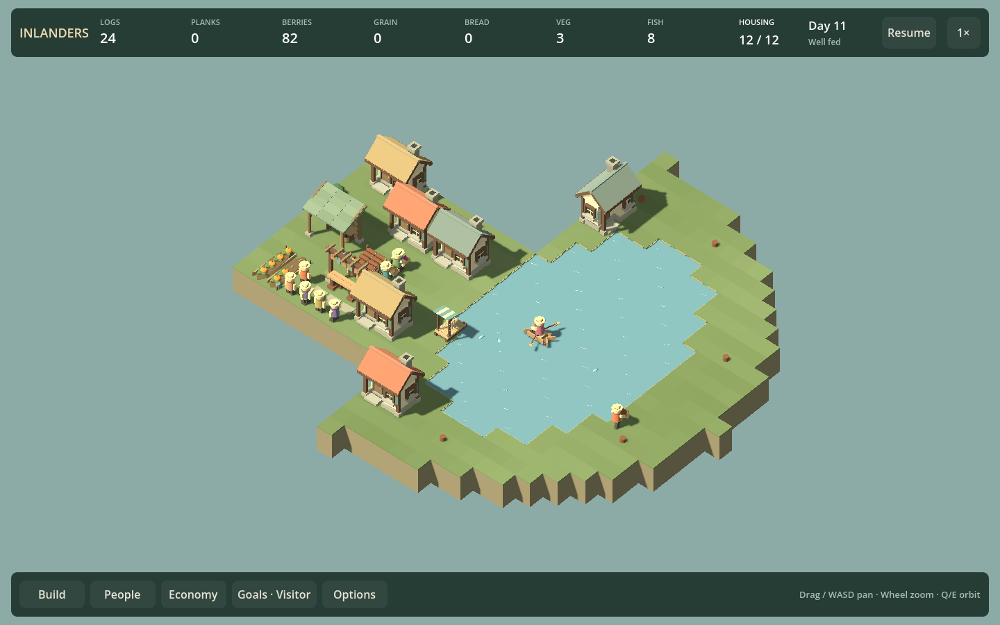
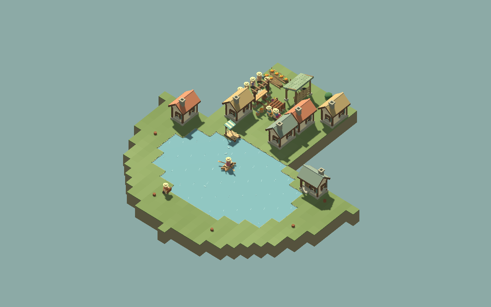
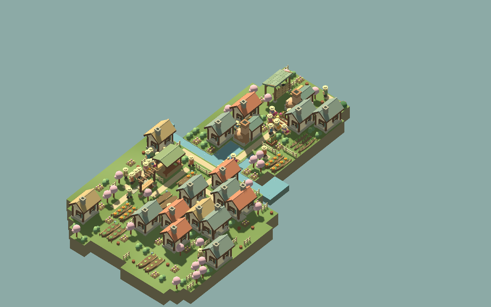

# Working-village composition — F23b10

September 12, 2026. Reviewed ordinary, densely decorated and working-lake settlements. Shipped one bounded treatment: older water maps now use the finale's muted water palette, sparse irregular ripples and short low earth shelves instead of a continuous bright rim. This is a shoreline improvement, not a claim that the game's visual direction is finished.

## Visual decision

At village zoom the old lake forms a bright outlined shape, and its evenly repeated white ripples emphasize the cell grid. Both compete with the working dock and boat. The new treatment lowers that contrast while preserving clear land/water separation. Launch edges receive no additional tall plants or rocks. Existing authored meadow planting remains unchanged.

Before:

After, same paused world and camera:

The orthogonal coast is still visible. This pass does not reshape buildable land, mask access boundaries, or change water depth/boat navigation. Dock canvas, piles, boat, fish and workers remain recognizable. The second rotation verifies the lake also reads from its opposite diagonal:

The 20-person and decorated 32-person finale fixtures already use this water style, so their terrain is intentionally identical between comparisons. They provide populated context rather than evidence that every village changed. Buildings have distinguishable roofs and entrances, but the busy central gathering area can still be visually crowded. More ornaments are not the solution to that crowding.

The next demonstrated ground issue is visible in the lake comparison: alternating tile colors and a rigid outer cut make open land look like a board. F23b11 should compare continuous ground color across cell boundaries before changing shoreline geometry or adding more props. A broader planting/layout pass remains conditional on those results.

## Reproduction and checks

Run `./Play.ps1 -CompositionSmokeTest`. It reads current-format `artifacts/large-village/ordinary.json`, `dense.json` and `artifacts/f11b2-complete.json`. Generate larger-village fixtures through `./Test.ps1 -FinaleCampaign` then `./Play.ps1 -LargeVillageSmokeTest`; the lake fixture comes from the simulation runner's `--lake` argument or the full `./Test.ps1` suite. No old-save conversion is provided.

The harness compares old/new water rendering on three real saved settlements, with two camera rotations and both HUD/clean Watch captures: 24 images under `artifacts/composition`. The worlds are paused for matched captures. It then measures 180 normal-process frames at 1x for each condition, retaining 179 complete raw frame intervals. Every condition replays its exact fixed-tick count into an independent copy, requires identical final simulation state, validates the world, and roundtrips its save. Foliage motion is off for matched images; all residents and actual cargo are rendered. Frame sync is off, FPS uncapped, daylight, 1440×900, orthographic size 32, Godot 4.6 GL Compatibility on Intel Iris Xe.

| Fixture | Landscape triangles before → after | Landscape meshes | Median frame ms before → after |
| --- | ---: | ---: | ---: |
| Ordinary, 20 residents | 2,950 → 2,950 | 13 → 13 | 10.48 → 10.82 |
| Decorated, 32 residents | 2,950 → 2,950 | 13 → 13 | 18.77 → 19.32 |
| Working lake, 12 residents | 13,032 → 11,856 | 10 → 10 | 6.82 → 6.96 |

The dense fixture retains all 67,452 decoration triangles and regional batching. Lake draw calls were 1,208 in both samples. These short live timings are noisy, with slightly different tick counts; they do not establish a speedup. A 681 ms before-lake outlier is not evidence that this art change fixes F23c3. See the [recorded measurements](COMPOSITION_RESULTS_F23B10.json).

Build, full simulation suite, composition comparisons and four-orientation shoreline checks pass. Dock checks cover construction, active fishing, returned catch, recall, demolition, saved boat state and paused oars; bridge checks cover actual worker crossings and protected access. Fishing smoke additionally checks legal dock preview, passenger position, resource UI and campaign progression. The existing certificate-store warning remains unrelated.

## Roadmap review

F23b10's bounded comparison/treatment is delivered. F10b2 listening remains open; F17b music depends on that review. Independent visual work can continue as F23b11 while waiting for listening feedback. Do not add another building type or need merely to increase visible activity. Human campaign enjoyment and visual preference remain feedback questions, separate from the verified routes and screenshots.
