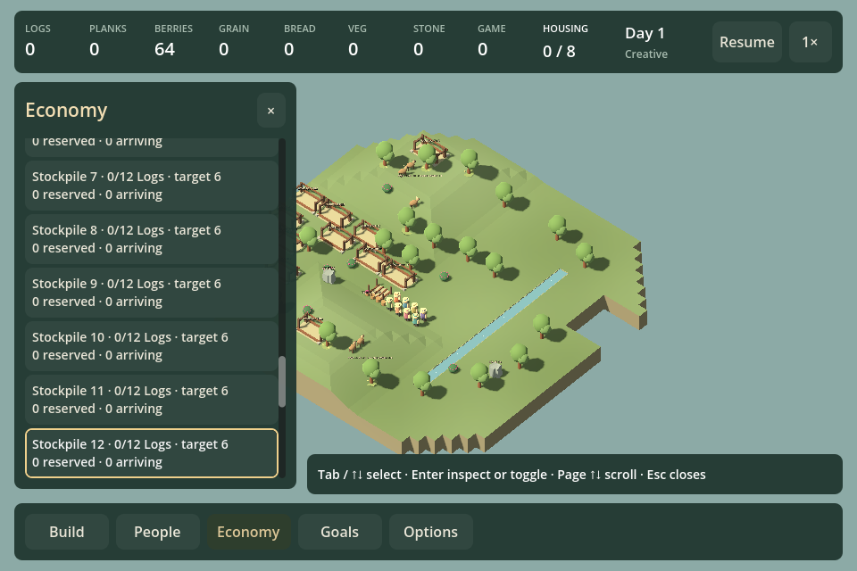
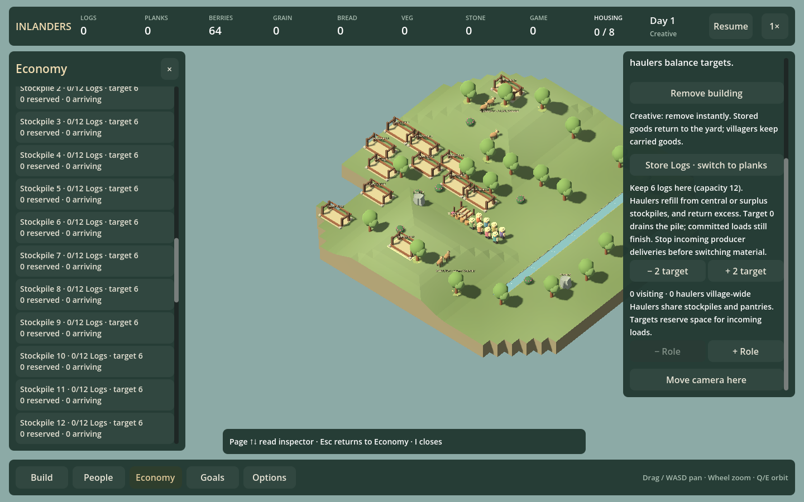

# Economy keyboard inspection — F21q

September 12, 2026. Economy now has an explicit keyboard flow for inspecting storage, bread places, idle residents and current supply trips, then returning to the originating control. It follows the existing menu/Build/People focus conventions.

## Controls and scope

- **I** opens Economy with visible focus; I again closes it.
- **Tab / Shift+Tab / Up / Down** move through visible, enabled controls and scroll the focused target into view.
- **Enter / Space** activate the focused link or disclosure. Opening a place/resident shows a **Back to Economy** button.
- **Page Up / Page Down** scroll long Economy or inspector text.
- **Escape** returns from inspection to the same source control, then closes Economy on the next press.

The supported Economy list includes resource-survey entry, meal-service entry, bread disclosure/place links, shortage actions, the supply-route disclosure and worker links, central stores, local stores and idle residents. Entries into other tools retain their existing behavior: meal/staff inspection hands off to People, build suggestions enter placement, and the survey launches its existing map tool. This does not claim full keyboard navigation of the source survey or every inspector action.

During place/resident inspection, this flow provides reading/scrolling and Back. It does not silently turn an Enter press into a staffing transfer, target change or demolition action. Existing mouse actions remain available. Full keyboard editing within all building inspectors is a separate follow-up; People already has explicit keyboard role assignment.

At 960px the inspector replaces the drawer; returning reopens Economy at the original identity. Wider layouts retain both panels. World movement/orbit/build shortcuts are suppressed while navigating; explicit management/Watch shortcuts hand off, and Escape restores world controls. Text entry never opens Economy. Clicking switches back to mouse operation, including the Back button.

## Live identity and validation

Focus uses semantic keys: issue ID, building ID, resident ID and supply worker ID. It does not remember a reused button slot as the target. Issue and route data are refreshed before activation. If the intended identity vanished, that key event does not activate the replacement row; focus falls back to the stable first control. Live refresh keeps the same identity when it still exists. Return from inspection resolves the original key again. Reload/map changes release focus and clear remembered context.

Run `./Play.ps1 -EconomyKeyboardSmokeTest`. Its 960/1440 fixtures contain twelve real Creative stockpiles and eight residents. Checks traverse the long list, inspect the final stockpile, return to its identity, inspect an idle resident, start their logging work, remove a focused store, and verify safe focus recovery. Read-only navigation preserves exact saved state. It checks mouse Back, external selection, People/Build handoffs, typing, reload and valid current saves. The real normal-simulation dense snapshot from F23c2 supplies changing supply routes; the test checks that focus follows worker identity or safely drops a completed route. Generate that fixture with the commands in [the larger-village review](LARGE_VILLAGE_F23C2.md) when absent.

Build, focused rendered checks, full HUD regressions and existing People keyboard checks pass. The existing certificate-store warning remains unrelated. No simulation production code or save format changes.

## Roadmap review

F21q is delivered. The next independent keyboard task is F21r: Goals evidence and campaign-action navigation, including return from a linked place/resident and fresh readiness checks before activation. Broader inspector editing and source-survey focus remain distinct follow-ups. Audio listening and musical variation remain open; this delivery does not stand in for perceptual feedback or campaign enjoyment testing.
