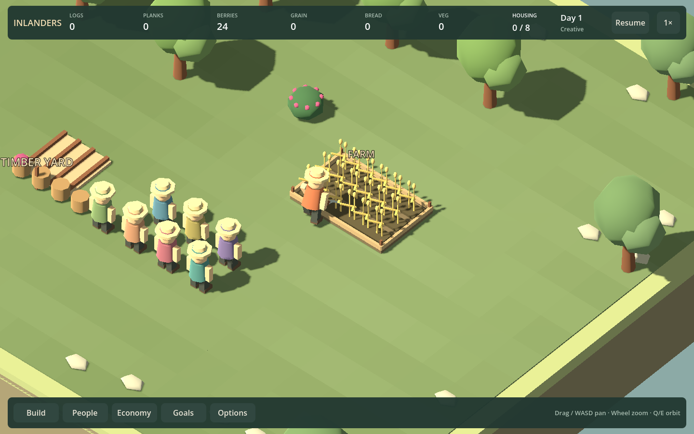
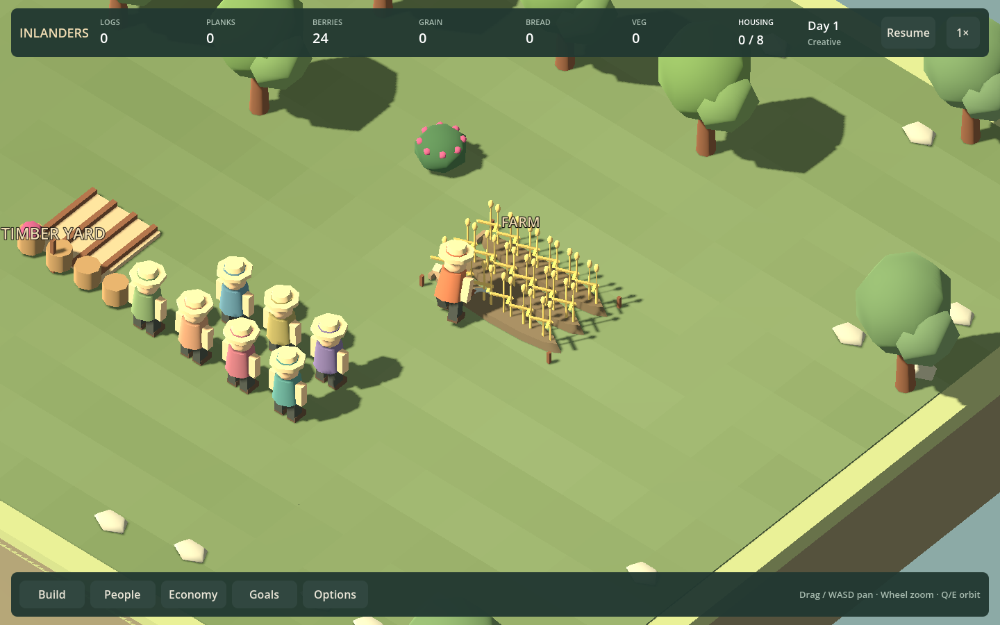
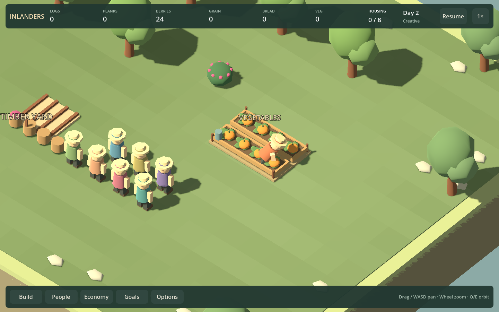

# F23b3 — fields on the ground

Farms and vegetable gardens previously sat on full rectangular plinths with continuous timber rims. This pass replaces those bases with separate tapered soil beds, leaving grass visible between rows and at the edges. Farms have three unframed worked strips and short end markers. Gardens have two broader beds with partial retaining boards and a ground-level watering can.

| Before | Field slice |
| --- | --- |
|  |  |
|  |  |

These are matched 1440×900 captures from the same harvesting fixtures, camera and work progress. Crop origins, heights, counts, growth stages and remaining-harvest masks are unchanged. Both buildings retain their costs, staffing, six-tile footprint, entrance, production and save format.

Construction remains visible: corner markers establish the plot, digging introduces the beds, and end markers or partial boards finish them. A farm gains its third worked row during construction. No fake ripe crops or decorative produce are added.

## Verification and review

`./Play.ps1 -FieldWorkSmokeTest` passes for grain and vegetables in all four orientations. It checks sowing/harvest tool contact, remaining crops, actual cargo transfer, partial harvesting, pause/reload and interruption. Captures cover 960/1440. `./Play.ps1 -ArtSmokeTest` adds a rotated four-stage field/garden sheet at `artifacts/f23b3-field-construction.png` and the wider working village.

Build and art smoke also pass. The construction sheet and harvesting captures were visually reviewed; this change requires no simulation migration or balance adjustment.

The field borders now read as cultivated ground instead of a continuous display tray. Rounded beds remain deliberately regular so crop progress is easy to count. Player aesthetic acceptance remains open; review them at ordinary village zoom before adding extra soil detail or denser foliage.

Next proposed family slice: F23b4 village square, with a more inviting shared gathering place and seating that remains consistent with actual visits. Keep recreation rules and capacity separate from that visual work.
