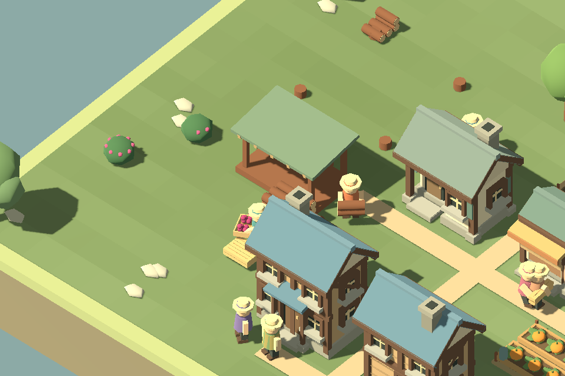
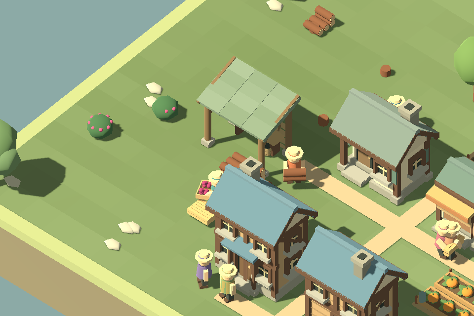

# F23b2 — the woodland shelter

The forager hut had thin posts, one flat roof slab, and a solid wooden display base. It now has round posts on separate stone feet, diagonal braces, overlapping roof panels, and a low woven rear windbreak. Open sides and a central entrance distinguish it from the enclosed cottage and lofted lodge.

| Before | Shelter slice |
| --- | --- |
|  |  |

The paired 960×640 captures use the same working Creative village, camera, simulation sequence and hidden labels. The sorting bench, empty baskets and spare picking poles are equipment. The old permanently full berry baskets were removed because the hut has no stored berry inventory; villagers carry their actual harvest to food storage.

Four-log cost, two forager slots, footprint, entrance, harvest rules and save format are unchanged. Construction progresses from separate feet to posts/braces, rear screen/bench/rafters, and finally roof/equipment.

## Verification and next review

`./Play.ps1 -ArtSmokeTest` includes the shelter in the working village at 960/1440, close views from four camera directions and the four-stage presentation sheet. It verifies actual berry delivery and unchanged paused settlement state, alongside the existing workshop checks. The latest build and art run pass. Current captures are under `artifacts/f23b2-forager-*` and `artifacts/f23a-*`.

Review whether the roof reads as a light woodland shelter at normal zoom and whether the open sides distinguish it from housing. Camera angle still affects how much of the bench is visible. Player aesthetic acceptance remains open. The next proposed slice is fields and gardens: soften the rectangular bases while keeping standing/harvested crops and worker contact clear.
