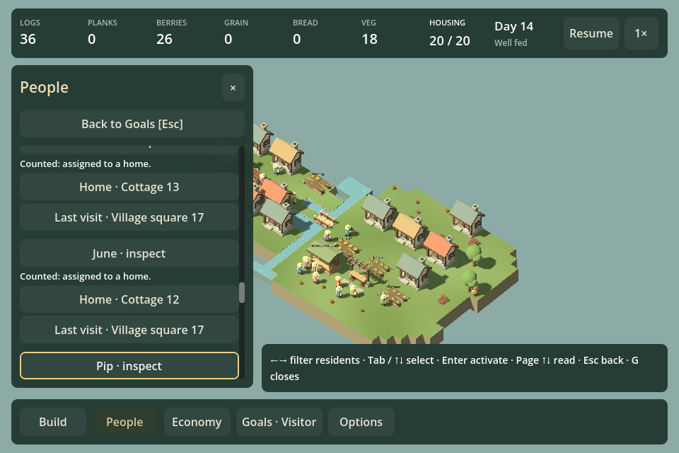
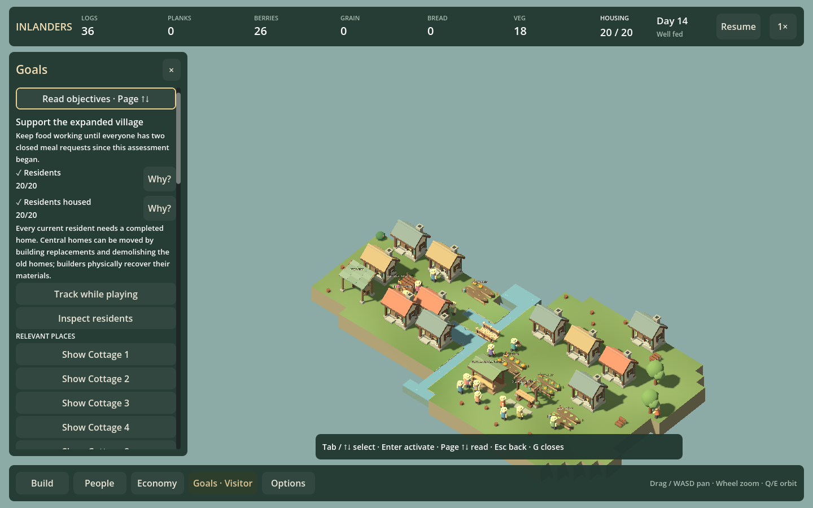

# Goals keyboard evidence and actions — F21r

September 12, 2026. Goals now supports keyboard reading, condition explanations, counted/not-counted resident evidence, relevant places and deliberate campaign actions. Linked inspections return to their originating goal or evidence row.

## Player flow

**G** opens Goals with a visible, harmless **Read objectives** focus anchor. **Tab / Shift+Tab / Up / Down** traverse visible enabled controls; **Enter / Space** activate the chosen control. **Page Up / Page Down** scroll text. **Escape** returns through inspection/evidence to Goals, then closes it. G closes the flow directly.

Condition controls expose Why, tracking and relevant resident/place links. In resident evidence, **Left / Right** changes the existing filter, including counted and not-counted residents. Person, home and venue links retain resident/place identity. A fixed Back to Goals button stays above the evidence scroll area. Inspector navigation is read-only: read with Page Up/Down and return with Escape or Back.

Introductory goals retain their objective and hint text. Tutorial controls, supper, phase actions, completion controls, campaign settlement links, standalone return and gardener controls can receive focus when visible/enabled. Existing actions and their existing recovery/confirmation behavior are used. Economy links hand off to its delivered keyboard flow. Placement and resource-survey links launch their existing tools; source-survey keyboard interaction remains a separate follow-up, and this chunk does not add keyboard editing to every inspector.

## Changing state and safeguards

Place links carry stable building IDs across control rebuilds. Resident, home and venue keys include their target identities. Returning resolves the original identity; if it disappeared, focus falls back to a reading/back control rather than activating a replacement row. The goal key remains meaningful as its count changes.

Campaign phase/completion identity is checked before activating a key and after actions. A change resets focus to Read objectives. Readiness is refreshed before activation, and existing simulation actions independently validate it. A formerly ready assessment cannot be started after housing becomes insufficient. A second Enter after a phase transition does not trigger another action. Disabled buttons are skipped; explanations remain readable using page scrolling.

Tab-page visibility updates after a page change. The focus request is retained until the destination is ready instead of falling back to the wrong control. Mouse Back, external management shortcuts and text entry continue to work. Reload or settlement replacement clears the context. World movement/orbit/build keys do not leak through active Goals navigation.

## Verification

Run `./Play.ps1 -GoalsKeyboardSmokeTest`. It uses an original level-one world and current-format `artifacts/finale-campaign-prepared-second.json` / `ready-supper.json`; generate the finale fixtures with `./Test.ps1 -FinaleCampaign` when absent. Campaign writes go to a smoke-test book under `artifacts`.

At 960/1440 the check opens and reads introductory goals, explicitly toggles/restores guidance, reaches the standalone link, reads a housing condition, switches to counted residents, inspects a late resident, and returns through evidence to Goals. It forces place controls to rebuild while preserving their target, inspects a home and uses mouse Back. Read-only paths require identical saved state.

The readiness check temporarily removes housing from the isolated fixture after focusing a ready assessment, verifies Enter cannot advance, restores the housing and activates the real assessment. Focus resets after the phase change; repeated Enter preserves state. A separate ready-supper world starts the real gathering flow and advances actual simulation until campaign completion, verifying another safe focus reset and exact current-save roundtrip. Shortcut handoffs, typing and reload reset are checked.

Build, focused Goals checks, existing Goals layout/evidence checks, Economy keyboard regressions and full HUD checks pass. The existing certificate-store warning remains unrelated. Simulation rules, campaign thresholds and save format are unchanged.

## Roadmap review

F21r is delivered. F21s should complete resource-survey keyboard selection and workplace/source return, closing another existing navigation gap before broader inspector editing. F10b2 listening and F17b musical variation remain outstanding. This work improves access to evidence; it does not establish human campaign enjoyment or justify new requirements, quotas or waits.
