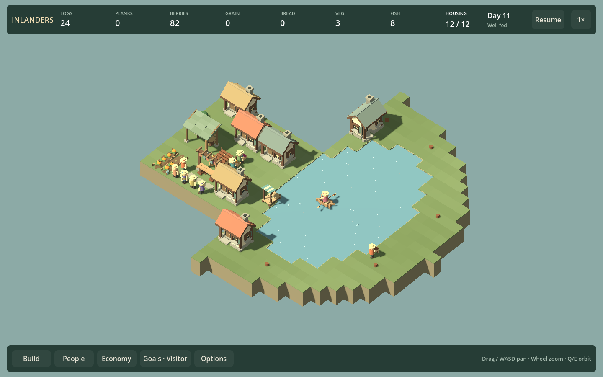
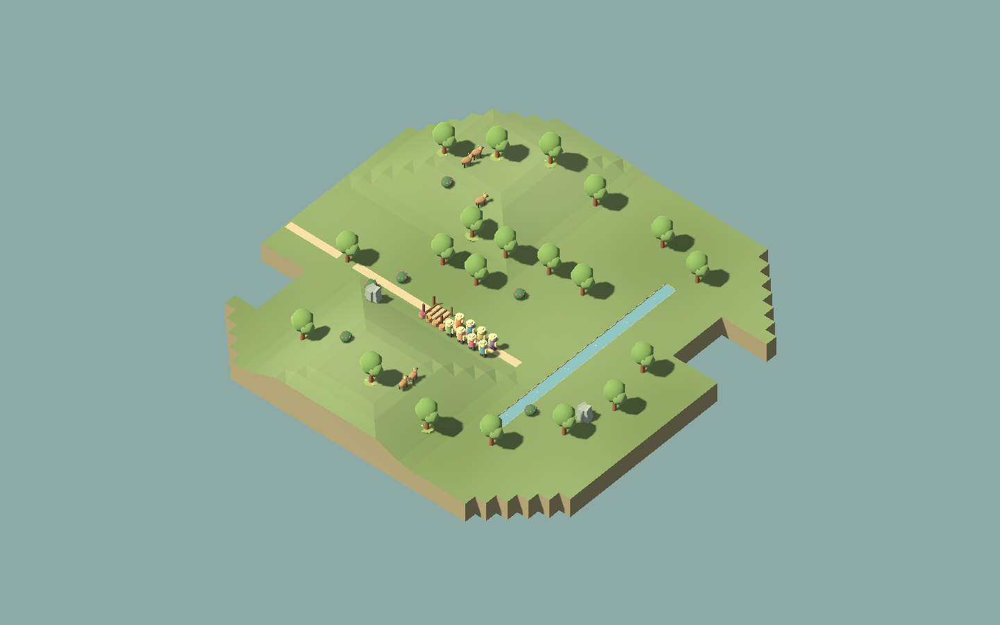
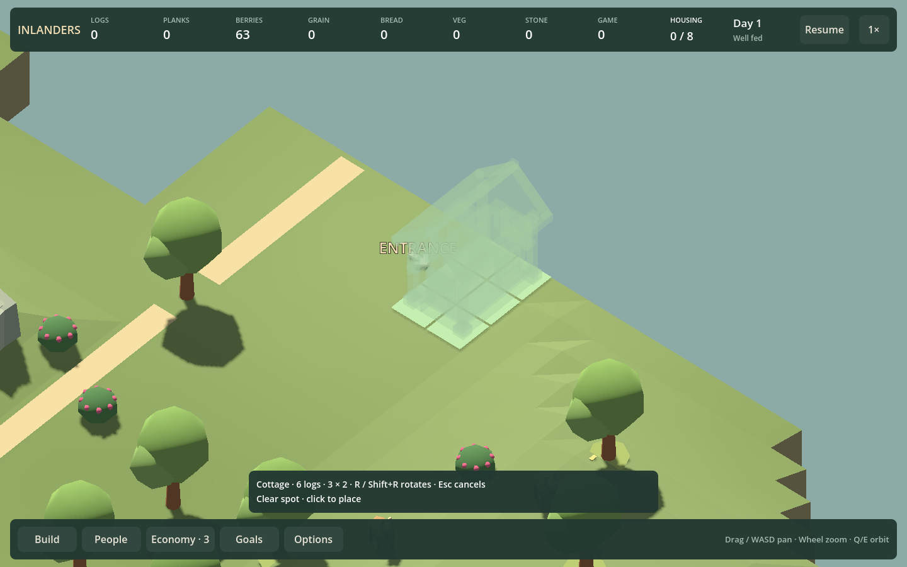

# Continuous ground color — F23b11

September 12, 2026. Open ground now blends across tile boundaries using a shared world-position color field. The original warm green palette and broad patches remain; the alternating per-tile grain is removed. Authored meadow color, terrain heights, slopes, boundaries and simulation rules remain unchanged.

## Visual result

Before, working lake:

After, same settlement and camera:

The shoreline still clearly separates walkable land from water. Entrances, workers, boat, cargo and garden beds remain legible. The new surface removes the checkerboard effect rather than adding more small props or textures. The rigid outer outline is still visible; this delivery does not claim to solve every landscape issue.

Raised terrain before:

Raised terrain after:

Actual slope facets remain visible because the geometry/normals are unchanged. These facets communicate height; removing tile-color seams should not be confused with smoothing away slopes or making steep sites buildable.

## Implementation and evidence

Grass vertices now sample a low-frequency world-position color field. Shared positions have identical colors, interpolated across the same tile triangles. Existing raised terrain keeps its geometry. The authored meadow keeps its existing color function. Flat expanded maps replace stacked tile boxes with a continuous top and exposed side walls, preserving their top, thin grass rim and bottom heights. The original clearing similarly replaces individual grass boxes with one surface and its outer rim. The outline and hit-testing surface are not changed. Original decoration random sampling is retained so the color comparison does not relocate its trees or rocks.

Run `./Play.ps1 -GroundColorSmokeTest`. It extends the composition harness with the original clearing and a normal raised map containing paths. Inputs for ordinary/dense/lake scenes are the current-format snapshots described in [F23b10](COMPOSITION_F23B10.md). The raised/original snapshots are generated under `artifacts/ground-color`.

The harness produces 80 matched scene captures: five maps, old/new treatment, two angles, 960/1440 widths, HUD/clean views. It also checks 24 legal/illegal placement views on original, lake and raised maps. Shared ground vertices must have identical colors. Mouse picking must return the chosen tile and retain the expected placement result. Paused checks preserve exact state; live normal-process samples replay their exact fixed-tick counts into independent worlds and require identical final saves. Current saves validate and roundtrip. Decoration triangle counts stay unchanged.

Build and composition checks pass. The existing map smoke also passes map switching/saves, bridge placement/construction, four-angle elevated picking, hilltop ghost/click, rotated crops, slope paths/planting/decorations and working carriers. The existing certificate-store warning remains unrelated.

| Fixture | Landscape triangles before → after | Landscape meshes before → after | Median frame ms before → after |
| --- | ---: | ---: | ---: |
| Ordinary, 20 residents | 2,950 → 2,950 | 13 → 13 | 10.37 → 10.73 |
| Dense, 32 residents | 2,950 → 2,950 | 13 → 13 | 18.19 → 18.57 |
| Lake, 12 residents | 11,856 → 6,176 | 10 → 10 | 7.26 → 6.84 |
| Raised map | 3,286 → 3,286 | 10 → 10 | 5.99 → 6.09 |
| Original clearing | 6,528 → 3,442 | 381 → 59 | 8.84 → 4.64 |

These are 179 complete raw intervals per condition from 180 normal-process frames, Debug Godot 4.6 GL Compatibility on Intel Iris Xe, daylight, foliage motion off, 1440×900, 1x, frame sync off and uncapped FPS. Camera size is 32 except raised terrain at 42. Counts include the whole landscape subtree. Final-frame draw calls and active animation states vary with actual tick counts. Geometry savings are deterministic; short timing differences are noisy and do not establish that F23c3 stalls are fixed. [Recorded results](GROUND_COLOR_RESULTS_F23B11.json).

## Roadmap decision

F23b11 is delivered. Keep outline/planting judgments open for player feedback; do not automatically start another terrain rewrite. The next independent task is F21q: an end-to-end Economy keyboard inspection flow, continuing the delivered menu, Build and resident navigation. F10b2 listening and F17b musical variation remain outstanding. No new mandatory needs or campaign quotas are justified by this visual pass.
