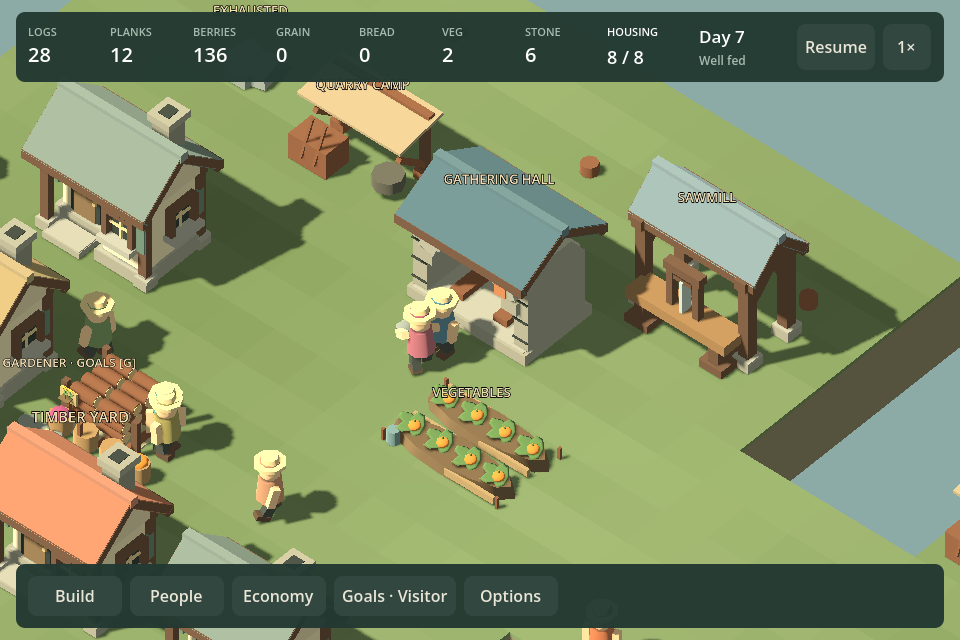
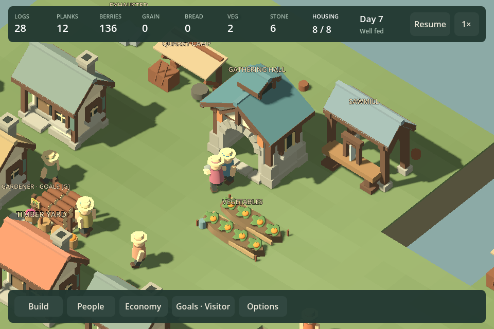
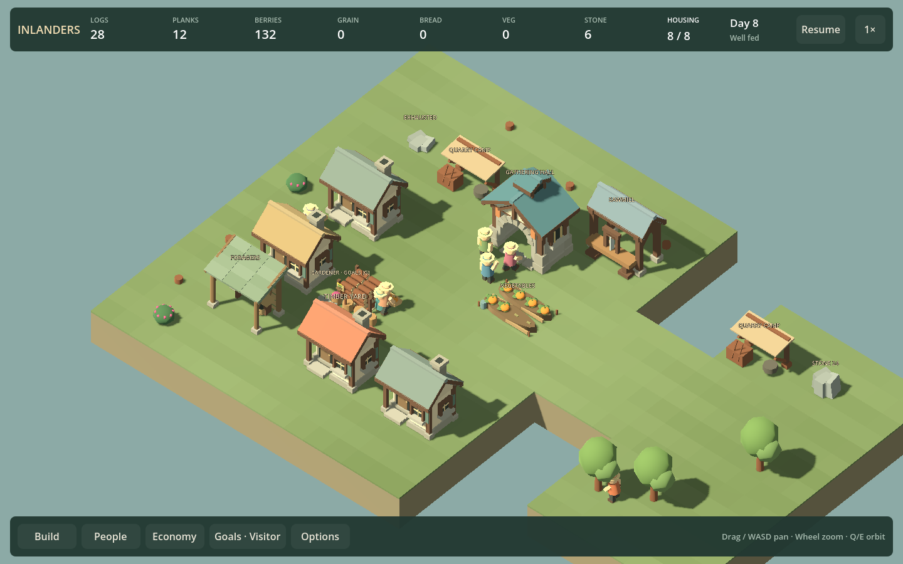
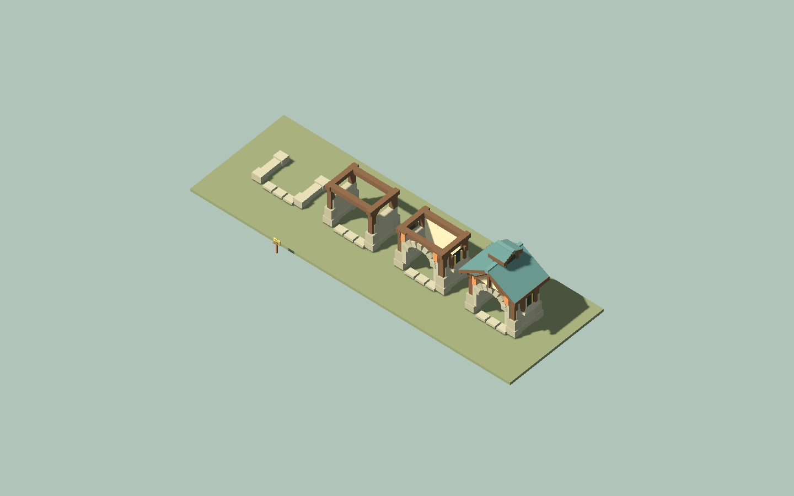

# F23b6 — gathering hall architecture

Implemented September 12, 2026. The hall now has separate stone wall feet and piers, a timber frame, recessed side lights, front/rear gables, a higher cross-oriented roof and a small roof lantern. An open arch, paired cloth panels and separate entrance stones identify its public frontage. The old interior benches were removed: visitors gather on reachable ground outside the blocked building footprint.

The model uses the existing stone/timber palette and batching. Four construction stages progress from foundations to frame, walls/arch, then roof. The hall thumbnail is framed separately to fit its taller silhouette; the first visual review caught the roof being clipped by the old thumbnail camera. Placement text now names the two-tile gathering area.

Cost remains 8 planks +12 stone, eight visitors, twelve-second visits, two-minute interval and four-minute recreation memory. Footprint, approach, simulation and saves are unchanged.

## Matched comparison

Before:

After:

Both before/after captures use the same scripted fixture and camera. The full village before view is retained at `images/f23b6-before-village-1440.png`. Agent inspection finds a more distinct public building beside homes and workshops; human aesthetic acceptance remains open.

## Verification

`Play.ps1 -HallArtSmokeTest` regenerates the normal quarry campaign fixtures, then runs the hall review. For every orientation, builders dismantle the old hall, physically recover its materials and construct a replacement. Actual recreation begins outside its footprint, paused state stays unchanged, an in-flight visit reloads exactly and then completes. The review captures both 960/1440, the completed village, four model stages and the thumbnail. Front, rear, construction and village-scale captures were inspected.

The regenerated campaign checks still complete at 420/360 seconds for two camps without/with paths and 480/480 for the distant-only route. Competing-venue recovery still passes. These are regression observations, not new human pacing claims. Build passes without warnings/errors; the known Godot root-certificate-store startup warning remains.

## Roadmap review

This closes the hall presentation slice. The dock and bridge art families remain, as do broader village aesthetic questions. Next is the existing Living woods scenario design: make timber expansion affect wildlife habitat and food choices, with preservation and mixed-food alternatives plus a recoverable clearing mistake. Prototype the actual resource/land budgets before implementing campaign progression. Do not repeat the rejected quarry reserve-only difficulty experiment or make a long timer the goal.
