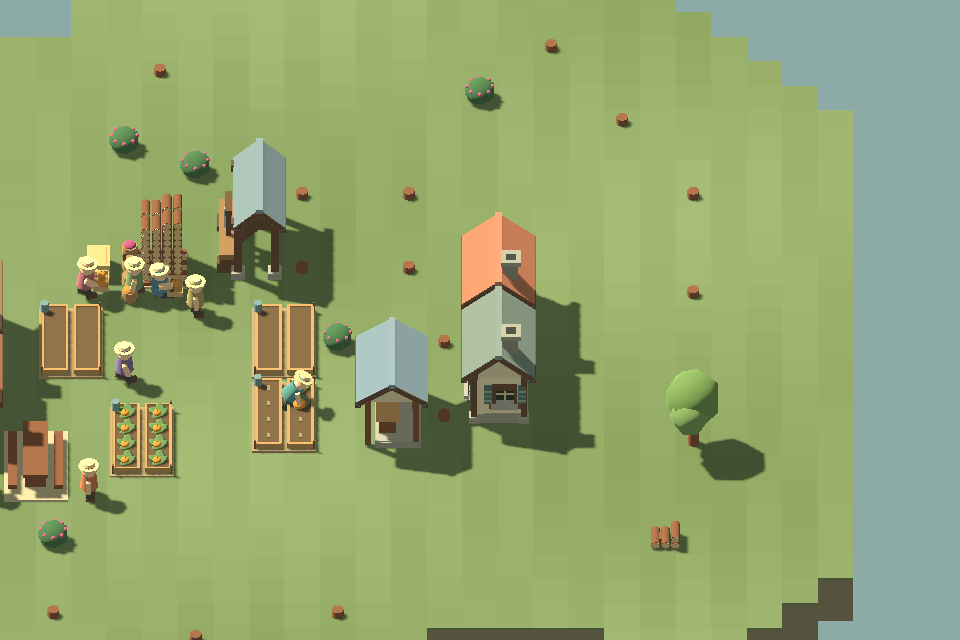
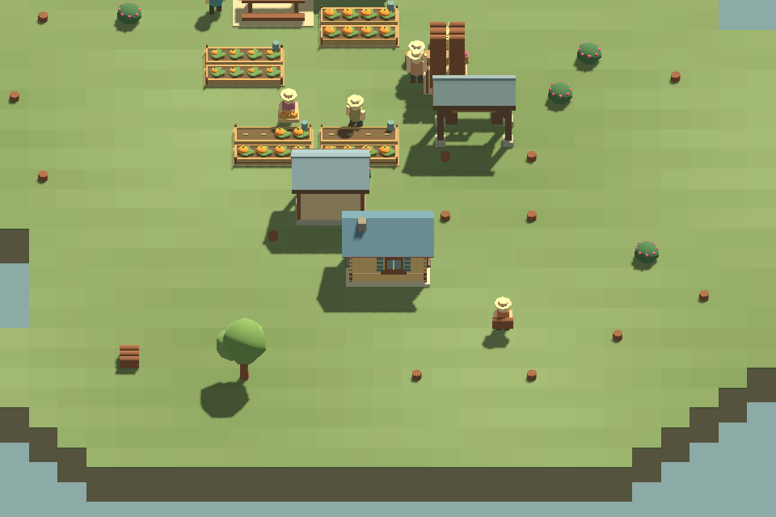

# F25b2 — comparison and visual follow-up

September 11, 2026. Keep home comfort as an optional prototype, with the existing 4/8-plank prices and 240-second rest interval. Do not make it a campaign requirement yet. The comparisons show fewer homeward trips, but no food-output gain over twenty minutes and no improvement to already reliable rest coverage. A mandatory upgrade objective would currently be a construction quota with a modest service benefit.

## Method and limits

Twenty-four deterministic runs: compact/dispersed housing × four cottages/two full lodges/three partly occupied lodges × ordinary/improved/relocated/food investment. Each housing/layout combination branches from one exact saved snapshot. Cross-housing comparisons have different setup histories, so their absolute production differences are not isolated effects of house type.

Eight residents; normal construction, timber harvesting and plank production on the flat, dry Three clearings map. Four vegetable gardens, a square, a sawmill and assigned homes are built normally. Initial berries are a finite 256-portion setup reserve. Begin measurement after construction, twelve available planks and a three-minute warm-up. Meals, work, rest and recreation continue throughout the twenty-minute measurement; project setup time is included, not fast-forwarded away. No population growth or save migration.

At the branch, one logger, one sawyer, one builder and five farmers are assigned. The improvement route temporarily changes one farmer to carpenter, then returns that person to farming when all orders finish. Four gardens have only four worker slots: the ordinary branch's fifth farmer can be idle. The food route adds a fifth garden and a pantry with target zero; producers deposit there without a dedicated hauler. This is an established village with spare labor and food, not a starvation or staffing-stress experiment.

The relocation route builds two ordinary lodges nearer the central workplaces and moves all eight residents there. Old homes remain as spare housing; no demolition refund is assumed. Changing home position also changes meal/recreation journeys, so reducing home travel alone does not prove a better overall layout.

| Choice | Additional materials | What is bought |
| --- | --- | --- |
| Improve four cottages or two full lodges | 6 logs + 16 planks | Workshop and eight improved occupied beds |
| Improve three partly occupied lodges | 6 logs + 24 planks | Workshop and twelve improved beds, only eight occupied (4/2/2) |
| Relocate | 24 planks | Two four-bed ordinary lodges; old housing retained |
| Food investment | 10 logs | Fifth vegetable garden and a local pantry |
| Ordinary | None | Keep current homes and resources |

These are competing uses within the comfort investment envelope, not artificial equal spending. Two logs produce four planks; material cost alone is 14 log-equivalents for full occupancy comfort, 18 for partial lodges, 12 for relocation and 10 for food infrastructure. Processing, delivery and worker time also matter. The baseline already owns its sawmill; a village without one pays extra.

Travel numbers below are summed villager-seconds, not elapsed time. Home travel counts the trip **to** rest, not every subsequent journey. Direct project labor counts construction material trips/building and comfort pickup/delivery/installation; it excludes timber harvesting and sawing. Do not interpret it as complete labor cost or compute payback by subtracting it from homeward travel. The output is vegetables delivered during the window, not final inventory or crops still growing. Ten-minute output, visits, coverage, hunger, meal outcomes, remaining stocks and exact final saves are retained in the generated JSON.

## Results

| Layout / homes | Choice | Setup seconds | Delivered vegetables / 20m | Homeward travel | Meal travel | Recreation travel | Direct project labor |
| --- | --- | ---: | ---: | ---: | ---: | ---: | ---: |
| compact / cottages | ordinary | 0 | 328 | 337 | 730 | 1044 | 0 |
| compact / cottages | improve | 448 | 318 | 273 | 796 | 1027 | 236 |
| compact / cottages | near-homes | 226 | 328 | 258 | 688 | 1047 | 118 |
| compact / cottages | food | 287 | 336 | 371 | 578 | 962 | 125 |
| compact / lodges | ordinary | 0 | 330 | 284 | 642 | 960 | 0 |
| compact / lodges | improve | 281 | 322 | 212 | 668 | 930 | 193 |
| compact / lodges | near-homes | 192 | 334 | 309 | 616 | 918 | 102 |
| compact / lodges | food | 217 | 362 | 396 | 498 | 853 | 114 |
| compact / spare-lodge | ordinary | 0 | 332 | 303 | 724 | 1044 | 0 |
| compact / spare-lodge | improve | 453 | 324 | 286 | 734 | 1048 | 272 |
| compact / spare-lodge | near-homes | 222 | 318 | 325 | 762 | 1072 | 138 |
| compact / spare-lodge | food | 242 | 346 | 395 | 460 | 915 | 130 |
| dispersed / cottages | ordinary | 0 | 326 | 544 | 706 | 714 | 0 |
| dispersed / cottages | improve | 570 | 322 | 464 | 725 | 729 | 306 |
| dispersed / cottages | near-homes | 223 | 304 | 316 | 686 | 939 | 139 |
| dispersed / cottages | food | 219 | 362 | 520 | 616 | 656 | 112 |
| dispersed / lodges | ordinary | 0 | 332 | 512 | 720 | 711 | 0 |
| dispersed / lodges | improve | 450 | 326 | 412 | 688 | 739 | 266 |
| dispersed / lodges | near-homes | 175 | 344 | 252 | 483 | 750 | 123 |
| dispersed / lodges | food | 212 | 356 | 480 | 543 | 633 | 114 |
| dispersed / spare-lodge | ordinary | 0 | 328 | 538 | 701 | 738 | 0 |
| dispersed / spare-lodge | improve | 727 | 324 | 439 | 691 | 744 | 396 |
| dispersed / spare-lodge | near-homes | 231 | 312 | 272 | 649 | 963 | 129 |
| dispersed / spare-lodge | food | 225 | 352 | 488 | 559 | 613 | 112 |

## Decision

- Ordinary homes remain viable. All routes retain full recent-rest coverage, with no hunger, missed or skipped meals in this supplied fixture. There is no rest-coverage deficit for comfort to solve in these supplied villages.
- Comfort reduces homeward travel but does not increase twenty-minute vegetable deliveries. It takes several minutes to finish the neighborhood; twelve improved beds occupied by only eight people cost 50% more planks for the same population.
- A new garden/pantry improves food output in these runs. Relocation can reduce homeward travel much more than comfort, but can also move residents farther from recreation and lower output. Compare the whole daily routine before calling a site better.
- Keep the current numbers provisional. Do not add a productivity multiplier, higher happiness ceiling, upkeep or another need to manufacture demand. F25b3 should ask whether the visual home improvement and fewer journeys are enjoyable enough to retain; otherwise revise or cut it. Defer the dedicated home-comfort scenario.
- Next implementation: F21l, readable campaign goals. The level-6 player question is direct evidence that abstract service counters are hard to act on. Compact progress, an obvious next action, and optional explanations/links should precede another mandatory system or longer scenario.

## Visual review and change

The first four-direction capture exposed a front-only marker: rotating the camera hid all evidence of an improvement. Improved cottages now carry matching shutters around their existing side/rear windows. Improved lodges also gain side/rear windows with the same treatment. Fixed pieces are batched inside the comfort detail node; footprints, simulation rules and earned rest remain unchanged. The actual cushioned rest pose is retained.

The rerun captured ordinary/improved cottages and lodges at 960/1440 from four directions, with unchanged paused saves. Side and rear captures were visually inspected. These details can now be seen from those directions, though shadows and distance still reduce contrast. This is not acceptance of the whole building family or a claim that the art now satisfies the player.

## Reproduce

Run `./Test.ps1 -ComfortComparison`, then `./Play.ps1 -ComfortReviewSmokeTest`. The simulation command validates every tick, requires each project to finish and checks exact save roundtrips. It reports measured outcomes without asserting that an upgrade must win. Outputs are ignored `artifacts/comfort-*.json`; rendered comparisons are `artifacts/comfort-review-*.png`. The compact cottage/lodge snapshots are the inputs to the visual review, not hand-built decorative fixtures.
