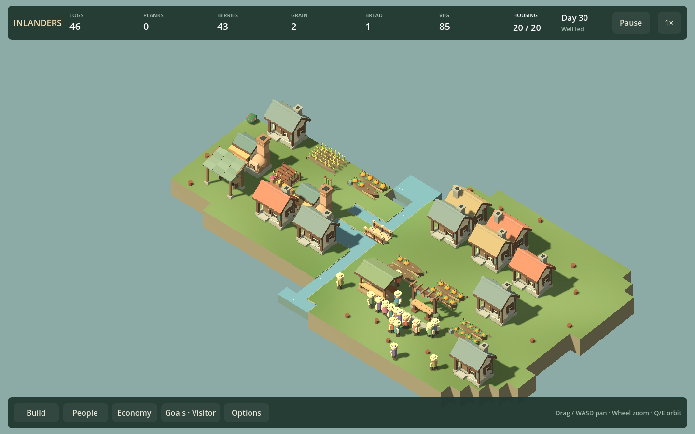
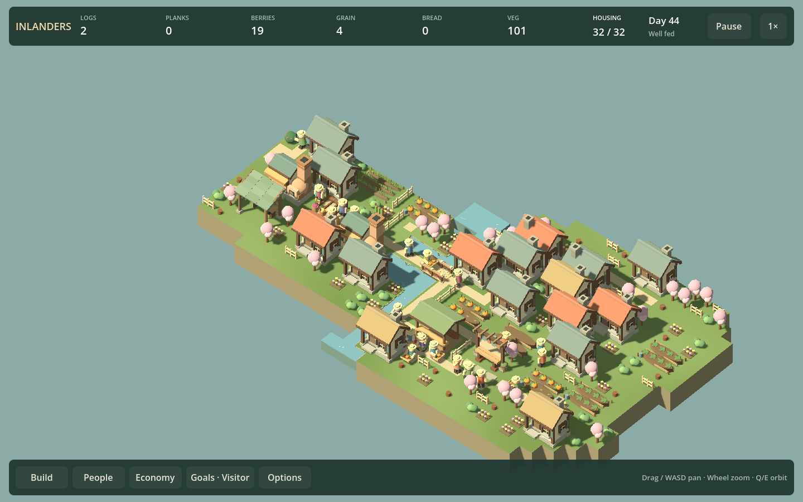

# Larger-village performance — F23c2

September 12, 2026. **Shipped a bounded decoration batching improvement.** A normal 20-resident village has roughly 11 ms median frames in this short local profile. The decorated 32-resident fixture has roughly 19–21 ms medians after the change. These results do not establish a population ceiling or sustained 60 FPS. Intermittent long frames remain unresolved and become F23c3.

## Representative fixtures and measurement

Both fixtures use normal simulation on the 36×22 finale map. The baseline has 20 residents and 22 buildings. The dense fixture starts from the saved 22-resident route, builds additional housing and two gardens with actual materials/workers, invites residents to reach 32, assigns additional farmers/haulers, and advances production. It has 30 buildings, 51 path cells and 104 accepted decorations. Paths come from actual worker routes; decoration placement uses normal access checks. No Creative-mode needs exemption or fake population counter is used.

The initial snapshots are preserved under `artifacts/large-village/ordinary.json` and `dense.json`. Generate their upstream campaign saves with `./Test.ps1 -FinaleCampaign` when absent, then run `./Play.ps1 -LargeVillageSmokeTest`. The profiler regenerates both benchmark snapshots before measurement.

Hardware/software: Intel Iris Xe Graphics, Godot 4.6 GL Compatibility, local Debug build, 1440×900 window, orthographic size 32, daylight, world labels hidden, frame sync disabled and Engine.MaxFps=0. The camera starts at (3, terrain height, 3), angle 0.72; orbit uses 0.3 radians/second. Ordinary game frame-sync preferences are restored on exit.

Each condition has 30 settled frames followed by 180 samples: frozen rendering, live 1x, live 4x, orbit 1x and Economy-open 1x. Normal `_Process` is suspended during the harness. It reproduces the capped-delta simulation accumulator, scene updates, HUD and audio while timing their CPU sections independently. The rest of the frame includes engine/layout/render/driver/wait work; it is **not** a direct GPU timing. Autosave and user input processing are outside these measured sections. Frozen rendering does not update simulation, actors or UI.

Scene adoption CPU and time through the first displayed frame are separate from steady samples. Economy opening is also timed separately. Each run replays the exact recorded tick count into an independent saved world and requires byte-identical simulation state. These are short diagnostic windows, not a long-session benchmark. Cargo and assigned routes are present in the dense fixture and in the baseline's 4x run; the report's cargo/moving fields count person-frame occupancy, including stationary saved routes in frozen samples.

## Evidence and targeted change

Hiding only decorations in the frozen dense scene reduced median frame time from 18.3 to 14.5 ms and draw calls from 3802 to 3085. Hiding the empty decoration layer in the baseline changed no draw calls. This isolates a real decoration cost without claiming it explains all remaining frame time.

Fixed non-fence ornaments now batch by material within 8×8-cell regions. Existing individually batched meshes can be combined inside those regions; other callers retain the previous primitive-only batching behavior. Fences remain separate because placement previews hide/replace neighboring fence bodies. Regions retain bounded culling areas rather than combining an entire map into one mesh. Rebuilds still follow the existing decoration revision; no new per-frame mesh generation is added.

The fixture's decoration meshes fall from **312 to 160**. All **67,452 triangles** remain, and the isolated before/after image comparison finds **zero channels differing by more than 4/255**. Saved simulation state remains identical. Frozen whole-scene draw calls fall from **3802 to 3482**. Ground colors, dimensions, collision/access rules, prices and actual quantities are unchanged.

| Condition | Before median ms | After median ms | After p95 ms |
| --- | ---: | ---: | ---: |
| 20 residents, frozen | 9.13 | 9.18 | 12.81 |
| 20 residents, live 1x | 10.34 | 10.94 | 13.94 |
| 20 residents, live 4x | 11.22 | 11.29 | 14.76 |
| 20 residents, orbit | 10.86 | 10.90 | 13.99 |
| 20 residents, Economy | 11.40 | 11.75 | 15.45 |
| Dense 32 residents, frozen | 18.95 | 17.07 | 22.16 |
| Dense 32 residents, live 1x | 20.40 | 18.66 | 23.69 |
| Dense 32 residents, live 4x | 22.06 | 19.51 | 28.86 |
| Dense 32 residents, orbit | 20.72 | 21.06 | 28.14 |
| Dense 32 residents, Economy | 22.61 | 20.71 | 25.97 |

The draw reduction is deterministic; wall-time differences are noisy. The orbit case did not improve in the final run, so this is not a claim of a uniform speedup. An earlier post-change run had a 19.5 ms dense orbit median. Retain the raw distributions rather than selecting only favorable runs.

Dense live scene preparation typically takes about 1 ms and HUD updates about 0.8 ms; most frames have no fixed simulation tick. Larger tick and scene-update outliers remain visible in the reports. Single Economy-opening observations were 75 ms through the next frame in the baseline and 32 ms in the dense case, illustrating why these one-off samples cannot rank general menu performance. Scene adoption itself is roughly 65–100 ms CPU in the final run, with several hundred milliseconds through the first displayed frame.

[Before](LARGE_VILLAGE_BEFORE_F23C2.json), [decoration isolation](LARGE_VILLAGE_ISOLATION_F23C2.json), and [final after results](LARGE_VILLAGE_AFTER_F23C2.json) include medians, p95, maxima, counts and settings. An intermediate post-change run showed the same mesh reduction and similar typical times. Long outliers persisted: the final dense 4x maximum was 874 ms, with an earlier post-change run reaching about one second. Batching does not resolve or explain those stalls.

## Verification and remaining work

The profile's exact continuation and save checks pass in every condition. The geometry/image comparison passes. Existing decoration UI checks now verify retained triangle counts across reload and reduced geometry after removal, rather than assuming one root node per decoration. Build passes with zero warnings/errors; Godot emits its existing certificate-store warning.

Full HUD, connected-fence and decoration-brush regressions pass for the affected editing/preview behavior. No simulation production code changed. The profiler and screenshots do not certify long-term food balance for 32 residents, maximum supported population, or other hardware/renderers.

**F23c3 — diagnose intermittent long frames** is next: replay the same working fixture for longer cold/warm runs, correlate stalls with simulation ticks, actor/food geometry rebuilds, allocations/GC and render submission. Distinguish reproducible game work from host/driver noise before changing architecture. Make one supported correction if possible; retain an unresolved measurement if the cause cannot be isolated. Do not use lower averages to claim the stalls are solved. F10b2 listening review and F17b music remain queued.
