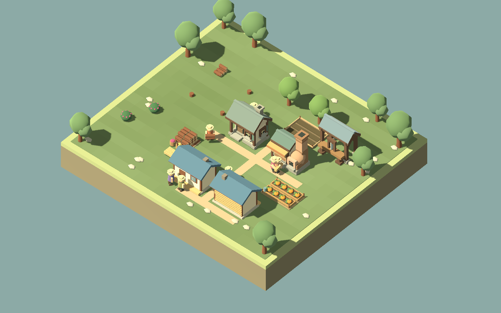
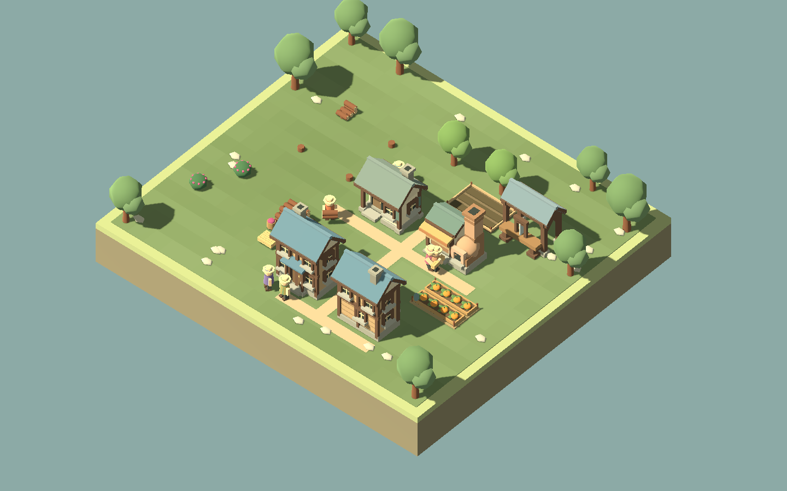

# F23b1 — a shared home with a loft

The lodge used the legacy cottage body with a second roof layered over it. Beside the newer cottage it looked smaller despite housing twice as many residents. This focused slice gives it a taller timber frame, two rows of recessed windows, a thick blue-gray roof, stone feet, and a central sheltered entrance. The completed home uses its own geometry through all four construction stages.

| Before | Lodge slice |
| --- | --- |
|  |  |

These captures use the same Creative village, simulation sequence, 1440×900 viewport, camera and hidden labels. One lodge faces forward and one backward. The lodging silhouette is taller while its six-tile footprint, four beds and twelve-plank cost remain the same. Entrance routing and rest behavior are unchanged.

Ordinary lodge windows have simple exposed frames. Actual completed comfort improvements add paired shutters to the loft on all four sides; the upgrade no longer draws floating windows at the old wall positions. Cottage treatment is unchanged.

## Review and verification

`./Play.ps1 -ArtSmokeTest` renders the working village at 960/1440 from four directions, all construction stages, and close ordinary/improved lodge views. It also exercises existing bakery/sawmill buffer and pause behavior. Captures are written to `artifacts/f23b1-lodge-*` and `artifacts/f23a-*`.

Build, art smoke, and home smoke checks pass. The home check covers actual paused rest, resident/home inspection, spare-bed reassignment and saved state at 960/1440. No simulation or save-format change was needed.

The lodge now reads as a larger shared house at the village camera. Human aesthetic acceptance is still open: judge whether its extra height feels appropriate, whether its window rhythm is too regular, and whether the shared entrance remains obvious. More geometry is not the goal. The next proposed family slice is a forager shelter; defer a wholesale family replacement until this direction gets feedback.
