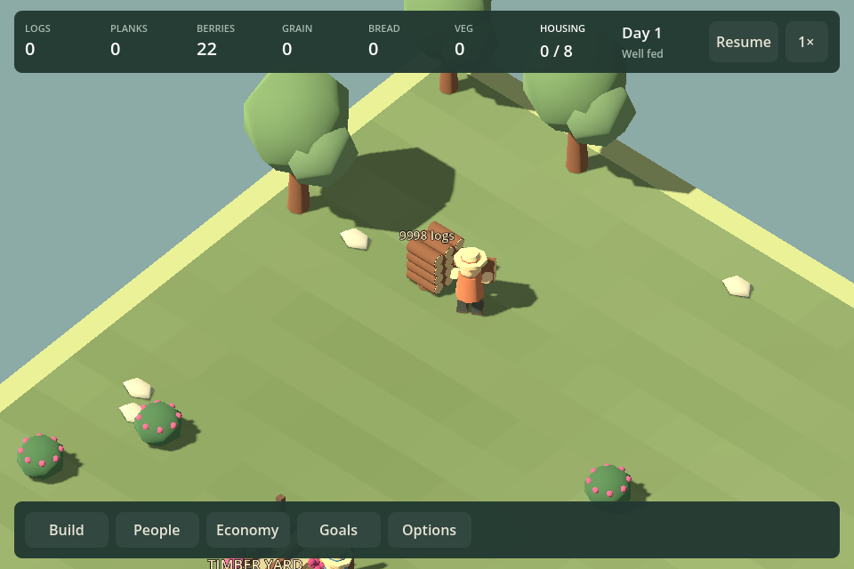
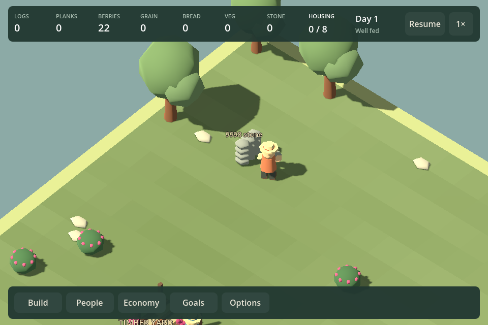

# F23c1 — bounded loose timber and salvage

Implemented September 12, 2026. Loose logs, recovered planks and recovered stone now display at most twelve pieces, batched by material. Piles above twelve have an exact quantity label using the existing world-label system. Ordinary eight-log trees retain their arrangement, felling transition and stump.

The cap affects rendering only. Simulation stock, cargo, reservations, pickup access and clearing rules are unchanged. Above-cap collections update the quantity label without rebuilding geometry. Crossing down to twelve removes the label and resumes one-piece-per-unit display. Collected salvage disappears; a collected tree retains its stump until cleared or replanted.

## Evidence

`Play.ps1 -LooseStockSmokeTest` builds accounted fixtures for a felled tree and log/plank/stone salvage. Each 10,000-unit source has no more than four immediate display nodes, with mesh bounds below 1.2 tiles high. A real logger collects two units; source stock becomes 9,998, cargo matches its material and the display retains identical node identities while the label updates. Paused and in-flight saved states remain exact.

Separate fourteen-unit sources cross the label threshold and drain through actual work. All fourteen units arrive at central storage. Salvage nodes disappear; the ordinary tree has only its stump, which is then cleared through normal work. Captures cover 960/1440. This is bounded source-rendering evidence, not a whole-village frame-rate claim.

Existing logging and clearing rendered checks also pass: axe contact, pause-aware fall, fall-to-pile transition, reload without replay, preservation interruption and ordinary clearing controls.

## Roadmap review

The source towers observed during the storage review are resolved. Both stored and loose high reserves now have bounded presentation. Human visual feedback remains open; the cap and label do not establish aesthetic acceptance of the rest of the village.

Next is an F11/F18 challenge experiment on the quarry scenario. The current six-to-eight-minute competent runs leave the starter economy largely untouched. Compare constrained starting reserves and production/labor choices, preserve two viable source routes and saved recovery, and measure actions and service failures. Adopt only changes that create decisions; do not inflate proof windows or stone quotas merely to prolong play. Hall/dock/bridge art remains in the backlog.
