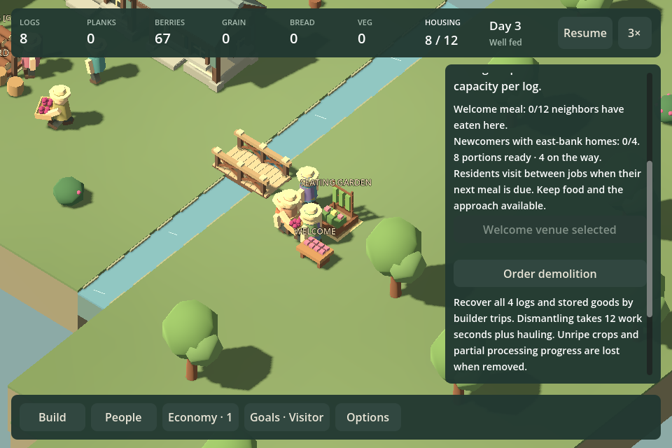

# F27a — a place across the river

In progress. This is the complete gameplay experiment from the [strategic reset](STRATEGIC_REVIEW_8.md), not a new sequence of small campaign patches. It counts as one playable outcome only after the full start → commitment → shortage/recovery → inhabited payoff works through the UI.

## Design decision

Current work-order decision: [hunger experiment and synthesis](NEIGHBORHOOD_HUNGER_EXPERIMENT.md). Removing the global slowdown did not stabilize alternative food production. Keep the welcome introductory, stop incremental balance iteration, and test F27b's whole-scene village-making experience next. This does not accept F27a or waive its unobserved ordinary play/recovery requirements.

Latest evidence changes the next step: [authored spatial alternative and recovery findings](NEIGHBORHOOD_LANDSCAPE_F27A.md). The welcome can finish before food failure. Treat the implemented event as introductory, and test the global hunger slowdown/shared labor restrictions before claiming two viable replacement food strategies. Earlier intentions below are hypotheses still being tested, not acceptance criteria satisfied by mechanical completion.

A bounded independent game-designer review recommended making expansion a commitment and the welcome an actual activity. Existing `BeginSupper` is unsuitable unchanged: it deducts central bread immediately and globally redirects the village. Existing Automatic workplace behavior is also insufficient: it chooses a workplace within an assigned profession, while Unassigned residents do no work. Renaming either system would preserve the rejected design.

Start from the eight-person west hamlet and author two credible eastern sites: a compact landing with short access to existing supplies and a larger meadow farther away. All buildings remain available. Do not mark compulsory building plots or require a pantry, bakery or particular recreation identity.

One action welcomes four neighbors after a visible journey, initially 90 simulated seconds. Require a reachable eastern arrival destination, not a food-reserve or service gate. Show the commitment clearly before activation. The residents arrive even if preparation is incomplete; homelessness and food shortage need recovery rather than restarting a certification window. Four arrivals and 90 seconds are experiment values, not established pacing.

The objective is housing the arrivals and sharing a welcome meal at an eastern recreation venue chosen by the player. Use any edible foods. Helpers physically transport portions to a visible display; attendees walk over and eat. Normal routines continue during preparation. Delivered supplies persist until used or physically recovered if the venue is removed. A food shortage delays the welcome rather than resetting progress. Completion must not require every villager to occupy a seat simultaneously; attendance can accumulate through the actual activity. Explain a blocked participant/route locally.

Test two plausible strategies: landing homes with directly edible production, and a meadow grain/bakery chain. Their differences must follow from space, construction, labor and journeys, not regional bonuses. Exercise an early arrival commitment with inadequate food capacity, then recover through direct food/labor changes and separately through improved production location. No injected famine or hidden winning recipe.

Shared residents must actually pick work across professions in this experiment. Building controls offer visible worker slots, a shared default, optional dedicated workers and a concise current obstacle. Releasing a dedicated resident restores shared work. Food/construction starvation and the risk that automation removes every labor decision both need testing. Preserve the current baseline for comparison; no automatic campaign-wide rule rollout.

## First implementation — local grain foundation

The local-grain comparison factory now allows a farm to retain up to twelve physically harvested/delivered grain. Bakers reserve two at a reachable source selected by the combined worker → source → oven journey, with central storage still available. Full farm stores send additional harvested grain centrally. Stock, incoming baskets, reservations and oven input are separate conserved quantities. Grain remains inedible.

This is deliberately enabled only by `World.NewLocalSupplyExperiment()` for development comparisons. The ordinary river campaign retains its central route. It is **not the complete neighborhood scenario**, and no new campaign/menu entry presents it as such yet.

Interrupting a farmer returns carried grain physically; interrupting a baker releases the claim. Farm demolition cancels incoming/pickup claims and builders recover stored grain through real trips. Cancellation and original-world versus one-reload continuation are checked. Existing production diagnostics identify the actual farm source. Current save version is 41; no migration is provided.

Focused command:

```powershell
$env:DOTNET_ROOT = Join-Path $PWD '.tools/dotnet'
$env:DOTNET_CLI_HOME = Join-Path $PWD '.tools/dotnet-home'
& .tools/dotnet/dotnet.exe run --project Tests/SimulationTests.csproj -- --local-grain
```

`Tests/LocalGrainChecks.cs` verifies actual farm delivery and baking while central grain is zero, competing bakers, source feedback, interruptions, capacity overflow, demolition/cancellation, malformed-save rejection and exact continuation from active deliveries/pickups. It also runs the baseline central chain. Generated pickup/baked states are in `artifacts/local-grain`. These checks establish mechanics, not enjoyable layouts or pacing.

Verification: the existing full `Test.ps1` simulation suite passed. After the final local inventory/route-label adjustments, the focused command passed local-grain, existing economy and existing supply-route checks. The final game build passed with zero warnings/errors. No rendered or native playtest is claimed for this foundation; full player-facing integration remains below.

## Shared staffing foundation

`World.NewSharedWorkExperiment()` enables a real shared pool alongside local grain. Residents claim existing profession jobs, retain that profession during work and delivery, then return to the pool. Meals and breaks continue normally. Assigning a profession dedicates the resident; assigning Unassigned releases them back to shared work in this experiment. Named workplace assignments retain their exclusive slots. Ordinary campaign staffing remains unchanged.

The initial policy prioritizes food below three portions per resident, limits concurrent food roles to roughly half the population and each profession to roughly a third, then tries construction and supporting production. Shared logging keeps a modest reserve rather than harvesting indefinitely. These are provisional scheduling choices, not validated balance. The complete scenario must still demonstrate meaningful staffing choices and recoverable shortages; automatic completion of this test does not establish that.

`--shared-work` runs the new staffing checks plus existing local-grain and workplace-assignment checks. Verified actual bridge/workplace construction, logging, local bread production, residents changing professions, dedication/release and exact original-versus-reload continuation. The game builds without warnings, and the full existing `Test.ps1` simulation suite passed. Arrivals and welcome activity are still outstanding; this foundation does not advance the playable checkpoint.

## Remaining work in the same F27a outcome

- Normal menu entry, dedicated saves and neighborhood Goals are implemented. Review start/completion clarity through ordinary play.
- Test shortage/recovery and labor agency in the complete scenario; newcomers now join the shared pool.
- Compare the implemented welcome activity in both economic layouts, including natural shortages and recovery.
- Author and compare the landing/meadow decisions; check precise placement refusals and world/context feedback during play. The alternative and original river level are now accessible from the experiment menu.
- Demonstrate two real strategies and two recoveries, validate changed saves/claims and use ordinary UI play. Record decision opportunities, panel dependence and time spent waiting, separating tool overhead from pacing.

F27b remains the separate whole-scene art experiment, but F27a still needs enough visible activity and contextual feedback to test its own gameplay honestly. Do not ship a simulation-only comparison as the promised playable alternative. The next periodic whole-project review remains checkpoint ten.

## Building staffing controls

The experiment's workplace inspector now shows dedicated slots, current workers and the village-wide shared pool. **Dedicate worker** takes a shared resident (preferring someone already working here), preserves physical cargo recovery, and reserves a slot at this building. **Release to shared** releases a resident dedicated here. Full slots and an exhausted shared pool disable dedication with a reason; this never takes another building's dedicated resident. Storage buildings retain visiting shared haulers and their supply-target controls.

The developer fixture is available with `./Review.ps1 Inspect shared-work`. It is explicitly the staffing foundation, still using the old river objectives; it is not the completed neighborhood scenario. `./Review.ps1 Capture shared-work -Width 960 -ProbeControls` exercises the normal rendered buttons and captures dedicated/released states. The equivalent 1440-wide command checks the larger window. This reuses T01 with one catalog entry and a small targeted probe; no new testing framework was needed.

Focused staffing/local-grain/assignment tests passed, including capacity refusal without mutation and release through the building API. Rendered scripted checks cover dedication, changing slot/pool counts, release and disabled release at zero assignments. The 960-wide capture was visually inspected: both buttons and staffing explanation fit. These are scripted UI checks, not a native playtest or evidence of fun. The next implementation is committed arrivals and the physical welcome activity; F27a remains one unfinished playable outcome.
## Committed arrivals

`World.NewNeighborhoodExperiment()` now owns separate saved progress with no old river assessments or central-bread supper. `./Review.ps1 Inspect neighborhood` opens this unfinished scenario. The People panel offers one **Welcome four neighbors** commitment after a crossing reaches a clear eastern landing. The simulation API accepts a chosen eastern cell; the initial UI chooses the clear reachable cell nearest the landing. Direct destination selection and authored landing/meadow differentiation remain integration work.

The commitment requires neither spare beds nor a food reserve. Ninety simulated seconds later, four shared workers enter at the yard and walk across to the landing. Existing home allocation, meals and work apply. If the landing has since closed, the newcomers still enter at the yard; access is recoverable. This is a countdown followed by an actual crossing journey, not a rendered off-map caravan. Arrivals cannot be repeated, and completion still awaits the physical welcome activity.

`--neighborhood` passed real shared bridge construction, commitment with no spare beds and an inadequate food reserve, repeat refusal without mutation, exact save continuation through countdown/arrival, four shared newcomers, visible crossing tasks and eventual arrival. It also runs the shared staffing checks. Current save format is 41; no migration. Scripted rendered probes cover the commitment button, paused countdown, newcomer actors/roster and housing/status feedback. The 960-wide capture was inspected; no native play or pacing acceptance is claimed.

Tooling observation: the first rendered arrival probe took about 80 seconds including a build and physical bridge preparation. This is materially slower than T01's warm screenshots; separate a prepared arrival fixture if repeated reviews need it. Do not generalize the runner solely for this one probe. Next is the physical food transport/gathering and full scenario integration, followed by strategy/recovery comparisons. Count remains 8.
## Physical welcome meal

A selected eastern Square, Seating Garden or Gathering Hall now holds physical welcome portions. Shared workers and dedicated haulers reserve edible food at central/local pantries, carry it to the venue, and leave it on a visible table. Preparations can start before arrivals. The target covers one portion per participant and accounts for stock, incoming baskets, carried meals and completed attendees. Normal meals retain first access to unreserved food; the gathering does not freeze the village or instantly deduct central bread.

After arrivals, residents favor the chosen venue for their next ordinary meal if a portion and venue slot are available. They walk, collect, carry to an available nearby seat and eat. Attendance accumulates once per resident after consumption; everyone need not sit simultaneously. Missed meal windows can return a carried portion through the existing physical recovery, but never erase attendance. The experiment completes when all twelve have shared the welcome and the four newcomers have east-bank homes. Neither condition uses a recent-history assessment.

The selected-building inspector offers **Prepare welcome meal here**, stock/incoming/attendance counts and actionable food, access and housing feedback. The display shows actual stored portions. Venue changes retain earned attendance; old stock is drained by haulers. Demolition releases active claims and builders recover food in physical trips. Source/route labels identify a welcome table rather than misnaming it a pantry.

Focused checks (`--welcome-meal`) cover real preparation, persistent stock before arrival, two venue capacities (garden and square), actual eating, completion only after newcomer homes, original/reload continuation, pickup interruption and demolition/replacement. Existing pantry checks cover each edible kind. Prepared/complete evidence is generated under `artifacts/welcome-meal`. These checks are not the two materially different economic strategies or natural-shortage recovery experiment still required for F27a.

`./Review.ps1 Inspect welcome-meal` reaches a physically prepared crossing/venue without rebuilding them in the game process. Rendered control probes select the venue, observe delivered food and accumulate twelve attendees. The first 960-wide capture exposed clipped selected-button text and poor ordering behind demolition; both were corrected. The final verification record is below. Whole-scene art, ordinary uncoached play and pacing acceptance remain outstanding. The current ordinary meal cadence may make distant venues slow; compare this before scaling the design.



Final verification: full existing simulation suite passed; after final welcome feedback/validation changes, focused welcome, arrival and all six pantry checks passed. Game/test builds passed with zero warnings. Final rendered probes passed at 960 and 1440 pixels, including venue selection, visible supplied stock and twelve actual attendees. Both corrected table/inspector captures were visually inspected. Review-owned capture processes exited successfully. No native playtest or listening claimed.

## Normal game entry and objectives

Latest design evidence: [six-arm comparison](NEIGHBORHOOD_COMPARISON_F27A.md). Existing berries support both layouts without hunger; extra food infrastructure is not needed for completion. The next task is the authored spatial alternative and labor/travel evidence, with explicit reconsideration of the logistics premise if it remains irrelevant. Normal integration below establishes access, not acceptance of the design.

The main menu now offers **Neighborhood experiment**, with New/Resume and **Play original river level** for comparison. New starts paused on the neighborhood Goals panel. It explains shared work and local grain, offers the one arrival commitment, and links to home placement and the selected (or an available eastern) gathering place. The old central-bread supper controls, campaign selector and percentage bar are hidden in this mode. Squares describe their welcome role. Completion saves once and leaves the village playable.

The experiment uses `saves/neighborhood.json`; Continue, F5/F9, autosaves, restart and menu return follow that mode. Switching to the campaign stores the experiment separately instead of capturing it as the standalone supper. Review runs redirect this path into their own session folder.

Rendered menu-flow checks exercise New, visible objectives, disabled commitment before a crossing, Continue, restart, F9, original-river entry and Resume without changing the saved world. The existing staffing and arrival probes then continue in the resumed experiment. This is scripted control evidence, not an uncoached playtest.

Remaining F27a work is now predominantly design validation: authored landing/meadow choices, two materially different economic strategies, natural mistakes with alternative recoveries, and ordinary UI play. Do not increment checkpoint 9 merely because every component has an entry point. The whole experiment still needs evidence that its choices are understandable and worth making.
Integration verification: the full scripted menu/save/baseline round trip and resumed staffing/arrival checks passed at 960 pixels. After final wording and keyboard registration changes, game/test builds passed without warnings and a fresh opening Goals capture verified visible objective/actions. A reusable neighborhood-complete fixture physically constructs homes and serves the welcome before rendering the completion view. This avoids replaying the 236-second comprehensive UI flow for each text/layout check. No new simulation rules or save migrations were introduced in this integration chunk.
