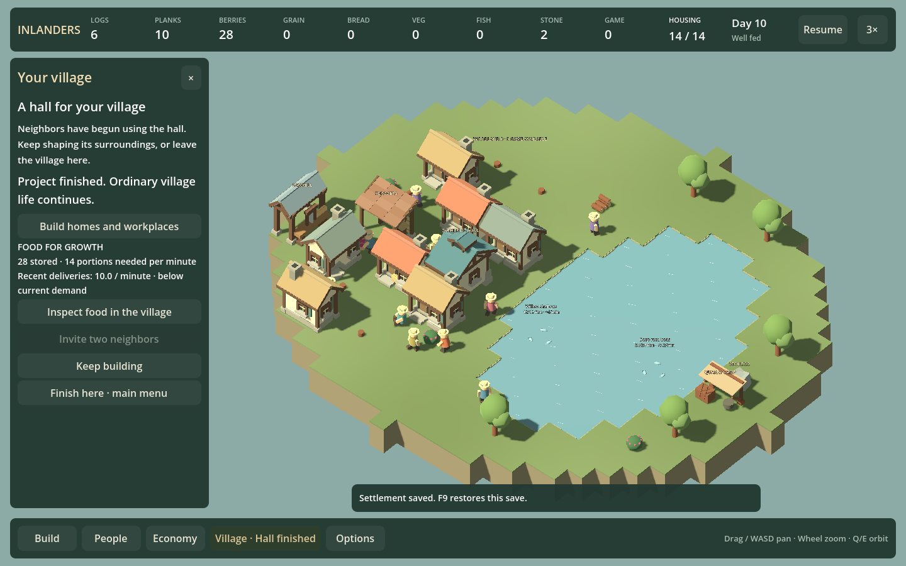
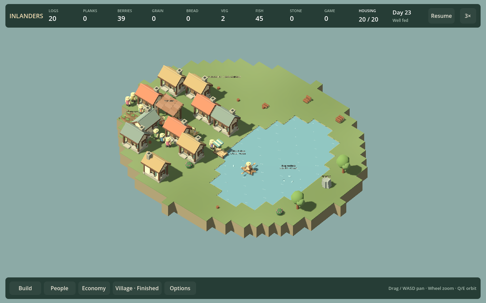
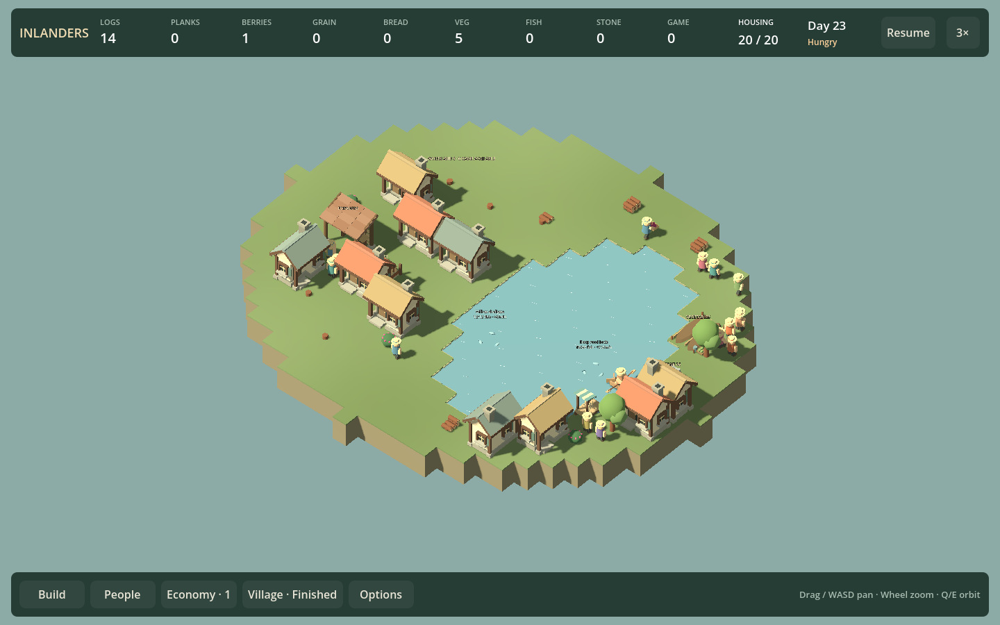

# F31e — growth creates a real food and location decision

September 13, 2026. Base `8c184ab`, plus this chunk. Retain optional larger-village growth: twenty residents outstrip the tested inherited food supply, while a compact garden-and-dock expansion stays fed. The same catalogue dispersed across the lake performs worse. This supports food capacity and neighborhood location as player decisions; it does not establish a difficult campaign or an enjoyable long-term loop.

## Delivered

The founding Village panel keeps its invitation button after founding and hall completion. Beside the invitation, it shows actual stored food, current population demand, and recent producer deliveries per simulated minute. Below-demand history is identified without predicting starvation or disabling an otherwise valid invitation. A button opens the existing food view for storage locations and routes. Existing bed/meal/arrival rules still apply; no twenty-person quota, new objective state, save migration or completion timer.

Delivery history is the existing rolling180-second food-flow data; rates appear after60 seconds. Transfers between stores are excluded. Tooltips distinguish historical deliveries from forecasts and timely access. A full store can temporarily suppress production, so a low observed rate is evidence to inspect, not proof of failure.

## Four-arm comparison

`--neighborhood-growth` starts each arm from the same normally founded twelve-person village and runs1200 simulated seconds. Growth arms order four cottages, then invite when the ordinary API allows. Mixed arms also order one garden and one fishing dock. Home placements are identical between homes-only and compact mixed; the dispersed arm uses the same catalogue on the opposite bank. No resources, needs or work rates are changed.

| Arm | First fully settled, seconds | Unfed person-seconds | Unfed, final300 seconds | Meal walking distance | Waiting, final300 seconds | Final food |
| --- | ---: | ---: | ---: | ---: | ---: | ---: |
| twelve-control | 0.1 | 0.0 | 0.0 | 351.7 | 62.4% | 34 |
| twenty-homes | 112.2 | 7630.4 | 2662.1 | 1444.3 | 71.7% | 2 |
| twenty-mixed | 112.3 | 0.0 | 0.0 | 912.6 | 61.2% | 86 |
| twenty-dispersed | 183.4 | 352.7 | 217.0 | 6264.5 | 41.8% | 6 |

All growth arms reach twenty housed residents. Homes-only passes the one-time settled condition in112 seconds and subsequently suffers substantial hunger: a first meal must not become a claim of sustainable supply. Compact mixed stays fed throughout. Dispersed mixed has roughly6.9 times its meal travel and some hunger. Waiting is observed `Work.Waiting`, not a complete measure of spare productive capacity; nonetheless simply adding more workers is not supported as the answer.

Sites use deterministic nearest legal placement restricted to the chosen bank, with all four orientations. Exact requested/actual positions and invitations are in [raw results](data/neighborhood-growth.json). The dispersed garden lands at (14,-5), away from some homes; this is not an optimized east-bank neighborhood or a proof that all east-bank growth is bad. Population arrival times differ, so raw travel totals are not a clean per-person causal estimate. Initial layouts, crowding, food access and available work all contribute.

Both views show the measured final worlds at the same camera. The compact option has substantial crowding and repeated cottages; this is not visual acceptance. Larger population alone does not solve the presentation problem.

## Recovery is partial, not a magic building

From the homes-only midpoint, order one garden at (-9,5) using normal construction. It completes in58.2 seconds. Over the matched final300-second window, hunger falls from2662.1 to1623.1 person-seconds, but remains substantial; final stock4. [Recovery record](data/neighborhood-growth-recovery.json). The existing no-intervention arm provides the same-age control. Do not claim one garden is enough, or that the compact garden-plus-dock result proves either building alone is sufficient.

## Validation and provenance

Test build passes; all four arms and the recovery branch validate world state and exact current-save roundtrips. Main comparison ran before the UI-only changes; recovery was then added and run separately with `--growth-recovery` using the saved midpoint. The main flag also runs recovery for future reproduction. Full game/test builds pass.

Godot UI journeys at960 and1440 verify project continuation, real hall use, completion, another ordinary cottage, visible post-project invitation, actual arrival to14, food-view opening and exact Continue restore. Viewed both growth-panel captures. Runs `20260913-230446-188-founding-hall-ca0095` and `20260913-230520-592-founding-hall-8f9653`, capture0006. Final tested build: source `4DD67B2CB72444030B46B5D64A56C91F7F5F9EF74A1835A9F8BFCE12A5AF7DAD`; game `5196B621FFC55A9A8C5217150382218D3143EB868DB92841A493DD0B1C2E351E`; tests `453DEF949D8CE9A43D87F898FCDC6748F7E40635680D6E9D0CA054AE7DAE7494`. Subsequent source edit only removes a trailing blank line from the UI probe.

Measured-world captures use explicit fixture hashes under `artifacts/neighborhood-growth/views/*-configured`, rather than claiming they are catalogue fixtures. An initial custom capture omitted the repository's portable APPDATA setting and crashed before loading the world; the owned process was stopped and captures rerun with the configured runtime directories. No product crash conclusion from that launcher mistake. No uncoached play, listening, performance or independent-review acceptance is claimed.

## Queue decision

One playable outcome: continued growth with supply evidence at the invitation decision, count29. Next periodic whole-game review30 remains due, including visual/audio.

F31f: make shortage recovery a player decision using the existing economy/food/workplace controls. Compare adding capacity against shortening access from the actual overloaded village; identify what the existing interface fails to explain before adding controls. A garden alone is insufficient in this test, and aggregate stock alone cannot diagnose long routes. Deliver one coherent investigation-to-action flow rather than another population target, compulsory producer or generic dashboard. Preserve good up-front planning. The whole-game review must challenge whether this gentle management loop is enough, not treat larger population as validated depth.
