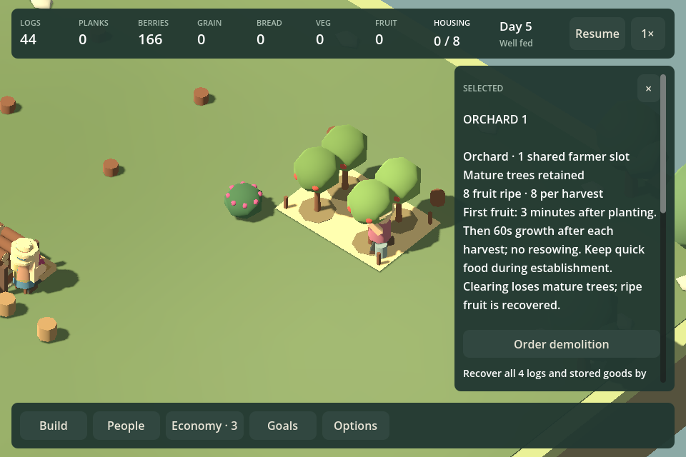
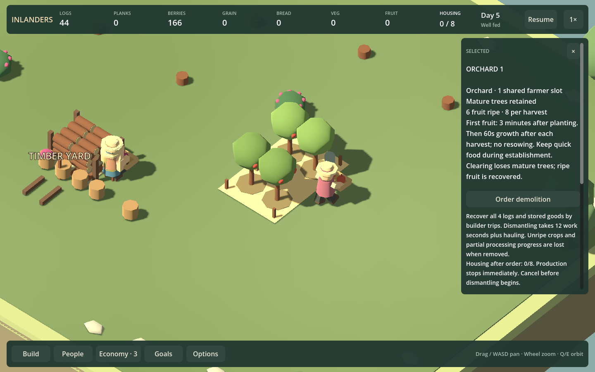

# Playable orchards — F05c

September 12, 2026. Orchards are now the eighteenth building type. They cost **4 logs**, occupy the usual six-tile plot and use **one existing Farmer slot**. A farmer plants the trees once; the first eight fruit take three simulated minutes to grow. Mature trees remain and grow another eight fruit in sixty seconds after picking. Farmers harvest and carry pairs to central food storage or a nearby pantry.

Fruit is a distinct food throughout stock, committed production, reservations, hauling, direct pantry deliveries, meals and recent supply evidence. It participates in the existing variety calculation; no new need or mandatory campaign food is added. Grain and vegetable gardens remain available to the same farmers. Gardens start sooner and remain a useful establishment/recovery option.

## Watching and managing a grove

Construction marks the plot with stakes, planting beds, a crate and watering can. Planted trees pass through three immature sizes before becoming permanent mature trees. Ripe fruit disappears progressively during picking; carried fruit is visible. The picking pose reaches into the tree while keeping the worker grounded. The preview and catalog show mature trees, while the inspector explicitly explains the first-harvest delay and current growth.

Existing priorities and shared farmer assignment select work. Output targets count committed crops, carried fruit and stored fruit. A zero target can prevent initial planting or hold the next mature batch; it does not strand an existing ripe crop. Pause stops new work and new mature batches while current jobs finish and already planted crops continue growing. Reassignment preserves carried fruit. Normal demolition stops growth, recovers ripe fruit and materials through real trips, and loses mature trees. Rebuilding starts establishment again. Creative removal returns fruit to storage.

Fruit appears in Economy, meal summaries, pantry inspectors and the resource bar when relevant. Local pantry models include the sixth food type. At 960px the resource bar still fits when fish, game and fruit are all present. Saved orchard maturity and six-food storage use **save version 34**; older saves are unsupported during this prototype.

## Verification

- `./Test.ps1 -OrchardPlayable` generates the rendered fixtures and checks all four orientations, actual construction and planting, first/repeat growth, targets, pause/resume, saved immature/ripe/carried states, interruption, physical demolition/rebuild and real twenty-minute meal routes. It also checks direct pantry production/delivery and closure redirection for all six foods.
- `./Play.ps1 -OrchardSmokeTest` captures immature, ripe, picking, carrying and repeat stages at 960/1440; checks the inspector, preview/cancellation, crowded resource bar, Economy, local fruit stock and read-only state.
- The full `./Test.ps1` suite and full `./Play.ps1 -HudSmokeTest` pass. The existing certificate-store warning remains unrelated. The picking correction and final pantry display were subsequently checked in the focused rendered suite.

[Actual route results](orchard-playable-results.json) use the same eight-resident, two-plot setup as the earlier timing comparison, without background foraging and with one farmer diverted between minutes six and eight:

| Route, twenty minutes | Fruit grown | Vegetables grown | Fruit actually eaten | Any missed/skipped meals | Final recent fresh supply |
| --- | ---: | ---: | ---: | --- | --- |
| Gardens | 0 | 144 | 0 | No | 28 delivered / 24 demand |
| Orchards | 152 | 0 | 136 | No | 26 / 24 |
| Mixed | 64 | 88 | 61 | No | 22 / 24 |

Mixed planting avoids misses over the run and provides variety, but its final three-minute delivery window falls short of fresh demand. Do not present that route as proven indefinite support. Distinct fruit changes meal selection relative to the proxy that counted it as vegetables, so exact proxy totals are not assumed. These are scripted route checks, not a human enjoyment or final balance verdict.

## Roadmap review

F05c is delivered. Keep an orchard campaign behind play feedback; no larger yield, new worker or longer waiting requirement is justified yet. Audio listening and music remain open.

Promote **F16c — Creative building relocation**: rearrange a finished building with a visible destination preview and rotation while preserving its identity, stored goods, finishes and orchard maturity. Respect valid placement, access and ongoing activity; failed/cancelled moves must leave the world unchanged. Normal-play clearance retains its investment tradeoff. This directly supports arranging and enjoying a village without requiring another producer.
