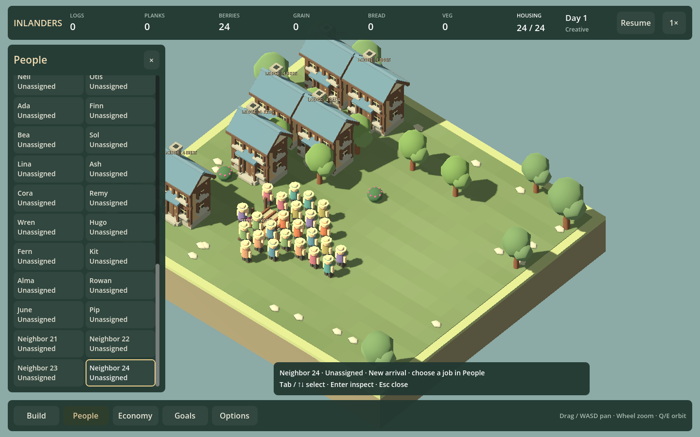
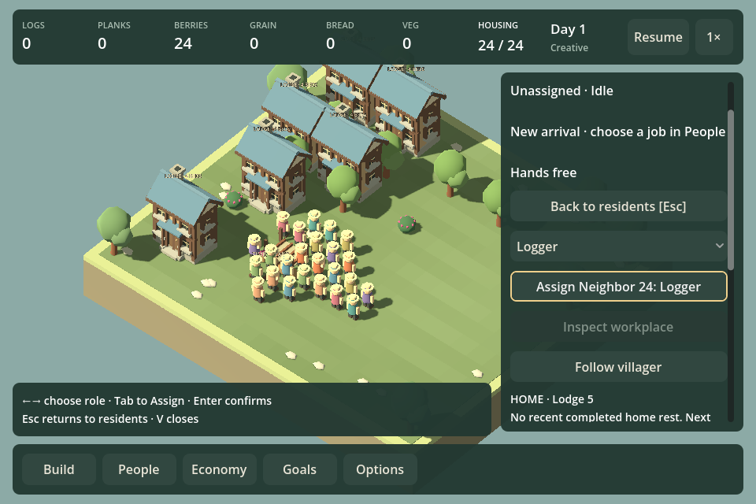

# Resident keyboard management — F21p

September 12, 2026. V now opens the resident roster with visible keyboard focus. Tab/Shift-Tab and Up/Down move between visible residents and the role filter; Left/Right changes the filter. The focus hint names the resident and shows their actual role/status. Enter or Space opens their existing inspector.

Inside the inspector, Left/Right changes the proposed role. Tab reaches the explicit Assign button, which includes the resident name while this keyboard path is active. Enter/Space on Assign invokes the existing assignment command; choosing a role alone cannot reassign anyone. Focus returns to the role selector after assignment. Escape or Back returns to the previous resident when still visible, otherwise to the filter. Another Escape closes People; V closes either layer.

## Scope and behavior

Focus skips disabled controls, including assignment during supper. If a filtered resident disappears, focus returns to a safe filter control; it never activates another resident in the old row position. Selection from another UI path cancels the remembered assignment target. World changes reset the keyboard session. Newcomers remain identified by their existing stable IDs.

Focused navigation consumes unrelated world shortcuts and blocks held camera movement. Build/People and other management shortcuts hand off their focus modes. Mouse selection releases keyboard mode; the displayed Back button also works with the mouse. Text editing retains its existing input. Original control focus modes are restored when leaving this path.

This implements resident selection and role assignment, not keyboard coverage for every People action. Global plus/minus staffing, invitations, detailed household/service controls and other management pages remain separate follow-ups. Assignment rules and saves are unchanged.

## Verification

`./Play.ps1 -PeopleKeyboardSmokeTest` passes at 960×640 and 1440×900 with a real 24-resident Creative fixture assembled through housing/invitations. Checks cover keyboard-only roster navigation, last-row scrolling, actual activity text, read-only browsing, explicit assignment to the intended resident, exact saves, disabled controls, disappearing filtered rows, named assignment, Escape/V, mouse/Build handoffs, text editing and smaller-world reset. The narrow assignment and wide roster captures were inspected.

Build passes with zero warnings/errors. The full HUD regression also passes for the input/selection integration. Godot reports its existing root-certificate-store warning.

## Roadmap reevaluation

F21p is delivered. Next is F25d2: prototype a restoration with a useful finished function and an actual later decision, retaining the earlier rejection of an attendance/learning gate. Do not automatically integrate another campaign level. Larger-village measurements, F10b2 listening review and F17b music remain queued. Remaining management keyboard work stays visible without expanding this resident-assignment slice into every inspector.
