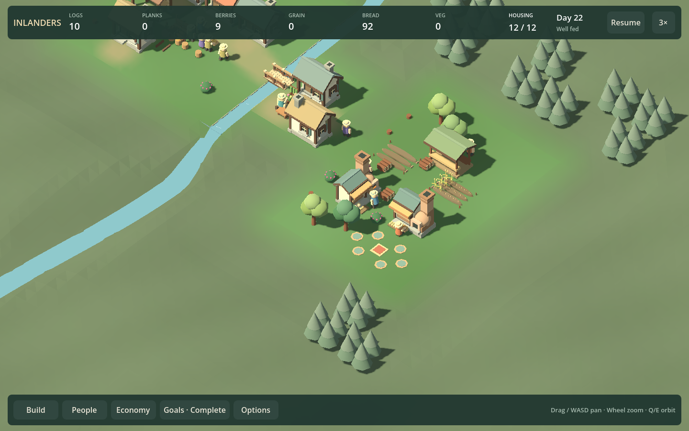
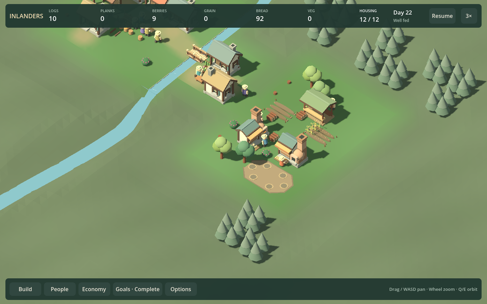
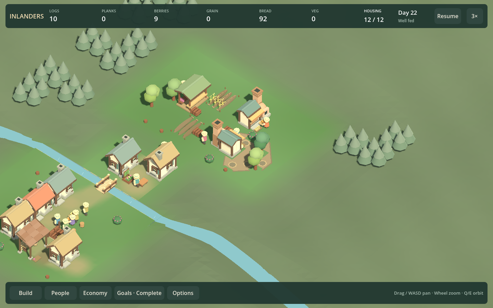

# F29a presentation review — accept readable place identity

September 13, 2026. One fresh independent read-only visual/audio reviewer, `f29a_visual_review`, on fixed commit `75eb47c`. All ten final comparison captures recorded that commit with `dirty=false`. Game DLL `C5D76D5ECDEBACF1E717B0999CB6DBC61B69499428E299C065D58C03CF94CAB3`; source fingerprint `2D998D58411C7574057C98EFF657A9A24900FEDFF6577E94D8CB8A579B2DD4C2`.

## Whole-game verdict and decision

Partially convincing. Accept F29a narrowly: a coherent ground shape reads as one persistent clearing at normal zoom, in all four open and all four shaded views, without a label. Mat-only controls resemble scattered selection markers and become harder to distinguish under foliage. No blocking footprint overlap was identified in the reviewed views. The lead agrees and ships the coherent surface as default.

This does not establish that people want to inhabit or reshape the place. Six rings on a bare patch still feel schematic; roofs and leaves hide some shaded activity. Do not add props merely to disguise this or turn commons attendance into another requirement. The finite settlement remains the primary contract.

Whole-game retention is justified for warm differentiated buildings, bakery ovens, crop silhouettes, crossings and physical carrying. Whole-scene composition remains weak: substantial empty foreground and repeated conifer clusters in the neighborhood, excess props and small labels in historical dense scenes. More isolated ornaments are not the next answer. A future composition comparison should arrange the same viable hamlet around a visible common clearing versus the current work strip, with matched resources and ordinary routines.

The guided opening, explicit ending and contextual activity/food inspector are provisionally retained. The reviewer did not observe uncoached discovery; dedicated-worker controls still compete with automatic shared work. Legacy campaign recipes and advanced policies stay secondary. The meadow needs a distinct spatial decision, not larger reserve numbers. Creative remains explicitly separate. No new producer, need or attendance meter is warranted.

Audio source inspection found spatial effects/listener positioning and accelerated-speed throttling; no listening occurred. No fresh campaign/Creative playthrough, native interaction or performance measurement was performed by this reviewer. Historical checkpoint-15 dense/Creative stills and current source supplied wider context. No disagreement with the narrow lead decision; both reject interpreting readable ground as a proven social-play reward.

## Evidence

All paths below are under `artifacts/review/runs/`; stills are `capture-0001/view.png` and provenance is in the matching manifest.

| View | Runs, turns 0 / 1 / 2 / 3 |
| --- | --- |
| Open candidate | `20260913-151607-906-commons-open-eac7d8`, `20260913-151614-473-commons-open-e1f30c`, `20260913-151620-913-commons-open-5e267f`, `20260913-151627-345-commons-open-2a8676` |
| Shaded candidate | `20260913-151634-348-commons-recurring-dbd69d`, `20260913-151641-303-commons-recurring-ce55f5`, `20260913-151648-431-commons-recurring-a0b9b6`, `20260913-151657-004-commons-recurring-b4c3a2` |
| Mat controls | Open `20260913-151708-840-commons-open-139616`; shaded `20260913-151721-136-commons-recurring-668f9e` |

The independent reviewer inspected these ten stills. The parent additionally ran the commons scripted controls at 960 (`20260913-151653-176-commons-264da8`) and recorded 30 simulation seconds at 1x: open candidate `20260913-151718-122-commons-open-02892a`, open mats `20260913-151811-452-commons-open-14a130`, shaded candidate `20260913-151855-086-commons-recurring-464034`. Each AVI has 732 frames and 30.5 seconds of video/stereo audio, including startup. Media integrity passes; sampled open frames show use and subsequent departure. Neither the independent reviewer nor the parent claims continuous-motion or listening acceptance from these checks. Encoding/frame timings are not native gameplay performance measurements.

Initial worlds match exactly within each site across rendering/camera variants. Candidate and mat-control open worlds also match exactly after recorded 30-second advancement. Food, routes and ordinary meal behavior are unchanged. Bundle reopening preserves the mat comparison flag. T04 avoided repeating roughly 16-second fixture preparation throughout the art-only iterations; no further infrastructure was needed.

## Roadmap consequence

Count this as one delivered presentation outcome: **19**. Next **F29b**, a distinct second-settlement decision. If that ships a playable outcome, perform the regular whole-game designer/UX/playtest/lead plus visual/audio review at **20** before further implementation. This presentation review does not replace that review. Keep broader composition and human preference as open product questions rather than claiming the current visual direction is finished.
