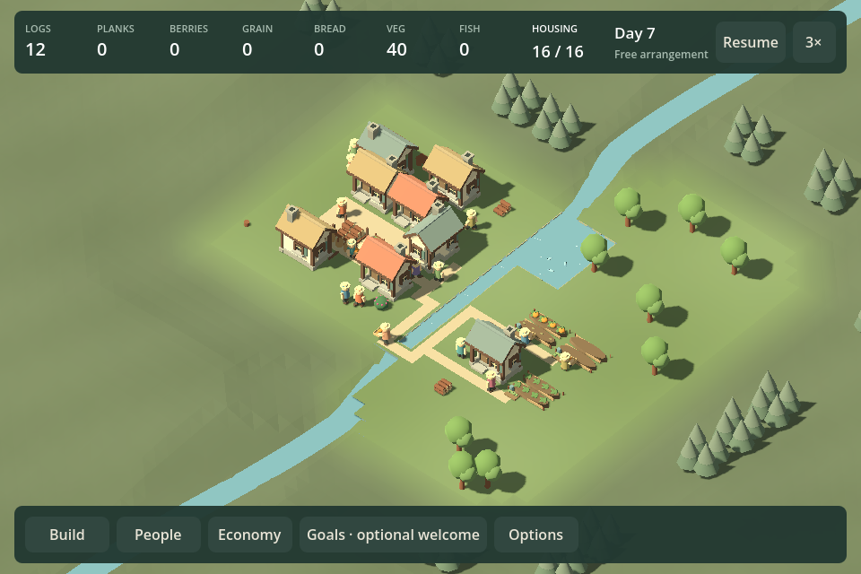
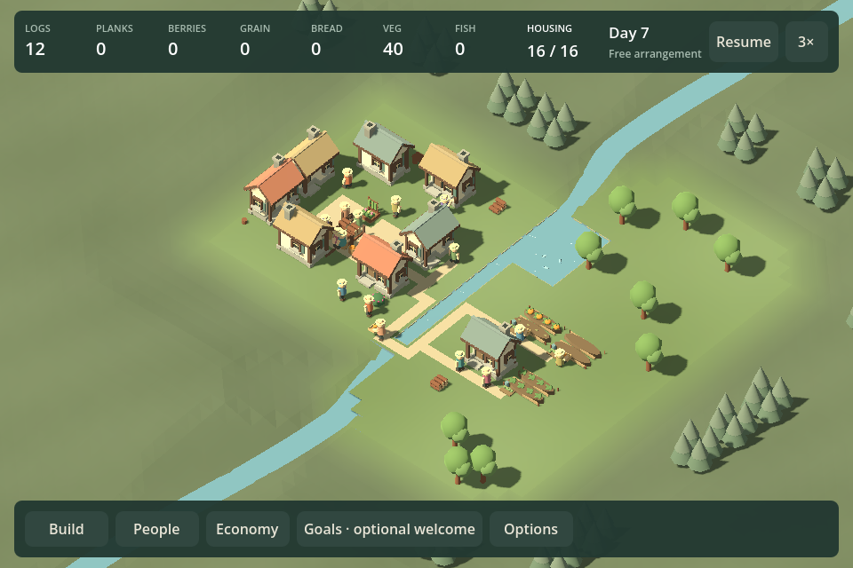
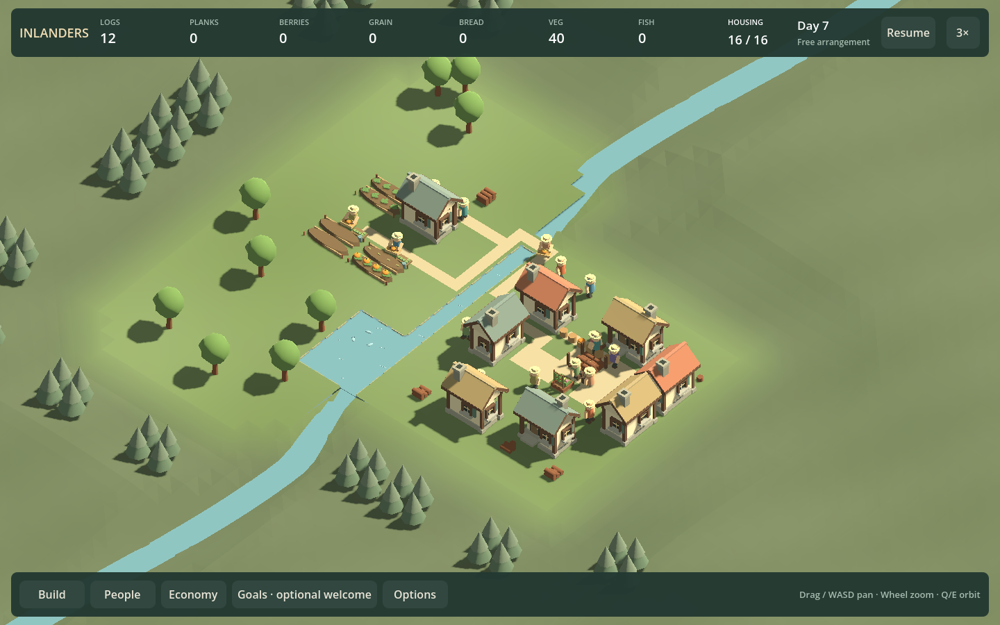

# Free arrangement presentation review — checkpoint 22

September 13, 2026. Fresh independent read-only visual/audio reviewer `free_court_presentation_review`, fixed source **83f99c45a09d9fa82622dd0ca2e6b02dff9e6432**. Whole-project presentation scope; this triggered review does not replace the periodic whole-game review at **25** or add a playable outcome.

## Verdict and decision

**Partially convincing: a real composition gain, but an unresolved watching experience.** The reviewer retains free arrangement and the current building language. Moving two homes opens a substantial courtyard visible from opposite sides. People occupy that space, home frontages, the river crossing and gardens; the compact 960 card covers less of the village. These are reasons to retain the work, not claims of human preference.

The central objection is that visible people are not necessarily understandable activity. Hats and bodies show occupancy, but work, waiting, meal collection and recreation remain difficult to distinguish at normal framing. Source contains differentiated animation; that does not demonstrate perceptual success. Motion might resolve some ambiguity, but this was not observed continuously.

**Lead synthesis:** agree with the reviewer. Retain free editing, shared labor, physical meals and the composed court. Move a coherent **recognizable daily life comparison (F30d1)** ahead of choosing a campaign structure. Test camera scale, activity silhouette/contact and foreground obstruction together; do not settle for a zoom-only close-up or more miniature props. Keep the simulation honest: no forced journeys, new hunger or fabricated jobs to fill the scene. The subsequent **F30d2** experience choice may select finite transformation, a village toy, or a justified combination. Free editing is promising, not the predetermined winner.

## Whole-game assessment

- **Village appearance:** warm roofs, timber fronts, bakery chimney/oven, cultivated plots and enclosing landscape form a coherent identity. Historical title and dense-settlement evidence support retaining building massing/materials. A wholesale model replacement is not justified by the current evidence. Buildings still dominate resident activity, especially through foreground roofs.
- **Economy/buildings/needs:** shared work and physical goods give arrangement potential consequences. Cottage/lodge investment and garden versus bread processing have meaningful rule differences; these are not proof of distinct pleasure. Three civic scales, comfort and orchard progression remain hypotheses. Do not turn eighteen available ingredients into eighteen progression obligations.
- **Campaign and continuation:** retain useful river, lake, quarry and woodland geography as ingredients. Freeze new levels and repeated construction/welcome sequences until we establish why someone wants to watch or continue. If clearer life still fails to motivate a second self-chosen change, compare a finite authored transformation against free village play rather than adding quotas.
- **Normal/Creative and onboarding:** free construction should share the settlement's resident model. Keep optional welcoming and recoverable edits. The compact card is a useful secondary explanation, not the primary visual interface. Historical foodless/manual-role rules should remain explicitly historical.
- **Audio:** unassessed. Source shows spatial voices, separate buses and musical quiet intervals; no listening occurred. Reuse existing audition tools before adding sound/music content.
- **Reliability/performance:** successful functional checks support further comparison. Neither source review nor capture wall time establishes native frame performance. No full campaign replay or fresh ordinary/dense profiling was performed in this review.

## Concrete review corrections

Two source defects were identified on the fixed commit. The reviewer found that the court entry notice was immediately overwritten by a generic paused message. The lead found, and the reviewer independently verified, that Options map shortcuts could silently load historical sandbox rules. Post-review corrections preserve the specific entry instruction, hide historical map shortcuts in neighborhood worlds, and guard their handlers. Historical maps remain accessible from Earlier prototypes. The lead’s final wording audit also corrected Economy’s old foodless description/zero demand and the arrival tooltip’s hard-coded four-person count. These small UI corrections are subsequent to the fixed presentation evidence; no new playable count.

## Next experiment and failure conditions

Use the same inhabited court and free editing. Let an observer choose a spatial change, then watch with cards closed at 1×; use 3× for waits. They should be able to identify somebody working, collecting/eating food and spending time at home or a shared place, describe the effect of their change, and propose a desired second change without receiving an objective.

Reject the presentation candidate if recognition still requires labels/coaching/cards, succeeds only from one camera or a staged close-up, or produces attractive roofs without a reason to watch. If clearer activity still supplies no continuation motive, reconsider the core experience instead of polishing it indefinitely. No human preference or listening result is filled in by these stills.

## Evidence and provenance

All nine clean runs below use commit **83f99c4**, source fingerprint `D7878F05EE8BC26D3A0BAEA6B5FC3507DE7879AA02773F5EC713266906D894B0`, game assembly `80CC974B19F711DAECB7AF4EE023B9FC8D1CBFDA6F5076D75175C26FAC5A93B5`, test assembly `FDB04AF25F9FD516650A2937C9D10996100E198C0A19A17420992A4CAB84C40C`. Full metadata is in each request/manifest, with a local index at `artifacts/review/f30c-fixed-evidence.json`.

| Scene | Width / turn | Run under `artifacts/review/runs/` |
| --- | --- | --- |
| creative-court | 960 / 0 | `20260913-175325-537-creative-court-042238` |
| creative-court-expanded | 960 / 0 | `20260913-175444-246-creative-court-expanded-09770a` |
| creative-court-expanded | 960 / 2 | `20260913-175459-223-creative-court-expanded-8dc4d6` |
| creative-court-expanded | 1440 / 0 | `20260913-175513-803-creative-court-expanded-c6f267` |
| creative-court-expanded | 1440 / 2 | `20260913-175527-874-creative-court-expanded-b835fb` |
| creative-court-arranged | 960 / 0 | `20260913-175551-475-creative-court-arranged-1ec8c2` |
| creative-court-arranged | 960 / 2 | `20260913-175606-367-creative-court-arranged-f9fc86` |
| creative-court-arranged | 1440 / 0 | `20260913-175619-896-creative-court-arranged-0290c7` |
| creative-court-arranged | 1440 / 2 | `20260913-175634-770-creative-court-arranged-d6dd45` |

The new-mode 960 probe verifies menu, two paused moves, placement/removal, compact card/Escape, real meal collection/eating, F5/F9, Continue/Resume, normal-save isolation and Reset. Expanded/arranged initial captures share the same sixteen-resident age (374.1 simulation seconds). Each later capture follows five real seconds at 3×; these endpoints are not exactly equal simulation ages. This is spatial/behavior observation, not an isolated performance or enjoyment A/B. All cards are closed in the paired whole-scene views.

The reviewer also inspected historical `docs/review19-menu.png`, `docs/review19-commons-study.png`, checkpoint-20 dense default `20260913-163404-702-dense-de2140`, checkpoint-19 river `20260913-153624-181-river-3333b2`, and the prior court expanded image. Those are contextual evidence at their own sources, not newly replayed content at checkpoint22. No fresh lake/woods/full-campaign replay, uncoached native interaction, continuous-motion judgment, listening or native performance measurement occurred.

## Tooling investment

Keep the fixture/provenance workflow. Existing fixture reuse skipped about 9.3–9.5 seconds preparation per repeated expanded/arranged view. A sequential shell loop completed the eight camera/width comparisons; a short metadata check produced an ordered index and verified common source/build hashes. Warm single captures took approximately 13.5–14.8 seconds; these are setup/capture costs, not game frame times.

The next presentation comparison can promote that small loop/index into one bounded command if it removes repeated reviewer path hunting. Beneficiaries: lead and every presentation reviewer. Estimated implementation: hours, low upkeep; validate ordered before/after links, common provenance, refusal of mismatched builds and measured setup time. Do not create a new replay platform, asset framework or mode abstraction. Higher-value evidence remains watching/listening to a short 1× sample and recording an actual self-chosen arrangement.

## Post-review verification

Final corrections are committed at `f66bef8`. Both projects build with zero warnings/errors. Clean scripted UI checks pass at 960 (`20260913-180619-900-creative-court-bdcdf5`) and 1440 (`20260913-180653-302-creative-court-5e4e63`), under `artifacts/review/runs/`. They verify the retained court-specific notice, hidden/guarded historical map shortcuts, eight-person arrival explanation, actual meal demand and hunger forgiveness in Economy (without irrelevant food-mood scoring), alongside the complete editing/meal/save/resume/reset flow. The 960 Economy still was inspected during correction; final captures retain their own manifests. This functional follow-up is not a new independent presentation review or a playable checkpoint.
