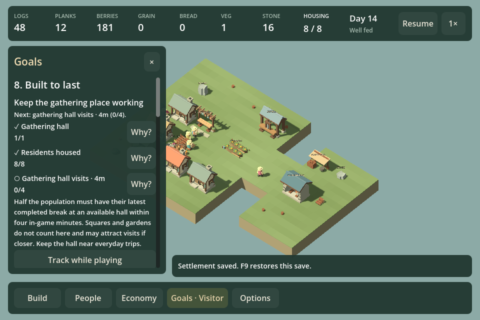
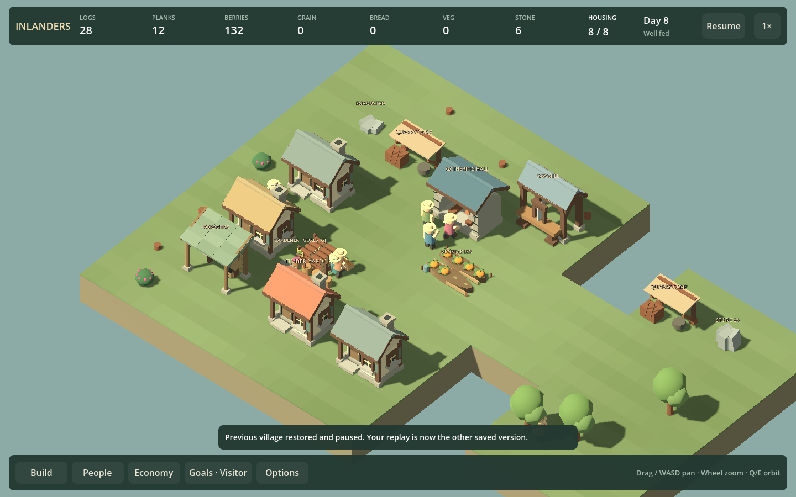

# F26b2b — Built to last implementation review

Implemented September 12, 2026 as campaign level eight. [Original brief and budget](QUARRY_CAMPAIGN_F26B2.md). This records source, simulation and rendered review; first-play enjoyment remains unverified.

## Shipped behavior

The campaign picker opens the authored eight-person village with two stone sources. A finished available hall enables **Assess the gathering place**. Construction cards count delivered/incorporated planks and stone; players never have to restock the hall's consumed materials. Stone help links directly to both outcrops and their current reserves, claims, exhaustion and workplaces.

Assessment requires homes for everyone, half the population's latest completed break at an available hall within four in-game minutes, reliable closed meal requests and fresh deliveries covering eating/demand. It uses the existing rolling food window starting at the player's phase action. Diet variety, population growth and home comfort are optional. Misses and stale/non-hall visits delay proof without removing construction progress. Halls under demolition do not count. Normal completion, continuing play, replay and restoring the previous village are available.

Goals supports explanations, resident filters, related hall links, source survey, live food evidence and tracking. Hall wording explicitly distinguishes four-minute hall visits from river/lake rules. Quarry placement/survey messages now refer to Resource survey instead of assuming stone is only on Three clearings.

Adding the stone column exposed offscreen pause/speed controls at 960px. Narrow resource spacing/minimum widths now fit, and conditional resource visibility can shrink the bar after changing villages. Rendered checks assert those controls remain within the viewport.

## Route evidence

| Full route | Completion, simulation seconds | Remaining near / distant stone |
| --- | --- | --- |
| Two camps, no paths | 420 | 0 / 24 |
| Two camps, shared road layout | 360 | 0 / 26 |
| Distant only, no paths | 480 | 8 / 18 |
| Distant only, shared road layout | 480 | 8 / 16 |

These routes use real work, hauling, visits and service evidence, advancing 0.1-second ticks. The two-camp test plans the nearby camp first; global work selection can use the distant camp first if it becomes available earlier. Initial test ordering accidentally left the nearby source unused; the corrected route explicitly asserts that it is exhausted. Paths help the tested two-camp route but do not move the distant route past an earlier assessment check. These are examples, not proof that either strategy dominates every placement.

A distant hall alone still completed: distance is not automatically a service failure. The adverse fixture instead has a central square competing with the distant hall. At 788s, zero of four required residents have a qualifying recent hall visit. The displayed blocker names the competing-venue problem. Removing the square and distant hall, recovering their materials, and rebuilding centrally completes the same assessment at 1020s, including a saved recovery continuation. No free replacement materials or new phase start.

## Verification

- `Play.ps1 -QuarryCampaignSmokeTest`: regenerates four complete routes and recovery, then verifies campaign-picker entry, actual assessment button, source links, resident filtering, 960/1440 bounds, completion and replay/restore. Navigation leaves exact saves unchanged.
- Current-format save rejection checks cover missing quarry state, invalid phase, future assessment time and inconsistent completion. Normal assessment continuation is compared tick-for-tick after reload.
- Full existing simulation suite passes; the new quarry campaign check is now included in its normal run as well. Focused river/lake Goals rendering passes after the shared UI changes.
- Build succeeds with no warnings/errors. Rendered runs still emit the known Godot root-certificate-store startup warning.

## What this does and does not settle

There is a supported cost/transport choice and a visible, recoverable civic-placement error. The working starter village also permits a competent player to queue the core project and finish in six to eight simulated minutes. That does **not** settle the request for longer, more demanding campaign levels. Keep a campaign challenge/pacing follow-up under F11/F18: evaluate competing production/labor commitments and staged settlement decisions, rather than increase stone quotas or add idle time. Human first-play times are unknown.

The hall's model is visibly simpler than the recently revised homes/sawmill. The civic art follow-up should give it a more distinctive frontage and silhouette; that should not require new service rules. Next bounded rendering work is the already-observed tall loose timber/salvage display under F23c, followed by a deliberate choice between campaign challenge and the remaining building family passes. The overall roadmap remains unfinished.
