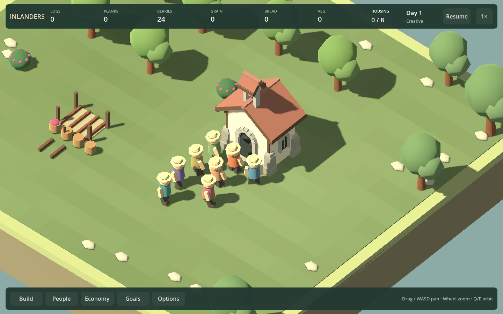
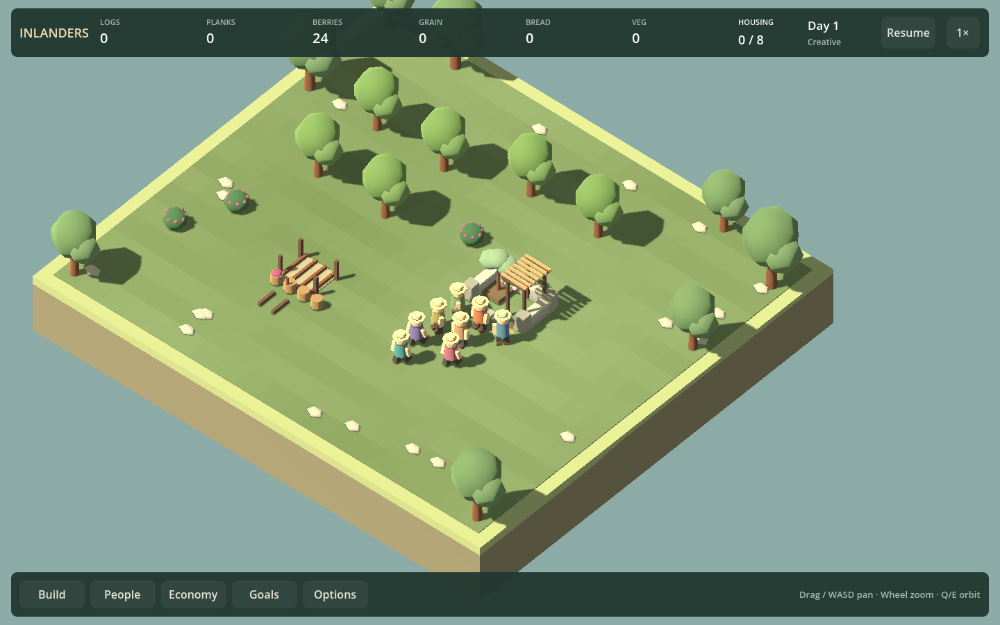

# Quiet civic visits — F25e3

September 12, 2026. Arrived Chapel visitors now face their venue with a slight settled bow and close arms. Planted court visitors face outward with a slow glance and relaxed arms. Small breathing motion follows saved visit time. Hall conversations and home-rest seating are unchanged.

The renderer uses actual Work.Leisure state. Walking arrivals keep their walking pose; completion or reassignment clears quiet gestures through the existing per-frame rig reset. No visitor, seat, benefit, timing or simulation field was added. The poses are intentionally subtle at village zoom; the building silhouette remains the primary identity cue.

## Sound decision

Keep both identities silent for now. Code/design assessment: ordinary arrivals are staggered recurring breaks; there is no bell-ringing action or shared ceremony to communicate. Automatically chiming each arrival would give an ordinary visit disproportionate significance and require additional group suppression. No new listening comparison was performed, so this is not a claim that a tested bell sounded bad. F10b now owns the broader soundscape comparison; a bell can be reconsidered if it serves a demonstrated purpose.

## Verification

`./Play.ps1 -SocialSmokeTest` passed, including the new quiet-civic checks and existing square/home checks. Build: zero warnings/errors. The engine reports its existing root-certificate-store warning.

- Real arrived groups, four orientations for both identities, walking arrivals, completed visit credit and interruption.
- Frozen paused poses and unchanged saved-world state; exact local poses after reload.
- Identical 15-second simulation continuation against ordinary Hall, after normalizing only cosmetic identity.
- Restored Hall conversation after identity changes; no retained stool or wide gesture.
- Four-orientation captures for each identity; inspected chapel close view and court village view. The wider scene shows the subtlety of the pose, not a claim of new campaign depth.

The focused check uses Creative to assemble the group quickly. Normal construction, identity costs and actual service were already covered in F25e2; that suite and the full simulation suite were not rerun for this renderer-only change.

## Roadmap reevaluation

F25e3 is delivered. Replaced the long delivered queue with five active briefs and preserved the old acceptance text in NEXT_CHUNKS_HISTORY_2026_09_12.md. Next is F10b soundscape comparison, followed by People keyboard management, functional-restoration design, representative performance and musical variation. Human enjoyment remains open; new needs are not prerequisites.
