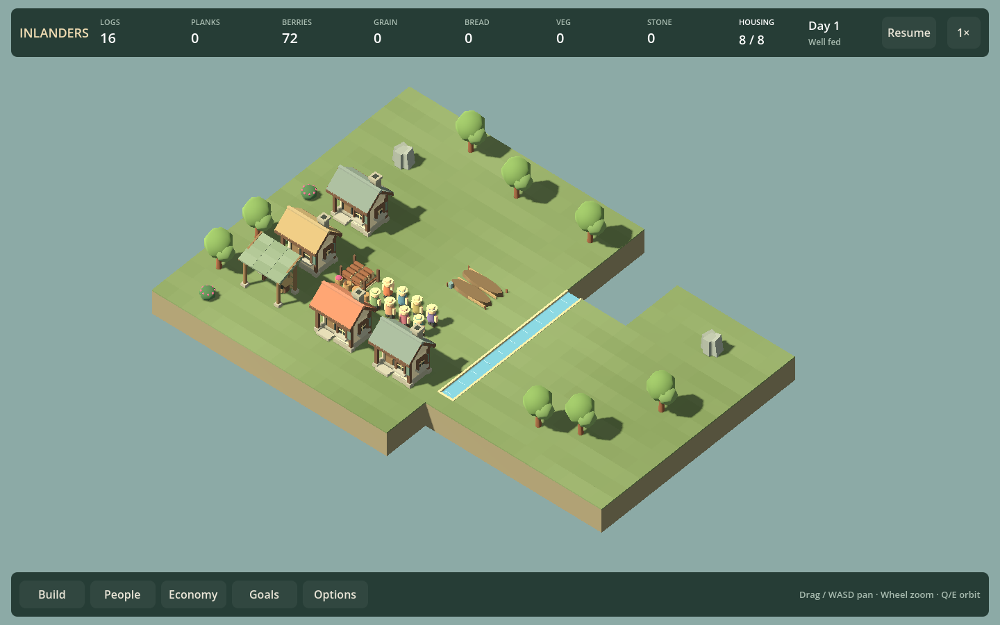
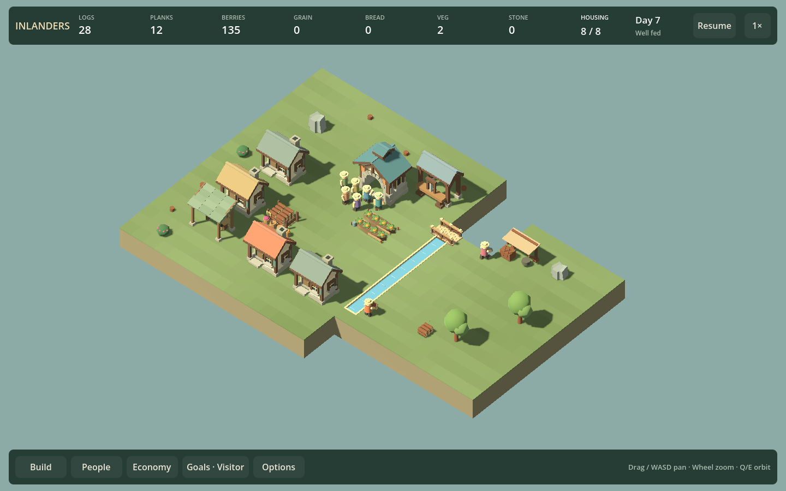

# Functional restoration experiment — F25d2

September 12, 2026. **Cut a separate restored-crossing feature; retain the shortcut as an ordinary bridge/layout option.** Do not integrate F25d3 or another campaign level from this result. The prototype has a useful finished function, but does not create the intended second commitment: all infrastructure can be ordered at the start, and overlapping it outperforms the staged opening.

## Candidate choice

| Candidate | Finished function | Design assessment |
| --- | --- | --- |
| Reopen a northern crossing | Shorten the physical route between the existing village and distant stone/workplaces | Selected for an executable existing-system probe. Compare bridge labor/materials with improving the open detour. |
| Recover a productive riverside site | Supply food/materials through a restored workshop or mill | Not selected for implementation. A relocated bakery/sawmill already offers the basic function; a water-powered advantage would require a distinct producer/terrain design. No measured claim about this unimplemented candidate. |

The earlier education/attendance gate remains rejected. Nothing in this experiment establishes a need for a learning meter, staged permissions, a new institution or a mandatory flour chain. A future productive restoration needs its own payoff; it is not automatically approved by this bridge comparison.

## Executable place and budget

The test starts from the quarry map's imperfect working eight-person village, with all residents housed, an existing forager hut and vegetable garden. It retains 16 stored logs, 64 standing timber, 72 stored berries and 44 finite stone. Existing homes/food buildings contain another 32 construction logs. No resources are injected after starting a route.

The prototype changes only authored geography: extend the middle corridor south to z=7; put water at x=6, z=-3 through 6. The southern causeway remains open at z=7. A normal six-log bridge at (6,-3), rotation 1, shortens the actual yard-to-quarry entrance path from 27 to 19 cells. The quarry camp is at (11,-4); the sawmill at (3,-5); the attended hall at (0,-3). All sites remain available before the bridge, through the longer route.

Common investment: quarry + sawmill cost 12 logs; hall costs 8 planks + 12 stone. Sawing those planks requires at least four further logs. A bridge adds six logs and builder travel/work. Paving the 27-cell detour uses the current free path rules. These are deliberately current mechanics; charging for roads to make restoration win would bias the experiment.



## Measured alternatives

All times are simulated seconds from the same starting village, not human completion estimates. “Supported” means all ordered structures are complete, the hall has an actual recent visitor, and current meal evidence is reliable with fresh supply. Routes stop at that checkpoint, so total travel is not a fixed-horizon throughput comparison.

| Route | Raw construction logs + planks + stone | Hall/project built | Supported | Routed person-seconds |
| --- | --- | ---: | ---: | ---: |
| Existing unpaved route | 12 + 8 + 12 | 462.5 | 474.7 | 2021.1 |
| Pave detour first | 12 + 8 + 12 | 401.9 | 414.7 | 1753.0 |
| Finish crossing, then fund production/hall | 18 + 8 + 12 | 445.2 | 461.0 | 1970.1 |
| Order crossing and production/hall together | 18 + 8 + 12 | 397.8 | 410.0 | 1768.2 |
| Divert food workers; repair allocation at 900s | 18 + 8 + 12 | 389.0 | 1185.1 | 3070.6 |

The crossing opens at 61 seconds on both competent crossing routes. It is actually walked on; this is not unused scenery. Yet overlapping construction reaches supported operation only 4.7 seconds before paving, while requiring six additional logs. Building the crossing as a first stage is 46.3 seconds slower than paving and 51.0 seconds slower than overlapping it with the rest of construction. This is a small logistics choice, not a compelling staged restoration.

The poor allocation takes both foragers and the farmer away from food. At the repair point there are 24 missed/skipped recent requests. Restoring their roles, then using the two spare residents for quarrying/sawing, recovers fresh reliable meals and real hall attendance. Competent alternatives have no missed/skipped requests at their checkpoints. The lesson is labor allocation, already represented elsewhere in the game.

After funding, the remaining work is maintaining food staffing, supplying stone/planks and allowing the hall to serve real residents. The shorter route changes hauling cost but does not unlock a new decision or a different final use. No ownership quota, deadline or forced waiting stage is added to disguise that weakness.



## Recovery and proposed presentation

The normal incomplete bridge can be paused by reassigning builders. Cancellation leaves its two delivered logs as physical salvage; a saved/reloaded village collects them and rebuilds the crossing by 367.7 seconds. Both supply routes remain available throughout, so cancellation cannot isolate the village.

If this optional shortcut is used in a future authored map, use the existing building inspector rather than a new project screen. Concept only:

```text
NORTHERN CROSSING · Optional shortcut
6 logs · existing southern route remains open
[Plan bridge here]

While building: actual delivered logs and construction progress
When open: use the existing supply-route view to inspect worker journeys
Next choice: keep the current workshops or invest nearer the resource
```

The “next choice” is currently too weak for a new campaign phase: the investment can already be made before restoration. This sketch is not shipped UI or a promised objective. No ruins, cosmetic restoration stages or special save state have been added.

## Reproduce and verification

`./Test.ps1 -Restoration` passes five route probes plus partial pause/cancel/salvage/rebuild. It asserts actual path shortening, crossing occupancy, hall attendance, material budgets and food recovery. Each saved checkpoint roundtrips exactly; two independently loaded continuations agree for twenty seconds. Generated initial/stage/final saves and detailed results are under `artifacts/restoration`. [Recorded measurements](RESTORATION_RESULTS_F25D2.json) preserve the run.

After the simulation probes, `./Play.ps1 -RestorationSmokeTest` builds and runs the rendered review. The console-engine arguments are `--path . -- --hud-smoke-test --restoration-views`. It captures initial, crossing-only, paved and completed snapshots, asserting rendering does not change their saves. These four rendered checks pass; initial and completed captures were inspected at matched 1440×900 camera/light. The straight channel and regular terrain are a route prototype, not finished landscape art.

Build passes with zero warnings/errors. The full simulation suite was not rerun: no production simulation code changed. This experiment lives in the test assembly and does not appear in campaign/free-play menus. Godot reports the existing certificate-store warning.

## Roadmap decision

F25d2 is delivered as an experiment with a negative integration decision. F25d3 restored-crossing integration is cut; existing bridges already supply this function. Do not grow the feature into a higher invoice or an education prerequisite. A future productive-site proposal must demonstrate a distinct payoff before reopening this track.

Next: F23c2 representative larger-village performance. F10b2 listening review and F17b musical variation remain queued. Campaign first-play pacing, stronger inhabited composition and other optional building ideas remain visible in their existing roadmap areas.
