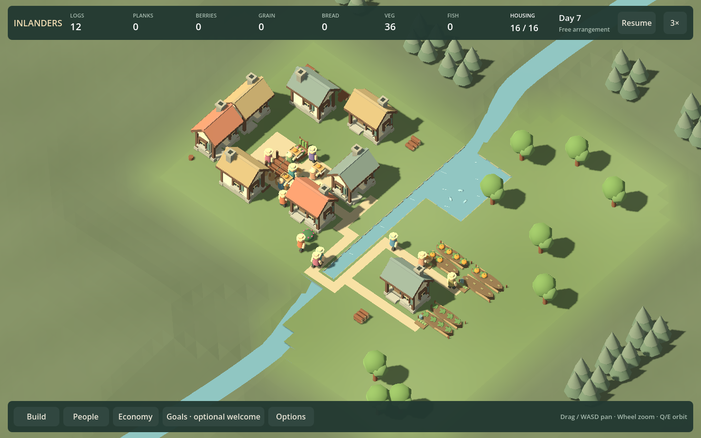
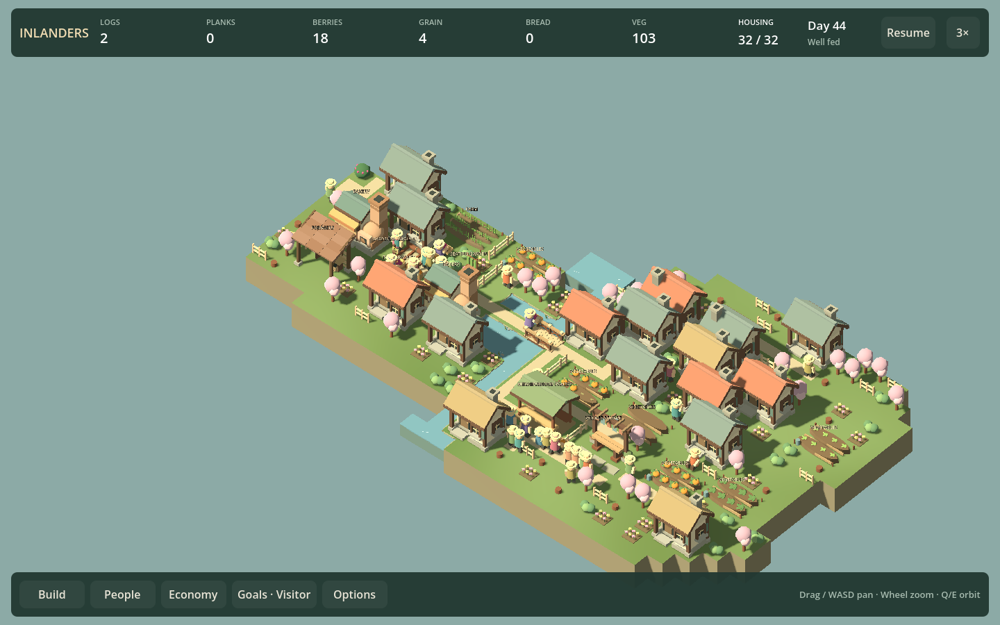

# Whole-game review — checkpoint30

September 13, 2026. Fixed reviewed commit **`1a11bf37f7c40eb7e5d41662880d519bd5c15c6e`**, game hash `D3108132A07527662ED341B1C106870AD3C60F600F7CEC6C7FEEDC2D1D6282A2`, source fingerprint `DD2BF9B0FB57AEEEDB8826F0DA9013BB67EC0AB969798585F5C1EB8E3A9F372D`.

One fresh independent read-only game designer (`review30_design`); four separate reused reviewer contexts (`review15_ux`, `full19_playtest`, `full19_lead`, `full19_visual_audio`) after the fresh-agent limit. An attempted `review25_ux` restart also failed; it did not contribute a review. All five roles returned independent verdicts before synthesis. This is not five fresh contexts. Playtest is an evidence/source audit because native UI control was unavailable; no uncoached play, listening or motion acceptance.

## Verdict and lead decision

**Partially convincing as a gentle settlement game; not yet a compelling sustained game or a consistently appealing place to watch.** Physical work, growth and recoverable food limits now supply real consequences. The player can make a place, see it used and choose to grow. The missing payoff is a village whose competent arrangement is also visibly desirable. The compact twenty-person solution is functional but crowded; the spacious-looking alternative fares worse. This is not proof that efficient villages must be ugly, but it is the strongest unresolved design tension.

Choose **a spacious working lakeside hamlet** as the next coherent slice. Replace further recovery controls/population milestones with a comparison that changes housing organization, shared open space and the surrounding shore as one inhabited place. Use existing buildings and normal food/growth rules first. The lodge's investment for four beds is a hypothesis to test against cottage infill, not a prescribed answer. Carry over the free court's connected ground and readable spaces where they help the main village; do not merely copy its façade or add props.

Keep voluntary growth, real supply and optional endings. Do not declare a full campaign validated. Preserve a non-growing arrangement option as a comparator: if players prefer making a place to repeatedly expanding it, prioritize composition and watching explicitly. Do not create another primary mode for this comparison.

## Independent verdicts and evidence

| Role | Whole-game judgment and distinctive finding | Direction / limits |
| --- | --- | --- |
| Game designer, fresh | Growth finally has consequences, but “more cottages, more production” is a demand curve rather than a compelling aspiration. Compact success visibly crowds the village. | Compare cottage infill with lodge-led neighborhood around useful open space; retain existing resource geography. Source, growth/recovery data and current stills; campaign/free/audio mainly source/documentation. |
| UX, reused | Current inspector and primary Free arrangement improve on checkpoint15; do not carry obsolete criticisms forward. Leading founding Build action opens People; below-demand history can imply more than it establishes; food-flow wording and unrelated visit guidance burden diagnosis. | Correct broken promises, then test spatial improvement rather than add panels. Inspected fixed river/dense/court and matching-code960/1440 UI; no native play. |
| Playtest, reused | Comparative consequences are stronger, but actual shortage UI evidence was missing: the probe navigated a healthy14-person settlement. Independently confirmed wrong-tab bug. | Test hungry/no-pickup path; observe whether a player chooses and explains a recovery. Verified source/assembly correspondence across dirty-precommit and clean fixed captures. Evidence audit, not a playthrough. |
| Development lead, reused | Real reservations, simulation separation and current saves deserve retention. Runtime flags/map-name branches still carry rejected experiments. Recovery depended on an unverified artifacts midpoint. | Same-village comparison; bounded fixture provenance improvement; no engine, mode or telemetry framework. Current source/reports/growth images, no independent tests or performance measurement. |
| Visual/audio, reused | Warm architecture works best in the free court, where circulation and open space organize activity. Main founding's board-like shore, roof packing and weak hall center are less resolved; dense labels compete with inhabitants. | Redesign whole hamlet composition and shore, retain material language. Viewed growth, fresh river/dense/court and960/1440 Economy; no listening, motion or title/menu observation. |

There is strong agreement against more quotas, compulsory needs, catalogue expansion and isolated ornament. The designer favors a bounded neighborhood-planning comparison; the lead sees a case for continued gentle management; UX/playtest keep non-growing improvement as a serious alternative. Synthesis preserves actual management as a constraint while making recognizable place-making the next test. It does not settle long-term preference by committee.

## Whole-project decisions

- **Campaign:** keep old levels archival. Their river/lake/woodland/quarry geography is useful; delivery recipes and rolling service certificates should not regain primary status by inertia. Founding and the hall remain introductions, not proof of a longer skillful campaign.
- **Economy and catalogue:** retain physical food, materials, construction, gardens, shoreline and woodland choices. Test existing lodge/processing investment before adding housing types. No universal garden+dock prescription: the overloaded control is one situation. Pantries redistribute; they cannot create absent food.
- **Needs:** keep meals, homes and communal visits as visible daily life. Defer new needs and civic tiers. Do not turn historical first use into permanent health certification; “Finished” remains an optional project milestone.
- **Normal and Free arrangement:** retain real daily life with explicit relaxed construction/hunger. Keep historical rule variants in Earlier prototypes; avoid a new rule branch to conduct this comparison.
- **Controls/onboarding:** retain contextual workplace controls and actual-source links, correct the wrong-tab action, and remove unrelated material from meal investigation. More diagnosis text cannot substitute for visible consequences in the village.
- **Presentation:** retain warm timber/roof forms and simplified residents; redesign spatial rhythm, public center, circulation and shore together. Selected/contextual labels merit testing alongside this work, not as a substitute for it. Competent placement must leave inhabitants visible from multiple ordinary camera angles.
- **Audio:** existing spatial voices/music merit an audition, neither approval nor replacement from source. No new themes/cues until actual listening identifies a need.
- **Reliability/performance:** keep current-format exact saves and scoped tools. No compatibility, ECS or broad architecture rewrite. Native/dense frame tails and long sessions remain unmeasured. A shutdown failure discovered during review corrections is recorded below, not hidden behind passed assertions.

## Selected next slice and falsification

**F32a — make a working lakeside neighborhood worth watching.** Compare the present compact cottage growth with a spacious arrangement using existing lodges/homes, food places and shared open ground. Keep the same starting people/resources and normal rules. Rework shore/ground composition and circulation sufficiently to test a whole village, rather than add another isolated building detail. Keep all buildings available and accept good up-front plans.

Use no more than a compact control, one plausible spacious candidate and one imperfect/recovery arrangement initially. Record cost, sustained meal outcomes and journeys, but judge the visible neighborhood at matching ordinary zoom, opposite cameras and normal-speed activity. Do not silently optimize a failed candidate until it passes. If it requires coaching or arbitrary capacity bonuses, reconsider footprints/access/housing economics explicitly; a failure is not permission to nerf every journey.

Ask an unfamiliar observer to choose a place to improve, predict one consequence and explain what changed after residents use it. Record voluntary watching/revision/ending. Reject the alternative if it is picturesque only from one camera, hides activity, forces one layout, or has no intelligible investment benefit. Reject growth as the central motivation if non-growing arrangement is preferred. One successful script is not acceptance.

The presentation change triggers its own visual/audio review; it does not reset the next full review at35. Do not prefill four more speculative outcomes before this bet is tested.

## Tooling decisions

- **Accept now: regenerate the dependent recovery midpoint from real commands.** Reuse the existing fixture catalogue/cache. Both simulation comparison and UI fixture share this generator; no arbitrary artifacts-path prerequisite. It reproduces the old input exactly: SHA256 `2970E1B0972B16F736CB6FF7BA07B24E65D9C4ADE176B981ED24C70F45CB1D46`. Cold preparation11.69 seconds in this run; cache reuse skips it. Beneficiaries: recovery comparisons and reviewers; small implementation/maintenance cost, validated by exact identity and actual UI shortage. No claim of aggregate time saved yet.
- **Accept for the next slice: consume existing observation tools.** One discoverable comparator launch and a short normal-speed watched/listened session; expected setup under half a day, minimal upkeep. Measure launch effort and whether a person actually identifies a consequence/preference. An unconsumed recording is not evidence.
- **Defer broad performance work until a bounded measurement.** Use existing ordinary/dense traces at1×/6× with camera/overlay/save markers when evaluating the new scene. Capture wall time is not frame performance. Reproduce the shutdown failure if it recurs before changing disposal architecture.
- **Reject for now:** new evidence platform, general dependency graph, mode framework, ECS, broad asset migration or another music system.

## Review corrections and validation boundary

After the independent fixed-source review, the lead corrected the founding Build shortcut and added a rendered assertion for its actual destination. Food flow says “Producer deliveries.” Growth rate comparison no longer says “below current demand”; it invites comparison and retains the history/forecast caveat. Meal filtering hides unrelated rest/recreation guidance/details. These are corrections to checkpoint30, not another playable outcome.

The new `shortage-recovery` catalogue fixture starts hungry with20 people. Its probe follows Economy to meal coverage, verifies a disabled unassigned-source link, inspects the real forager, chooses food production through catalogue controls, then uses normal placement commands and accelerated test ticks for the measured garden/dock intervention. It checks a hunger-free final300-second window and exact F9. This closes a state-coverage hole; the intervention is script-selected and does not prove an unfamiliar player can diagnose it.

Two1440 correction runs (`20260913-232922-529-shortage-recovery-14259c`, `20260913-233051-231-shortage-recovery-ee837b`) passed gameplay assertions and failed during Godot shutdown with C# script-binding/unsafe-reference errors. Treat them as failed process runs. A review-only finalizer-drain mitigation is tested separately; no general engine disposal fix or root cause is claimed. Final rerun outcomes are recorded in the [F31f implementation report](SHORTAGE_RECOVERY_F31F.md).

## Evidence coverage and provenance

Fresh clean fixed-commit stills: river `20260913-232239-599-river-03e5c4`, dense `20260913-232239-753-dense-530564`, Free arrangement `20260913-232248-770-court-life-9cf6e1`, each capture0001. Matching-code precommit final UI:960 `20260913-231916-767-founding-hall-a95dde`,1440 `20260913-231932-543-founding-hall-432659`. Growth/recovery numeric evidence and screenshots are linked from F31e/F31f reports. The designer and lead's whole-game coverage used source/documentation for some legacy/free areas; do not describe every role as having inspected every fresh frame.

Menu/error paths, complete current campaign progression, woodland/quarry activity, opposite-camera motion, listening, native/uncoached play, long sessions and representative performance remain incompletely observed. Review30 is complete with those limitations. Count stays30; next full review35. The next queue is a design/composition experiment, not automatic continuation of the local UI backlog.
