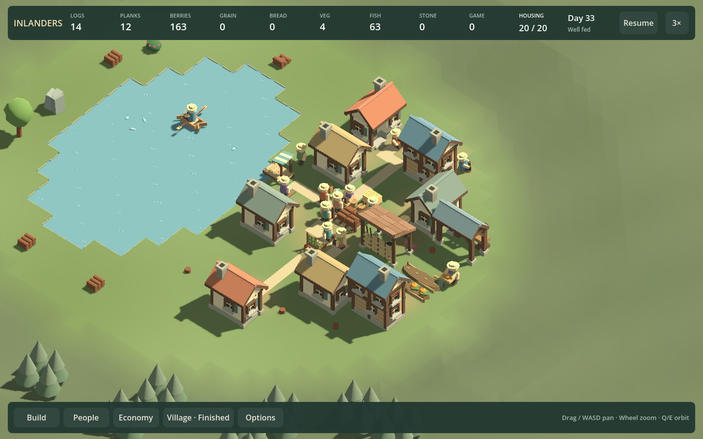
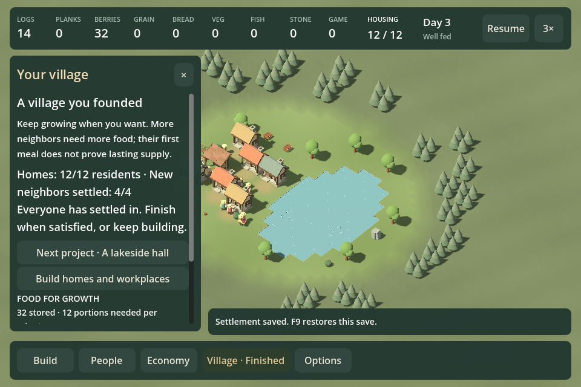

# Whole-game review35 — make a place worth shaping

September 19, 2026. Fixed gameplay commit `a94f953d4d6bcb934ef657c3eaa668acee7a9eb0`. Checkpoint35; production frozen during review. This synthesis records evidence and decisions, not human enjoyment acceptance.

## Whole-game verdict and decision

**Partially convincing.** The strongest current pleasure is shaping an inhabited place: physical meals/work, forgiving home/public-place moves and real paths make revisions matter. The inherited center is still crowded, and neither a food surplus nor more completed visits establishes a reason to keep playing. Continued population growth has not earned its place as the campaign's main motivation.

Retain the warm architecture, physical production/local food, shared work, optional arrivals/endings, reversible housing/community moves and current paths. Keep the introductory court and gentle founding as available experiences. Stop treating a new hall, population quota, food chain or need as automatic next content. The hall remains an optional construction project; its first visitor proves use, not enduring civic success.

**Chosen next design bet:** one authored shore/woodland village situation with two viable land/livelihood choices and a visibly inhabited open center. Compare it with current founding and the legitimate choice to stop growing. Use current systems, not another primary runtime mode. This combines landscape constraints with self-directed village-making; no rolling assessments or prescribed building coordinates. Do not commission a campaign series before this single situation earns retention.

Two bounded impediments precede that comparison: phase-specific village actions/current-rule catalogue guidance, and attribution of reproduced interaction stalls. Neither should consume another five-outcome cycle of incremental controls. The proposed comparison is a whole-place redesign, including the relationship between production hub, homes, public ground and shore; moving two roofs or adding shoreline props alone is insufficient.

## Independent roles and disagreements

| Role/context | Verdict and distinctive finding |
| --- | --- |
| Game design, reused `review30_design` | Partially convincing. Free revision makes a stronger case than the lodge upgrade economy. Test authored landscape situations with alternative livelihoods; retain growth only when its decisions are consequential. |
| UX/onboarding, reused `review25_design` in UX role | Partially convincing. Grouping helps discovery, but960 Food shows only one complete choice at once. Phase actions compete with prose; stale rule descriptions undermine trust. Test a persistent village organized around player-chosen improvements. |
| Playtest/evidence, reused `full19_playtest` | Partially convincing. Tools work, but voluntary use is unobserved. Compare two visibly lived-in places with compact growth and remaining at twelve; do not give a coordinate-based makeover walkthrough. |
| Development lead, reused `full19_lead` | Partially convincing. Retain narrow architecture/performance gains; measure interaction separately from unattended simulation. Compare composition supported by a gentle economy against growth-led management. |
| Visual/audio, reused `commons_presentation_review` | Partially convincing. Routes and open ground improve the hamlet; timber hub still dominates shared life. Compare a non-growing waterfront improvement with an inward court, growth and finite completion. No listening. |

These are separate read-only disciplinary passes, not five fresh contexts or uncoached human play. The original UX context was unavailable at the thread limit; another completed reviewer context took that role. The lead hit a usage limit before its final report, then completed after retry. The independent whole-game presentation/audio supplement also completed; audio remains unjudged without listening. No implementation agent was used.

Agreement: no further needs/catalogue expansion, no return to service certificates, no enjoyment claim from successful scripts. The main disagreement is emphasis: the designer favors authored geographic challenges; visual/audio and playtest favor a non-growing village-improvement comparison; UX favors clearer self-chosen commitments. The selected slice tests both in one genuine settlement situation; if meaningful livelihood decisions still fail while voluntary arrangement succeeds, make composition the explicit spine instead of protecting growth. Conversely, if players prefer solving supply constraints and ignore free composition, develop a logistics campaign deliberately rather than calling arbitrary decoration a challenge.

## Whole-game findings

**Campaign and purpose.** Introduction is a useful short interaction lesson; founding is a gentle opening, not the requested deeper challenge. Known homes-only twelve-person success contradicts any implication that an extra food producer is required to finish. The optional hall offers a recipe followed by one visit. Continued growth has demonstrated real shortage/recovery, but can reduce to repeating a garden/dock package. Archive old assessment structures; reuse geography only where it creates a distinct decision.

**Buildings/economy/needs.** Cottage/lodge remain startup-cost versus processing alternatives; F32a saved only five net building tiles after support buildings, so do not credit them with a dramatic spatial transformation. Forager/garden/dock/hunter/orchard are potential geographic/time alternatives, not mandatory rungs. Farm/bakery and sawmill are understandable processing chains; verify bread under current shared-work rules before building a scenario around its payoff. Quarry/hall and pantry/material storage deserve use when geography justifies them, not artificial bonuses to rescue failed remote strategies. Square/garden/hall are scales of public place, not required civic upgrades. Keep carpenter/comfort optional. Homes and meals have consequences; visible rest/recreation supports daily life. No education/religion or other mandatory needs now.

**Normal/Free arrangement/Creative.** Normal construction plus optional growth and forgiving moves is coherent provisionally. Current Free arrangement keeps actual meals/daily life with relaxed costs and hunger consequences; legacy Creative has different rules. Do not conflate their descriptions or claim one mode's appeal validates another. Producer relocation restrictions may preserve investment or frustrate expression; observe before adding exceptions. No new mode framework.

**UX and controls.** Categories address the user's overload, but comparison still requires scrolling memory. `BuildCatalog.BuildingStaff()` uses slots regardless of shared work. `PlacementPreview.BuildingDescription()` says Creative farm/garden food needs are disabled even in current Free arrangement with meals; dock/bakery text still implies central pantry delivery despite local production. These are confirmed source findings, queued corrections, not fixed by this review. Finished founding960 still says to finish and places the next hall project above keep-building/leaving; invite/finish actions can sit below the fold. Redesign the panel by phase with primary choices visible together, rather than add explanatory text. Preserve held-click and stable-control regression coverage.

**Presentation/audio.** Continuous terrain and contextual labels improve founding over the legacy floating board. Paths make approaches clearer; roofs and the timber/food convergence still hide communal activity. Free court has a clearer spatial shape. The lake outline remains conspicuously stepped. Retain warm material language and recognizable buildings; reconsider massing, shore and activity composition together. No additional prop pass as a substitute. Audio has not been listened to in this review and remains unjudged.

**Reliability/performance.** Current-save and ordinary simulation checks pass for delivered moves/paths; no migrations. F32b fixed-step final JSON is identical before/after while work/allocations drop substantially. It is not smooth-performance acceptance. Fresh dense samples below show long intervals outside the simulation phase as well. Current capture processes exited successfully; no normal long-session/quit reliability claim follows.

## Native performance evidence

Same fixed build,1440,Intel Iris Xe/OpenGL, same32-person30-building dense input. Before/after snapshots and process traces, not a recording or human motion observation. Exclude the last unfinished zero-wall interval; nearest-rank p95.

| Metric | 1x | 6x |
| --- | ---: | ---: |
| Simulated / wall seconds |8.008 /8.804|8.008 /1.364|
| Completed intervals |212|25|
| Median wall interval |35.32ms|41.28ms|
| Wall p95 |69.65ms|90.68ms|
| Maximum wall interval |471.29ms|132.22ms|
| Simulation p95 |2.27ms|29.67ms|

The6x sample is too short for tail acceptance. Dense ordinary simulation maximum39.51ms does not explain its471ms wall maximum; one actor phase reaches252ms. Earlier hamlet1x post-fix median~60ms/p95210ms remains relevant: different tasks/layouts have different costs. Do not infer that a larger population always runs worse or that unattended throughput proves responsive previews. Measure paused/running relocation, path preview, camera motion and saves in a bounded follow-up; native profiling is needed if most delay remains outside measured callbacks.

## Fair experiment and rejection criteria

Use current founding as control and one whole-place alternative with the same accessible catalogue. Terrain/resource choices should make two livelihoods plausible without a prescribed answer, and allow a meaningful recovery. Preserve ordinary construction costs and daily meals; home/public-space revision stays forgiving. Public ground must host visible daily activity from ordinary opposing cameras, not merely earn higher visit counts.

Ask an unfamiliar player to choose whether to grow, reshape or stop; state an intended consequence; act; then explain what residents do differently. Record voluntary watching or a second self-chosen action. Do not prime the specific moved cottages/path sequence. Keep a non-growing arrangement option equal in status.

Reject the alternative if inherited supply makes the livelihood decision irrelevant, one route dominates without an understandable tradeoff, recovery is only blind producer duplication, changes need reports to be perceived, or the result works from only one camera. Reject growth as the spine if players consistently prefer composition; reject composition as the spine if it needs an endless stream of assigned makeovers. Good up-front planning succeeding is not failure. No claim of acceptance until experience evidence exists.

## Tooling investment

| Investment | Beneficiary / payoff | Cost and validation |
| --- | --- | --- |
| Consume existing snapshot/comparison/audio tools | User and all review roles; reach actual alternatives without repeating20 minutes of simulation | Estimate under half a day to prepare a discoverable paired launch; minimal upkeep. Measure time to both states and whether someone actually watches/listens and identifies a consequence. Export alone is not consumption. |
| Bounded interaction trace attribution | Every arranging player; distinguish routing/reachability from actor/native stalls | Several hours to one day estimated, low maintenance. Reproduce a slow interaction, attribute it, then improve latency with exact simulation behavior retained. Stop broad optimization when the chosen obstacle is resolved. |
| Compact completed-frame summary in existing workflow, if repeated | Reviewers currently parsing traces by hand; consistent tail statistics | A few hours estimated. Include completed intervals, speed, median/p95/max and provenance. Measure saved effort over two comparisons; no separate performance platform. |

Snapshot imports already removed repeated long simulation from view iteration: current fresh court/river still captures took roughly13–14 seconds with a valid build; founding's scripted UI journey38 seconds. This is measured setup cost, not frame performance or aggregate time saved. Keep current explicit hashes/validation. Defer generic dependency graphs, ECS, occupancy caching without measurement, universal editors, mode frameworks, asset migrations and new music systems.

## Evidence and limits

Fresh clean fixed-source runs under `artifacts/review/runs`:

- `20260919-134300-180-founding-84eda3`:960 entry/invite/finish/Continue/F9/cancel/Resume, real held controls; construction through ordinary commands and accelerated scripted ticks.
- `20260919-134337-332-court-life-c49f46`: Free arrangement1440 still.
- `20260919-134358-240-river-5557dd`: archived river1440 still.
- `20260919-134448-758-dense-c5a5f0`: dense1440,1x trace.
- `20260919-134532-966-dense-abc184`: same dense input,6x trace.

Final hamlet1440 opposite run `20260919-134018-122-hamlet-spacious-8b1a7c` is dirty precommit27facd0 with source/assembly hashes matching cleana94f953. Earlier960 `20260919-133845-172-hamlet-spacious-8ea38a` predates the cyan preview color change and has different hashes; it is earlier interaction evidence, not identical final source. F32a–d reports preserve comparison inputs/results, failures and limitations. Designer's whole-game scope included source/history for free/legacy areas; other roles consumed some fresh broader views. Do not imply every role saw every frame.

No uncoached native play, continuous motion viewing, listening, complete fresh campaign traversal, long-session acceptance or comprehensive input-latency measurement occurred. Saved states were validated imports rendered on current code, not freshly played from the start. Development benchmark data is not player enjoyment evidence. Production remains at35; stop here after recording the review and revised queue.
