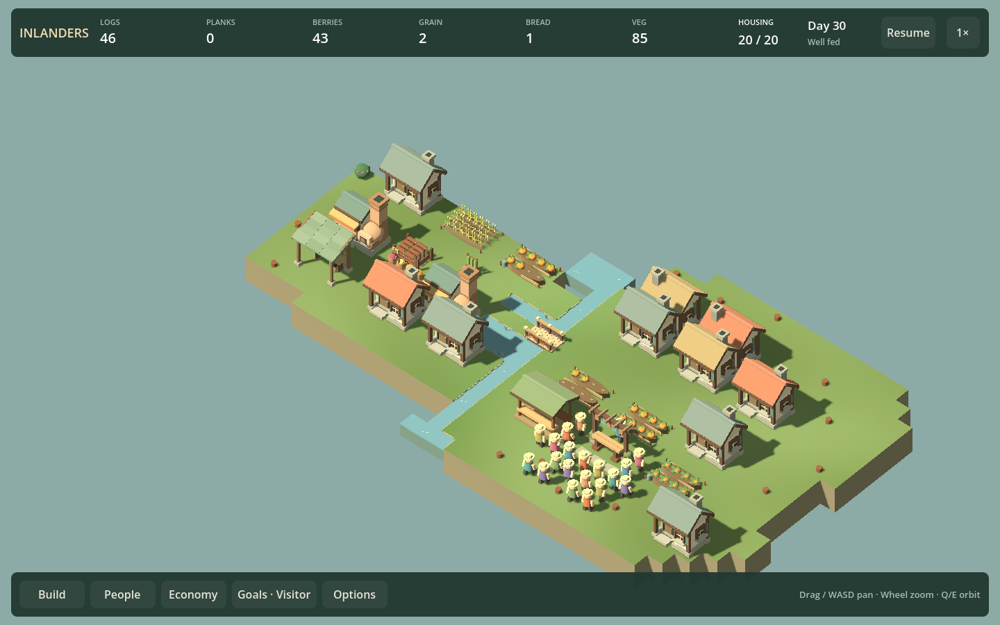
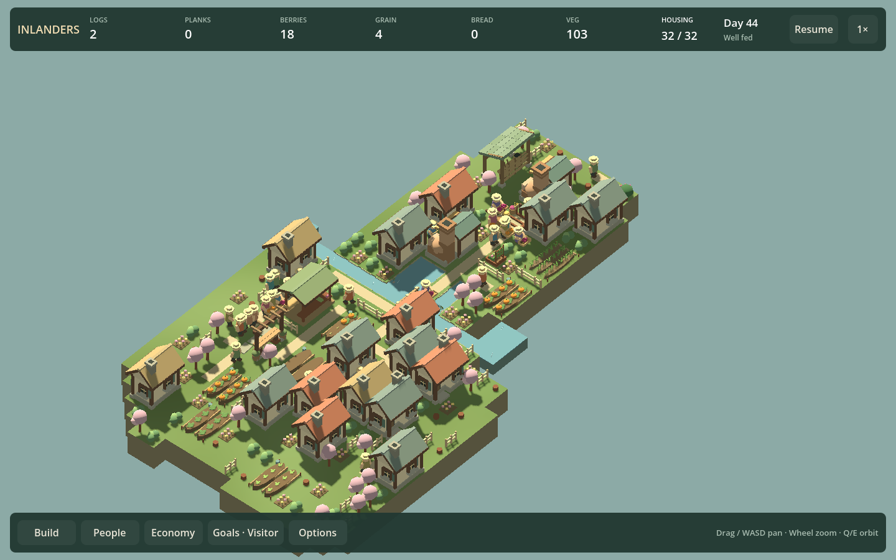

# Checkpoint 5 — whole-project review

September 12, 2026. Reviewed commit: `7e271fe7f22771d579096f3e3ff2f39ace4b0ade` (gateway feature `1c89149`). Root verified the clean worktree before review and independently hashed the built assembly: `37B9160D864611488B88E6184B5BCC741E9ACE172F0FB4780038515C2CF59E4B`.

The user clarified that every scheduled review assesses the **entire project/game**, not merely the last five outcomes. The design, UX and development-lead reviewers extended their assessments accordingly. This scope is now explicit in AGENTS.md and the accepted cadence. Personal saves are disposable; compatibility or preservation work is not a review prerequisite.

## Whole-game assessment

The game has a coherent identity and enough systems to prioritize operating, understanding and enjoying the existing settlement. This is not a finding that the game is finished or proven fun.

| Area | Assessment | Evidence and limits |
| --- | --- | --- |
| Campaign | Five lessons lead into five operational settlements: river access, shore space, finite stone, retained habitat and expanded neighborhoods. Geography changes the commitments; no missing tech ladder is established. | Campaign source and existing completion/recovery reports. Sustained useful decisions, first-play comprehension and enjoyment remain less well established than feasibility. |
| Buildings/economy | Eighteen building types cover housing, six edible outputs, processing, storage, crossings and recreation. Orchard establishment, finite hauling and hunting/restoration have distinct tradeoffs. | Buildings/production source and comparison reports. No blanket repricing or removal is supported. Successful finale tests converge on one bread arrangement, leaving alternatives uncertain. |
| Needs | Meals, home/rest and recreation already connect layout to resident routines. Variety does not require all six foods. Comfort and civic variants can remain optional. | Happiness, home and civic source/evidence. Fewer trips must not be described as proven productivity gains. No compulsory new need is justified. |
| Normal and Creative | Normal play retains investment and logistics; Creative supports arrangement while routines and physical production continue. Recent relocation, stock, terrain and gateway tools fit that purpose. | Creative and job source plus recent feature verification. Creative improvements do not establish improved campaign pacing. |
| Title and village appearance | The composed menu and ordinary village share a recognizable visual vocabulary. Roofs, fields, bridges and construction stages distinguish major functions; dense reverse views obscure more local activity. | UX inspected title, ordinary/dense village, forager stages and civic stills. Motion, listening and human appeal cannot be inferred from screenshots. No wholesale art replacement is supported. |
| Controls/onboarding | Bottom navigation, drawers, focus outlines, resident names, goal reasons and storage accounting form a coherent interface. Terrace recovery has specific gaps; orchard advice conflicts with named assignments. | Narrow/wide screenshots and source. Existing campaign explanations are promising but do not prove first-time discovery or comprehension. |
| Reliability | Fixed-tick simulation, conservation/reservation/access validators and campaign recovery tests are substantial. Several continuation helpers compare two reloads, leaving a specific blind spot. | Development-lead source audit. No critical corruption or architecture defect was established; reported historical tests were not rerun by the reviewers. |
| Sound and performance | Audio transport/voice controls have implementation evidence, but musical and soundscape acceptance remain open. Recorded long frames can interrupt watching and input. | Existing audio reports and F23c3 normal-process traces. No new listening or profiling result is claimed. |

## Representative whole-village appearance

These are historical composition-review captures inspected for this assessment, not fresh screenshots of the fixed checkpoint-five build. They show the ordinary and dense village, rather than only the newest objects.

The visual vocabulary is coherent, but the overall look remains a stylized tabletop prototype: repeated roof masses and broad flat ground dominate, while dense layouts can obscure activity behind buildings. This is not a claim that the presentation is polished or that the user's concerns about appeal are resolved. Observe navigation and daily activity in those conditions before selecting a district-composition, silhouette or camera correction. The [title capture](title-composition-narrow.png) and [finale goals](images/finale-campaign-opening.png) provide additional whole-product context.

## Independent roles

- **Game designer — `checkpoint5_design`:** campaign/building/needs/normal/Creative source and existing scenario evidence; recommends validating the operating loop, a controlled finale alternative and experience-quality work. No play, listening or fresh runtime test.
- **UX/onboarding — `checkpoint5_ux`:** title/menu, ordinary/dense composition, construction, People/Economy, campaign and arrangement screenshots plus source. Historical stills are not freshly regenerated fixed-build UI evidence. No live interaction or listening.
- **Development lead — `checkpoint5_lead`:** simulation, saving, campaign tests, rendering/input/audio architecture and recorded performance evidence. No new tests, profiling or GUI launch.
- **Playtest — `checkpoint5_playtest`:** not performed; zero gameplay findings. Native control initialized and eventually discovered Inlanders window `4982578` after an interactive launch. The subsequent window/state capture returned no image or UI state for 483.4 seconds before the lead interrupted the hung call. No clicks, keypresses, campaign progress or later-map play occurred. The reviewer read the public README only. This is a capture failure after successful window discovery, not evidence that the game itself froze or that native control is wholly unavailable. A prepared alternate launcher was never used. Review-owned game processes were stopped; no process is intentionally left running.

## Consolidated findings and decisions

| Decision | Finding / player consequence | Bounded action |
| --- | --- | --- |
| Fix next | Terrain refusal pools paths, invisible work access and whole worker routes into a coordinate-only message; all affected cells turn red. Players cannot tell whether to move the plot, remove a path or wait. | F12h4: return a blocker cell/category, mark that cell distinctly and give cause-specific recovery text. Preserve protection rules. |
| Fix next, same chunk | Terrain Apply promises Undo until the next edit/load, but later construction or traffic also blocks it. The reason is tooltip-only, and a duplicate error notice covers Close at 960. | F12h4: qualify the promise, show blocked Undo inline and prevent duplicate notices overlapping the panel. Check visible path, invisible entrance and temporary route cases, including reopening after construction. |
| Fix next | Orchard production guidance says farmers can work elsewhere while strict assigned farmers must wait. This can mislead food-labor allocation. | F21u: distinguish Automatic and assigned farmers in the actual inspector, including the growing/establishing orchard case. Keep strict assignment behavior. |
| Strengthen verification | Workplace, stone-storage and bush-move continuation helpers advance two reloads. Both could lose the same omitted runtime state and still agree. | In the existing active-job/cargo fixtures, advance the original and one reload with identical ticks. Do not claim a save bug before the stronger check finds one. |
| Investigate | Finale recovery changes both bakery capacity and location; successful alternatives converge on central grain and two bakeries. A hidden favored layout is a risk, not proven imbalance. | F11d: compare capacity and placement separately with matched population/labor and ordinary meals; measure reserve trend and recovery cost. Establish another credible arrangement or identify the precise failure. No quota inflation. |
| Investigate | Whole-loop comprehension, useful-action intervals, continued play and enjoyment remain weakly observed. Dense-scene navigation is an observational question. | Use ordinary-interface campaign play as evidence; distinguish agent observations from human enjoyment. Correct only demonstrated obstruction. Do not fill the uncertainty with more systems. |
| Investigate | Soundscape repetition/mix and three candidate themes/transitions still lack listening acceptance. | F10b2/F17b: matched-scene listening and complete theme/transition audition, with explicit accepted/revised/pending outcomes. Silence from the user is not approval. |
| Investigate | F23c3 recorded approximately 203 ms cold and 505 ms warmed frames; a later trace still recorded about 193 ms. | F23c4: native engine/driver evidence for the existing reproduction, including a recording beyond the two-minute autosave boundary. Fix only an attributed cause; do not strip animation or promise larger populations. |
| Fix documentation now | Active assessment/follow-up text still labels stone storage, workplace assignments and gates as candidates and music as one looping miniature. | Update delivered status and archive superseded acceptance briefs. No gameplay change. |
| Defer / retain cuts | More compulsory needs, a new producer, level eleven, a broad art rewrite or general architecture rewrite lack a demonstrated problem here. Previously cut seasons and restoration crossing gates stay cut. | Preserve the candidate backlog and cut rationale. Reconsider only with distinct player benefit/evidence. |

## Next five chunks

1. **F12h4 — visible terrain blockers and honest Undo recovery.** Includes all three related UX findings.
2. **F21u — assignment guidance and continuation verification.** Correct orchard advice; strengthen the three identified original-versus-reload fixtures without broad test churn.
3. **F11d / F18d — campaign operating-loop evidence and finale alternatives.** Use actual session observations where available, then isolate the finale bread placement/capacity question. Human pacing remains separately unverified.
4. **F10b2 / F17b — whole soundscape and music audition.** A joint listening session can cover both, but record their acceptance separately. If listening evidence is unavailable, keep this pending and advance independent work.
5. **F23c4 — attributed long-frame investigation.** Reuse the real settlement and include normal autosave timing; no speculative optimization.

These are work chunks, not five promised playable increments. Documentation, reviews and test/profiling foundations do not advance the ledger. All four roles reported and the source/visual review is recorded, but the interactive playtest did not pass or occur. Retry a responsive native capture/input session for F11d/F18d: make meaningful opening food/housing progress, then select a later settlement normally and observe assessment/recovery. Label it README-informed agent play, record real elapsed waits and screenshots, and keep human enjoyment separate. Independent corrections can proceed without pretending this missing evidence exists. Reevaluate order after every chunk.
