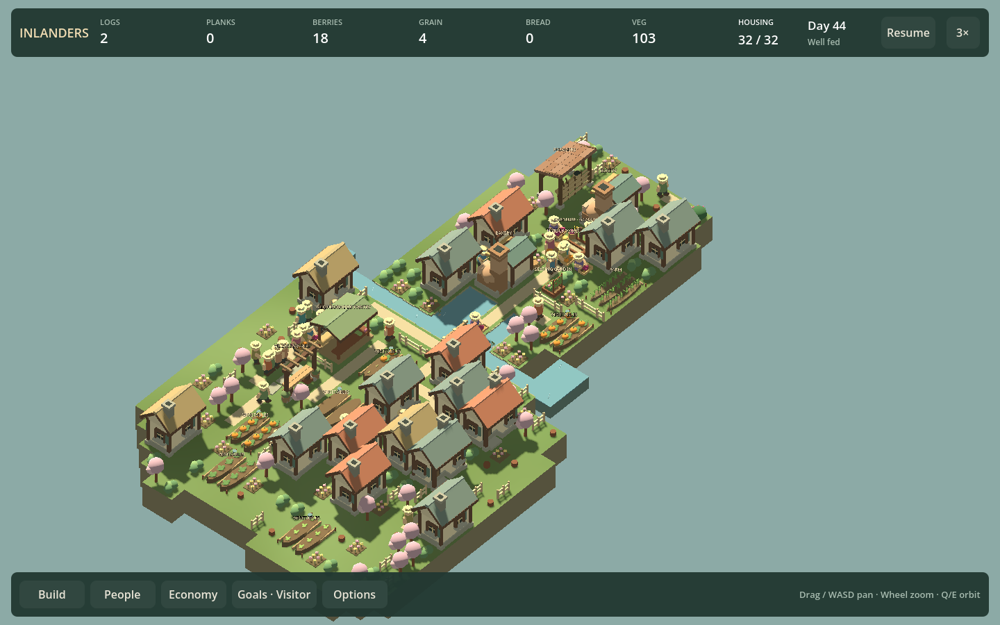

# T01 — scenario inspection and reproducible evidence

Delivered September 12, 2026. Development tooling only; playable checkpoint count remains 8. This is the first enabling investment from the [strategic review](STRATEGIC_REVIEW_8.md), not evidence that the game is more enjoyable.

## Use

Run from the repository in PowerShell:

```powershell
./Review.ps1 List
./Review.ps1 Inspect river
./Review.ps1 Inspect dense -Speed 6 -Width 960 -Turn 1
```

The launcher builds/prepares only when required, opens a paused interactive settlement with ordinary controls, prints its process/output folder, and returns. Space resumes, the normal speed control cycles 1×/3×/6×, and **F8 captures a matching screenshot/state bundle**. Close the window normally to finish. Review-session saves/settings are under that run's folder. Starting scenarios remain immutable inputs.

Explicit stages support focused work:

```powershell
./Review.ps1 Build
./Review.ps1 Prepare ordinary -Fresh
./Review.ps1 Check ordinary -ReuseOnly
./Review.ps1 Capture ordinary -ReuseOnly
./Review.ps1 Capture river -Width 960 -ProbeControls
```

`-ReuseOnly` refuses missing/stale builds or snapshots. Without it, missing/stale dependencies regenerate. `Capture` runs the normal renderer, captures the paused scene and exits; it is not a headless simulation screenshot. `-ProbeControls` additionally runs a clearly labeled scripted UI check, with normal process advancement and another F8 capture. `Check` validates the snapshot/roundtrip without opening Godot. A failure retains logs and does not count as successful capture.

To reopen a captured world with its camera, size, speed, selected resident/building and audio/view settings:

```powershell
./Review.ps1 Inspect -Bundle 'artifacts/review/runs/<run>/capture-0002' -ReuseOnly
```

The path is the capture directory printed by a run, not a literal `<run>` directory. Bundle settings take precedence over scene presets. Reopening starts paused. Bundle source/hash checks prevent silently opening stale evidence; this is not save migration or deterministic animation/audio replay. General panel navigation, transient placement state and audio transport position are not replayed.

## Scenarios and implementation

`Development/review-scenarios.json` registers opening, river, ordinary and dense scenes with descriptions and camera presets. Opening/river use the actual fresh campaign worlds. Ordinary uses one existing successful local finale route; dense extends the existing extra-resident route to 32 residents with normal building/arrival commands. These are authored deterministic preparations, not random seeds or uncoached play. The manifest explicitly records that distinction.

The dense preparation moved from the rendered profiler into `Development/ReviewWorlds.cs`, shared with the fixture executable; there is no second copied implementation. The existing finale route returns its resulting world. Cold preparation still runs that route's assertions and physical simulation, but inspection never reruns its comparison suite or profiling loops.

`Review.ps1` separates build, preparation, snapshot checking and inspection. A conservative content fingerprint covers relevant source, project, script and catalog files while excluding docs, downloaded tools and generated artifacts. Build and fixture byte hashes also have to match. Changes invalidate broadly on purpose; narrower dependency caching is deferred until useful savings justify it.

Each run retains `request.json`, `initial.json`, stdout/stderr and captures. Each capture contains `view.png`, `world.json` and `manifest.json`: source/build/commit/dirty state, generator and fixture provenance, wall/simulation times, paused state, current speed, camera/window, selected resident/building, current objective, renderer/adapter and audio/view settings. PNG and world hashes bind the bundle. The simulation pauses during capture and is checked for unchanged state before resuming its prior pause status. Existing viewport capture supplies the image.

## Verification and first measurements

Game and fixture builds passed without warnings/errors. Final implementation passed:

- Prepared and validated all four named scenes: 8 residents/0 buildings, 8/5, 20/22 and 32/30.
- Captured all four through the renderer, including 960px and 1440px, 3× selection and a rotated dense view. Opening and dense images were visually inspected for actual rendered content.
- Scripted river UI probe: paused startup, normal speed cycle, catalog access, normal-process simulation advancement, resident selection and F8 capture.
- Reopened the probe bundle and compared world hash, camera, window, selected resident and audio settings successfully.
- Deliberately stale fixture fingerprint, altered snapshot bytes and wrong build hash were rejected under `-ReuseOnly`; original test artifacts restored afterward.
- Capture processes terminated; no review-owned game remains running. Godot's existing root-certificate warning remained unrelated.

| Operation | Observed wall time | Scope |
| --- | ---: | --- |
| Initial game + fixture build | 33.77s | First build in this implementation run; later changed-source builds were faster. |
| Fresh opening / river preparation, existing build | 0.55s / 0.77s | Initial measured preparation runs. |
| Ordinary / dense preparation, existing build | 8.25s / 19.31s | Final source; one physical finale route each, dense extension included. |
| Warm river bundle reopen + capture | 9.30s | No build or generator. |
| Warm ordinary / dense capture | 9.86s / 12.99s | No build or generator. |
| Opening capture with regeneration | 8.58s | Existing build, stale opening snapshot regenerated. |
| River / ordinary / dense snapshot checks | 0.49s / 0.54s / 0.49s | No rendering. |

These are observations on this Windows/Iris Xe machine, not performance guarantees. Before T01, source inspection shows multiple commands, unconditional launcher builds and implicit fixture prerequisites; prior native snapshots sometimes exceeded 31 seconds. That is not a matched end-to-end benchmark, so no numeric percentage saving is claimed. T01 now reaches a valid captured scene with one command within the two-minute warm-build target. Measure saved setup time and upkeep again during F27a and the next review before extending infrastructure.



## Roadmap decision

T01's first version is delivered. **Next: F27a, the complete neighborhood gameplay alternative.** Do not keep broadening tools to postpone that decision. T02 supplies minimal comparison plumbing as the experiment needs it. Motion/audio export integration and automatic input-event history remain follow-ups with demonstrated need; existing sound exporters still exist, and this chunk makes no listening or new native-play claim. A scripted control check proves access, not comprehension or enjoyment.
