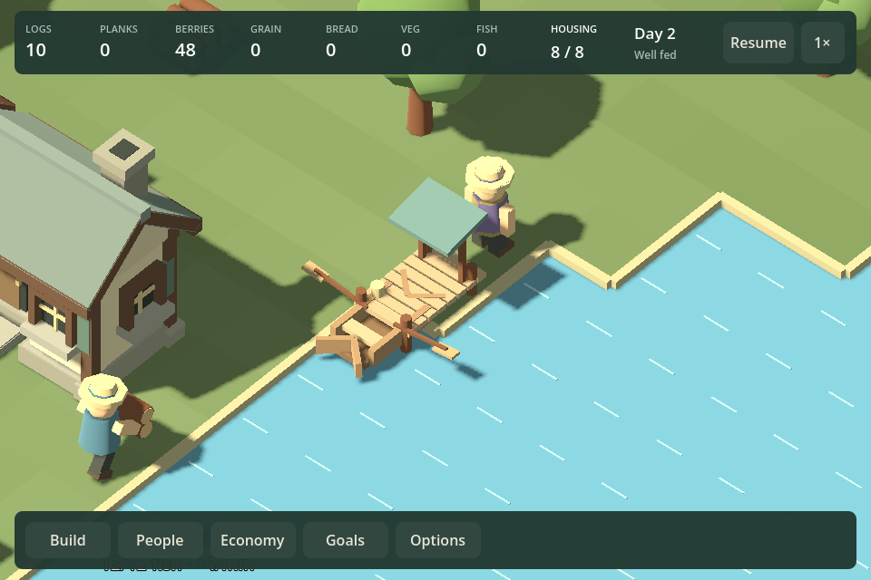
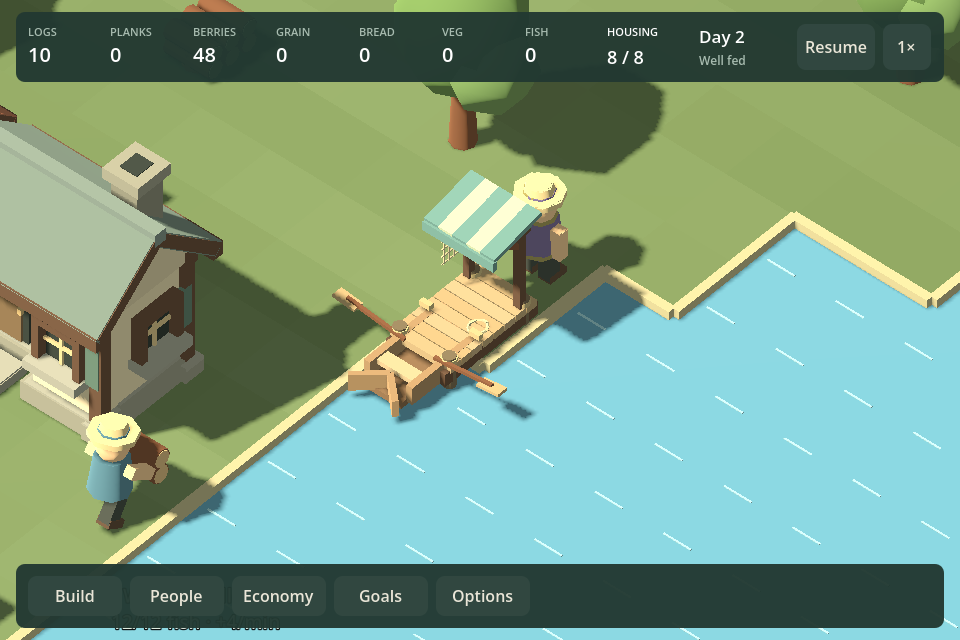
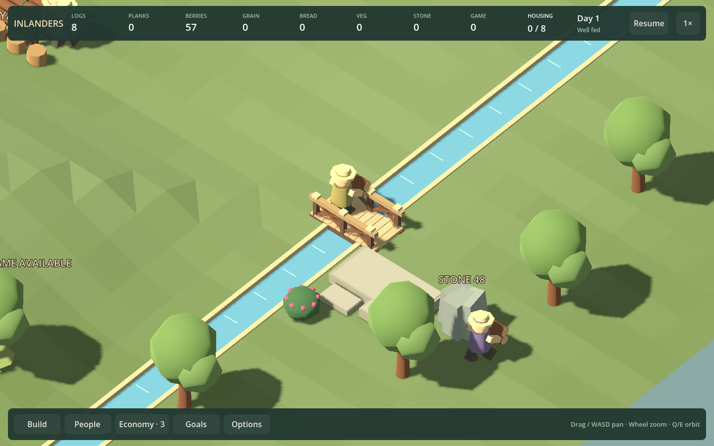
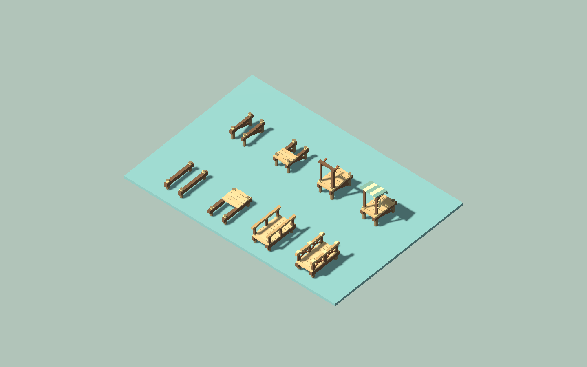

# F23b8 — docks, bridges and shore connection

Docks now have deeper piles, under-deck beams and braces, thicker varied boards, mooring cleats, rope and a striped canvas shelter. The net hangs at the side instead of across the landing. Bridges have heavier edge beams, supported posts, open ends, braced rails and post caps. Four construction stages reveal the structure before the finishing details.

Dock cost remains eight logs; bridge cost remains six. Footprints, entrances, launch cells, deck routes, boat models and simulation rules are unchanged. This is a structure pass, not wider bridges, freight boats or a water/terrain rewrite.

## Comparison

Before:

After, same construction fixture and camera:

Agent inspection finds stronger deck/support depth, a clearer small dock silhouette and readable rail openings. The landing stays open between the shore entrance and boat; all net/rope details are equipment, not invented fish inventory. Human aesthetic acceptance remains open.

## Verification

`Play.ps1 -ShoreArtSmokeTest` builds docks and bridges in all four orientations, runs real fishing, return and fish delivery, restores an active boat save, checks paused oars, recalls the fisher and dismantles the idle dock through normal material recovery. It captures docks at 960/1440 and all construction stages.

A divided-river fixture requires at least two distinct workers to use the bridge, then completes far-bank construction. Demolition is rejected while that crossing is needed. The captured worker is on the actual route, not a posed model.

`Play.ps1 -FishingSmokeTest` also passes: boat/passenger placement, actual catch delivery, fishing stocks, source and placement feedback, resource/Economy UI at both sizes, and the saved lake campaign phase action. Builds finish without warnings. No simulation source changed.

## Roadmap review

F23b8's structure pass is shipped. Continue with **F11b5/F18b5: A lasting village decision prototype**. Current art has received enough successive family passes to return to the larger unresolved question: meaningful decisions after initial setup.

The existing bright shoreline rim and repeated water marks remain visually artificial in the overview. Keep softer banks/water presentation in F12/F20 follow-ups; do not silently expand this chunk into terrain rendering. Broader atmosphere and later visual feedback remain open, as do deeper campaign pacing and enjoyment.
