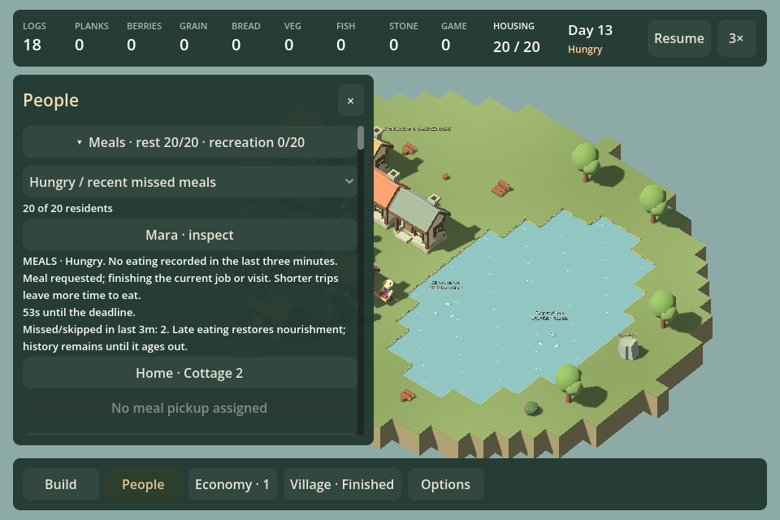
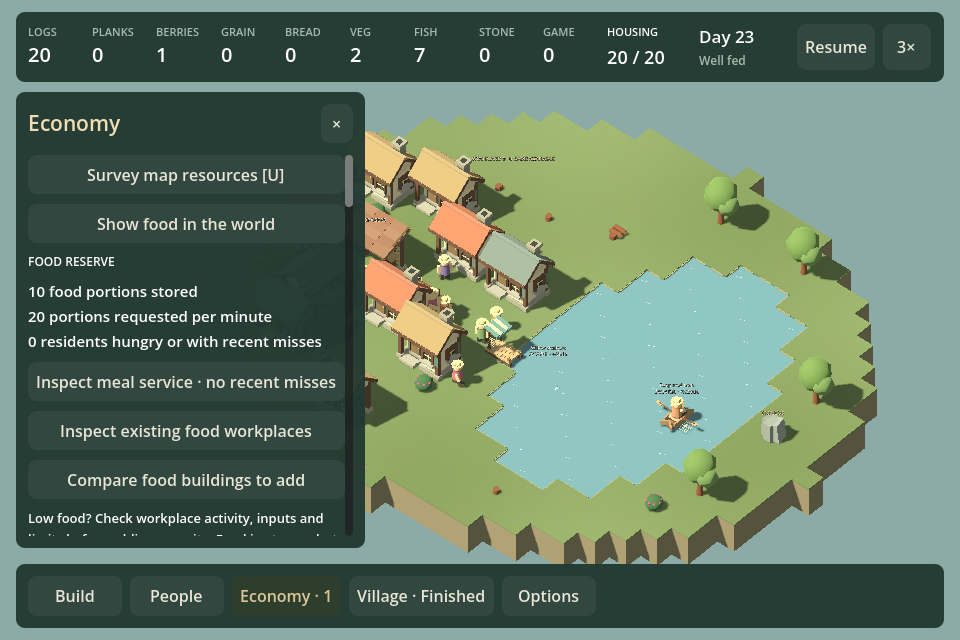

# F31f — connect shortage investigation to action

September 13, 2026. Base `ba1068e`, plus this chunk. Economy now leads with stored food, demand and residents needing meal attention, followed by direct links to meal service, existing food workplaces and food building choices. Detailed legacy assessment data moves to the reserve tooltip. Producer history remains below the actions. No new dashboard, automatic building prescription or production rule.

The food-workplace link opens the existing filtered building directory; selecting a workplace reaches its ordinary activity, inputs, pause and staffing controls. The expansion link opens the existing Food catalogue. Fishing docks now show their workplace state instead of the erroneous generic “Gathering place” directory label. In meal service, each resident can open their actual assigned pickup source, or the last consumed meal's source while that request remains. An unassigned request has a disabled link; central food focuses its location and enables the existing food map. No guessed source or diagnosis.

## Matched recovery experiment

`--shortage-recovery` now regenerates the F31e homes-only midpoint with ordinary commands; the review correction removes the unverified artifacts-file prerequisite. Both arms use ordinary construction and600 simulated seconds. Pantry target12 uses normal settings; no goods are injected. Positions and results: [raw data](data/shortage-recovery.json).

| Intervention | Total unfed person-seconds | Unfed in final300 seconds | Final food |
| --- | ---: | ---: | ---: |
| Pantry,6 logs | 6031.0 | 2899.7 | 1 |
| Garden + dock,12 logs | 1024.1 | 0 | 10 |

The F31e no-action same-age control has2662.1 unfed person-seconds in the final300 seconds; one garden has1623.1. Additional production resolves this particular shortage after construction and recovery time; a pantry does not. This is not proof that pantries or remote access are generally bad. No isolated causal attribution for the pantry's small regression, universal optimal build or player-enjoyment claim. All branches validate state and exact current-save roundtrip.

## Validation

Full game/test builds pass. Scripted Godot founding/hall journey verifies existing-food directory and category, actual forager inspection, food catalogue, real resident-source link, and saved Continue after post-project growth.960 final run `20260913-231916-767-founding-hall-a95dde`;1440 `20260913-231932-543-founding-hall-432659`. Initial capture revealed buried actions; opening hierarchy was corrected and recaptured. No native/uncoached play or listening claim.

Final tested source fingerprint `DD2BF9B0FB57AEEEDB8826F0DA9013BB67EC0AB969798585F5C1EB8E3A9F372D`; game hash `D3108132A07527662ED341B1C106870AD3C60F600F7CEC6C7FEEDC2D1D6282A2`; tests `5ADAE0B0EA0AB5DA375103847375C2668FA902B1CFF9FDCF477746E5F2023B83`.

One playable investigation/action outcome, count30 when committed. The [whole-game review30](REVIEW_CHECKPOINT_30.md) is complete; its synthesis chooses the next direction.

## Review30 corrections

[Whole-game synthesis](REVIEW_CHECKPOINT_30.md) found a wrong founding Build shortcut and a healthy-state-only UI demonstration. The shortcut now opens Build / Place / all buildings, asserted by the founding UI journey (`20260913-232825-471-founding-40e2bd`,1440). Food flow is labeled Producer deliveries; growth history uses neutral comparison language. Meal-filter rows and guidance omit unrelated rest/recreation detail.

The `shortage-recovery` fixture is generated deterministically from real founding and four-cottage growth commands. Its bytes match the original measured midpoint exactly (SHA256 `2970E1B0972B16F736CB6FF7BA07B24E65D9C4ADE176B981ED24C70F45CB1D46`). The existing source-aware review cache handles reuse: first preparation11.69 seconds, skipped on subsequent captures. No new provenance framework.

New scripted probe starts at20 residents with hunger, opens Economy/meal coverage, verifies an unassigned meal source is disabled, inspects the real producer, selects garden and dock in the ordinary catalogue, then uses placement commands and accelerated ticks. It validates zero hunger over the final300 seconds and exact saved restore. This is coverage of an actual shortage and recovery, not uncoached diagnosis or human site selection.

960 final UI/state run `20260913-233336-841-shortage-recovery-dbe884` exited cleanly.1440 runs `20260913-232922-529-shortage-recovery-14259c` and `20260913-233051-231-shortage-recovery-ee837b` passed gameplay assertions but crashed during engine shutdown with C# binding/finalizer errors; they are failed process runs. A review-only mitigation stops frame processing and drains managed finalizers before requesting engine exit. This does not change normal play or its quit path and is not a general engine-lifetime fix. The first final-build1440 rerun `20260913-233455-626-shortage-recovery-a68f25` passed including clean exit; the second consecutive1440 run `20260913-233612-784-shortage-recovery-beb89e` also passed with clean exit. Both retain the unrelated root-certificate warning; neither contains the fatal shutdown errors. This is bounded mitigation evidence, not proof of normal-play shutdown reliability.

Final build for this mitigation: source `42DE5E173671FE4F6335A32C469EFFEB4E49CF17DA12D8654FC43D36AF3EF9B4`, game `C591973D19F0D84740FD009B71BD2E32EA02F891B2F62F1E8D35B65D7789D477`, tests `0AF615766A05B217B6BBE06E4D824A1A4F7245A35380212EDA5915AF2F040A54`. Earlier960/source-link tests share final UI behavior; only review shutdown handling changes afterward. Count remains30; review and corrections add no second outcome.
