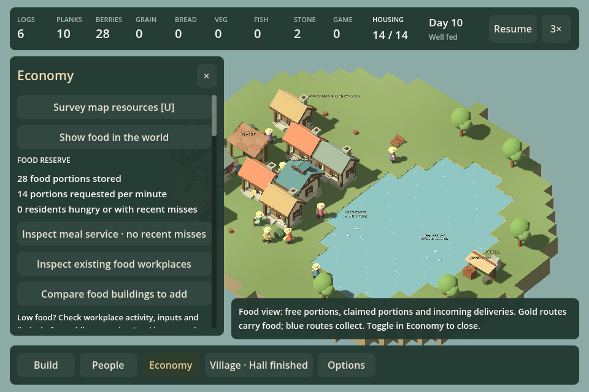

# F31f — connect shortage investigation to action

September 13, 2026. Base `ba1068e`, plus this chunk. Economy now leads with stored food, demand and residents needing meal attention, followed by direct links to meal service, existing food workplaces and food building choices. Detailed legacy assessment data moves to the reserve tooltip. Producer history remains below the actions. No new dashboard, automatic building prescription or production rule.

The food-workplace link opens the existing filtered building directory; selecting a workplace reaches its ordinary activity, inputs, pause and staffing controls. The expansion link opens the existing Food catalogue. Fishing docks now show their workplace state instead of the erroneous generic “Gathering place” directory label. In meal service, each resident can open their actual assigned pickup source, or the last consumed meal's source while that request remains. An unassigned request has a disabled link; central food focuses its location and enables the existing food map. No guessed source or diagnosis.

## Matched recovery experiment

`--shortage-recovery` loads the F31e homes-only midpoint (`--neighborhood-growth` generates it). Both arms use ordinary construction and600 simulated seconds. Pantry target12 uses normal settings; no goods are injected. Positions and results: [raw data](data/shortage-recovery.json).

| Intervention | Total unfed person-seconds | Unfed in final300 seconds | Final food |
| --- | ---: | ---: | ---: |
| Pantry,6 logs | 6031.0 | 2899.7 | 1 |
| Garden + dock,12 logs | 1024.1 | 0 | 10 |

The F31e no-action same-age control has2662.1 unfed person-seconds in the final300 seconds; one garden has1623.1. Additional production resolves this particular shortage after construction and recovery time; a pantry does not. This is not proof that pantries or remote access are generally bad. No isolated causal attribution for the pantry's small regression, universal optimal build or player-enjoyment claim. All branches validate state and exact current-save roundtrip.

## Validation

Full game/test builds pass. Scripted Godot founding/hall journey verifies existing-food directory and category, actual forager inspection, food catalogue, real resident-source link, and saved Continue after post-project growth.960 final run `20260913-231916-767-founding-hall-a95dde`;1440 `20260913-231932-543-founding-hall-432659`. Initial capture revealed buried actions; opening hierarchy was corrected and recaptured. No native/uncoached play or listening claim.

Final tested source fingerprint `DD2BF9B0FB57AEEEDB8826F0DA9013BB67EC0AB969798585F5C1EB8E3A9F372D`; game hash `D3108132A07527662ED341B1C106870AD3C60F600F7CEC6C7FEEDC2D1D6282A2`; tests `5ADAE0B0EA0AB5DA375103847375C2668FA902B1CFF9FDCF477746E5F2023B83`.

One playable investigation/action outcome, count30 when committed. The whole-game review is due before further implementation; its synthesis, not this local improvement, chooses the next direction.
