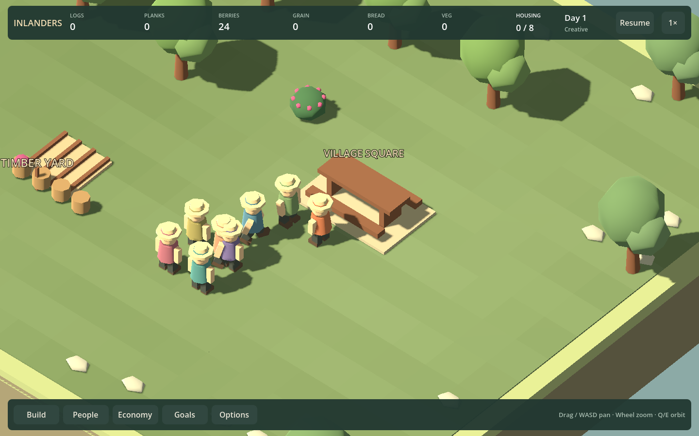
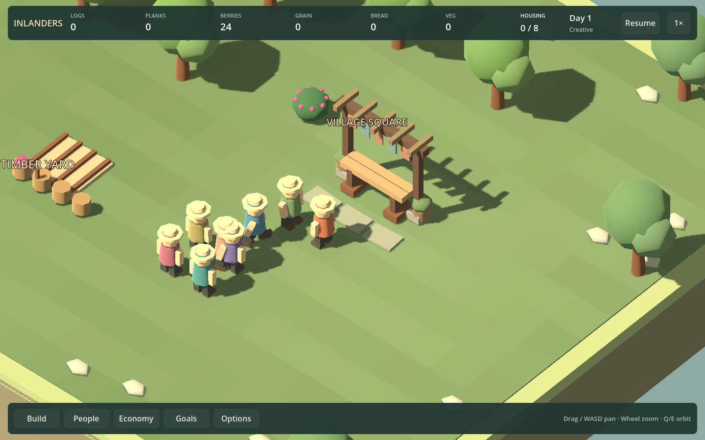

# F23b4 — a recognizable gathering place

The square now has a timber serving table, braced open arbor, cloth pennants, planted feet and separate frontage stones. It replaces the generic picnic-table platform without turning the blocked furniture footprint into pretend seating.

| Before | Civic frontage |
| --- | --- |
|  |  |

These are matched 1440×900 social fixtures at the same paused visit state. Residents still stand on reachable ground outside the model. No food is drawn permanently on the serving table. Six-log cost, four recurring visitors, visit cadence, supper rules and save format remain unchanged.

## Design review

The visual payoff is an identifiable civic frontage and a clear place to gather, rather than another house. `Simulation/Leisure.cs` selects reachable cells within two tiles of the entrance; `SupperSpots` in `Simulation/Food.cs` uses four tiles. These routines do not seat villagers on benches inside a building. The model therefore omits unused benches and leaves the frontage open. Build descriptions now distinguish the two radii and explain the table's role. A seating-system rewrite is unnecessary for this slice.

Construction reveals stones/feet, frame/braces, the table, then the arbor details. The service-space requirement remains consequential when arranging paths, homes and other venues. No extra mandatory needs or recreation bonuses were added.

## Verification

Build and `Play.ps1 -SocialSmokeTest` pass. The expanded test covers four building orientations, actual construction and visitors, footprint-clear destinations, 960/1440 views, paused/save restoration and supper completion after reload. Supper fixtures receive accounted bread to isolate gathering; they do not claim to test production. Existing pairing, gesture, departure and home-rest checks also pass.

`Play.ps1 -ArtSmokeTest` includes the square's four construction stages alongside the rest of the building family. Social and supper captures are under `artifacts/f23b4-*`; the matched comparison is above. Human aesthetic acceptance remains open; rendered checks prove operation, not enjoyment.

The next active chunk is F11b3/F18b3: examine river/lake decisions and clarity through the existing UI, then make a correction only where evidence supports it. Storage presentation remains the next separate art chunk. The larger roadmap goal remains unfinished.
