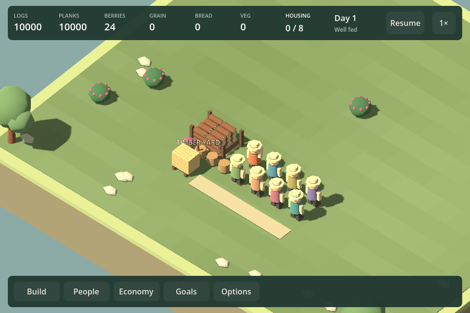
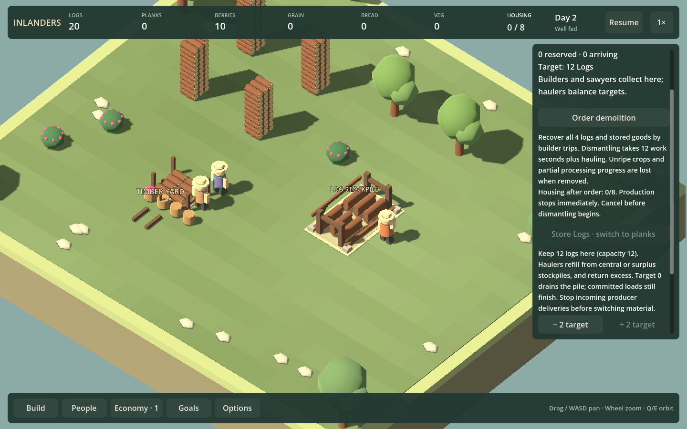

# F23b5 — compact storage presentation

Implemented September 12, 2026. Central racks display at most 24 logs and 18 planks. Exact quantities, reservations, capacity, hauling and saves are unchanged. The local 12-unit stockpile still displays every stored unit.

Central stock meshes are batched into four material groups when stocked; empty storage has no stock meshes. Above-cap inventory changes update the cached exact totals without rebuilding racks. The yard has rack uprights and plank sleepers; stockpiles have stone feet, stronger side frames, a braced rear rail and open frontage. Ground and path colors are slightly less saturated; no lighting or terrain rules changed.

## Verification

`Play.ps1 -PlankStorageSmokeTest` passes: actual local plank production/delivery, occupied material-switch protection, save/load, draining and changing material at 960/1440.

After building, run the bundled Godot console with `--path . -- --hud-smoke-test --storage-review` (using the same DOTNET_ROOT/APPDATA environment as Play.ps1). This runs the yard fixtures and existing log storage test. Fixtures cover 0, 8, 24, 10,000 and 10,002 units of each material, accounted conservation, exact unchanged saves, no idle rebuild, and no rebuild when already-full racks gain stock. Captures cover both window widths. Existing log tests exercise actual construction, rotated placement, hauler assignment, filling to 12, exact per-location inventory, reload and draining to zero.

The yard has four batched stock nodes at 24 and 10,000 units, zero when empty. One run measured 100 paused actor updates at 7.7–11.0ms CPU, VSync disabled, Intel Iris Xe/OpenGL. This is a small update-workload sample, not a frame-rate or whole-village performance improvement claim. The bounded geometry and unchanged node identities are the stronger evidence.

## Review and next work

Agent visual inspection finds a compact rack rather than an inventory-height tower; human aesthetic feedback remains open. The stockpile capture also reveals tall loose timber sources in the deliberately large logging fixture. Loose source/salvage geometry is separate from yard storage and remains a rendering follow-up; it must preserve source quantities and pickup positions.

Proceed to F26b2a: a budgeted quarry/hall scenario brief. Do not add storage capacity or hauling rules as part of this presentation change.
