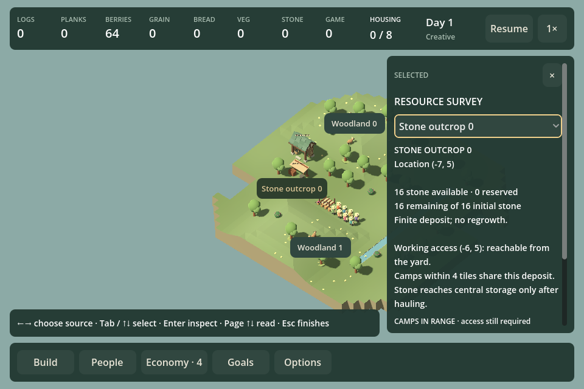
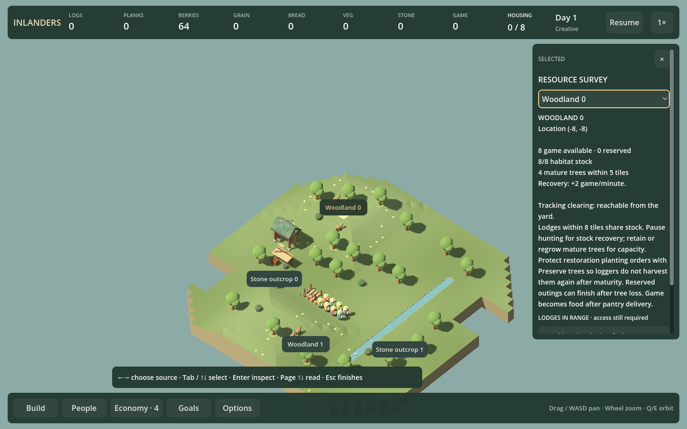

# Resource-survey keyboard navigation — F21s

September 12, 2026. Resource surveys now support source selection, current evidence, workplace inspection and return using the keyboard. Goals and Economy survey links hand off to the same flow.

**U** opens the survey or finishes an existing survey, including after mouse interaction. **Left / Right** chooses a source while the picker has focus. **Tab / Shift+Tab / Up / Down** moves between the picker, related workplaces and Finish. **Enter / Space** activates a workplace; **Page Up / Down** reads the inspector. **Escape** returns from a workplace to its source, then finishes the survey. Visible gold focus follows scrolling.

Selection follows the source key, rather than its position in the picker. Source lists refresh when their membership/order changes, while stock and access evidence refresh normally. Removed sources clear selection; removed workplaces cannot activate a replacement control. Empty maps retain an enabled Finish action. Read-only inspection preserves simulation state.

Mouse interaction releases keyboard focus. Placement, Watch, other management shortcuts and text entry retain their own behavior. Reload clears the survey context. Broader workplace editing remains a separate task.

## Verification

`./Play.ps1 -SurveyKeyboardSmokeTest` covers fish, stone and woodland at 960/1440, camera/source selection, workplace return, reordered sources, removed workplaces/sources, actual simulation stock recovery, empty maps, Goals/Economy handoffs, Watch, placement, typing, mouse Back, reload and exact saves. The Goals disclosure fixture temporarily exposes the later woodland phase, then restores valid progression before ticking and validating the world.

The build, focused check, existing mouse survey, Goals keyboard, Economy keyboard and full HUD regressions pass. The existing certificate-store warning remains unrelated. No simulation rules or save format change.

## Roadmap review

F21s closes this source-navigation slice. Keep audio listening and musical variation open. Promote F19d as independent visual work: compose a welcoming title screen using the game's actual visual identity, with readable menu controls and existing safe save/replay flows. Further inspector editing stays parked until a concrete editing task is selected.
