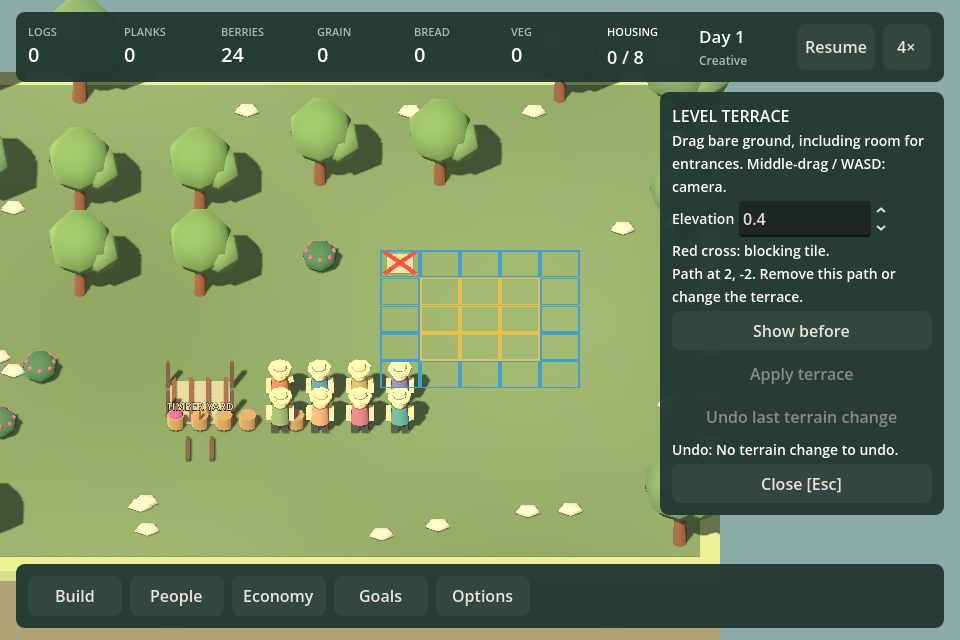
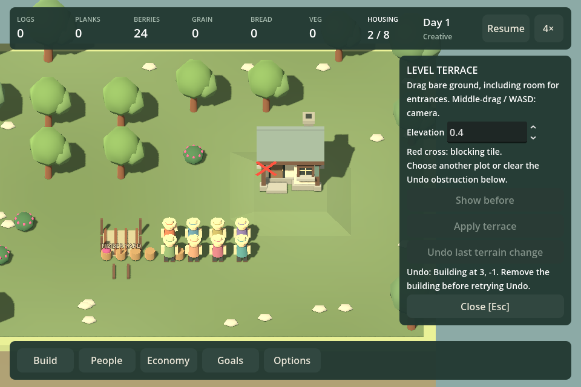

# F12h4 — terrain blockers and Undo recovery

Delivered September 12, 2026, following the checkpoint-five whole-project review.

Terrain validation now identifies a blocking tile and its use: paths, decorations, buildings, resource/service access, occupied ground, reserved destinations, meal seats or walking routes. Plot rims remain gold and the sloped border stays blue. A red cross identifies the first blocker, including otherwise invisible access and reservations. Clear that obstruction to reveal any subsequent blocker; the complete affected area is still protected.

The tool shows Undo's reason inline and highlights its obstruction when no new plot is selected. Removing a building or clearing a temporary route restores availability without discarding the inverse. Advice for Undo explicitly concerns restoring the previous terrain. Apply's panel feedback explains that Undo needs clear ground and lasts until the next edit or load. Terrain errors no longer create duplicate notices over Close.

The original protection set, fresh Apply/Undo checks, atomic publication, session-only history and current-format saves remain intact. No migration or save-preservation work was added.

## Evidence

- Build: zero warnings/errors.
- `./Test.ps1 -TerrainShaping`: passed, including path identification, stale rejection, blocked/retry Undo, temporary route reservations, unchanged world on refusal, live trips and save continuation.
- `./Play.ps1 -TerrainSmokeTest`: passed at 960×640 and 1440×900. Input-driven drag/Apply/Undo/cancel coverage plus controlled obstruction fixtures verify visible paths, hidden bush access, reopening after a cottage is built, route clearing and accessible Close. The first run found access-message overflow; shorter wording corrected it and subsequent runs passed.
- Inspected rendered path, access, building and route screenshots. These are scripted UI checks and still images, not ordinary player observation or evidence of enjoyment. Temporary route appearance/clearing is a controlled reservation fixture.

## Roadmap decision

F12h4 is delivered as playable checkpoint 6. F21u remains next: fix orchard assignment guidance and strengthen original-versus-reload continuation evidence. Campaign observation, listening and native frame attribution remain open. No new feature is justified by this feedback correction. The next periodic whole-project review remains checkpoint 10.
