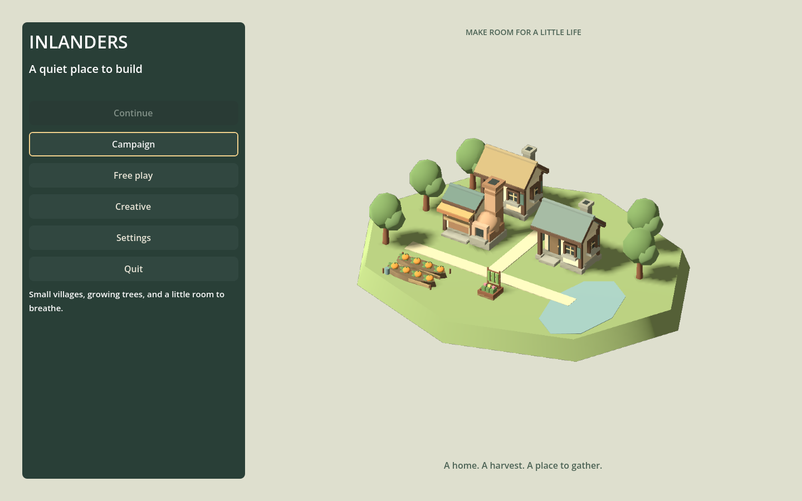
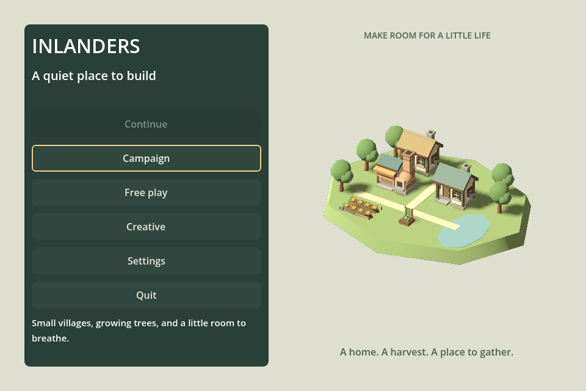

# Title-screen composition — F19d

September 12, 2026. The main menu now has a quiet, authored village illustration made from the game's actual cottage, bakery, vegetable and seating-garden models. A warm paper background replaces the dimmed live settlement. Homes sit behind a shared lane; crops and the gathering garden remain visible in front, with trees framing the houses and a small pond balancing the composition.

The previous background depended on the current map: a fresh launch showed an empty clearing and idle residents, while returning from play could put clutter behind the controls. The new illustration is independent of the player's map, camera, construction and stock. It presents the same visual vocabulary as play without loading or advancing another simulated village.

The first comparison was overlit and a foreground tree obscured the gathering garden. Softer light, visible crops and revised foreground placement improve separation at the narrow window size. The existing green control panel keeps its dimensions and keyboard focus treatment; the illustration occupies the remaining space. This is a composed miniature, not a preview of the Continue save.

## Implementation and checks

A dedicated, transparent SubViewport owns its 3D world and renders once at 1100×1000. Its texture scales proportionally. The illustration's nodes are removed from live animation groups. It does not allocate a second World, tick crops or rebuild as menu pages change. Existing menu navigation, settings and save actions remain unchanged.

`./Play.ps1 -MenuSmokeTest` covers both sizes, input isolation, settings, new/resume/replay, all Continue modes, corrupt-save recovery, autosave/recovery and window-close persistence. Additional checks keep the art outside the control panel and compare its exact pixels after playing/returning, including a separate 30-building settlement whose save must remain identical. `./Play.ps1 -MenuKeyboardSmokeTest` covers long Campaign scrolling, Sound sliders, remembered focus, confirmation/cancellation, errors and mouse takeover. Build and both menu suites pass; the existing certificate-store warning remains unrelated.

## Roadmap review

F19d is delivered. Title motion, save-slot browsing and controllers remain separate. Keep visual preference open rather than claiming this completes the game's art direction. Audio listening and musical variation remain outstanding.

Promote **F05b — orchard design and comparison** as the next independent gameplay investigation. The existing orchard brief already asks whether permanent planting offers a useful commitment beyond a slower garden. Evaluate that question before adding another resource, worker role or campaign requirement. Preserve ordinary food alternatives and cut the idea if its only distinction is waiting.
