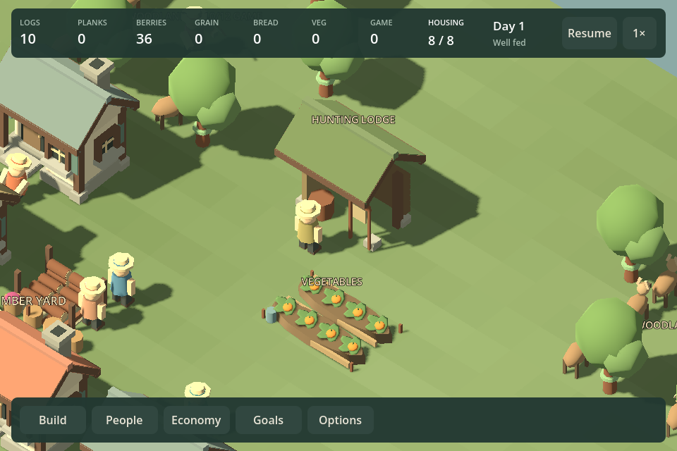
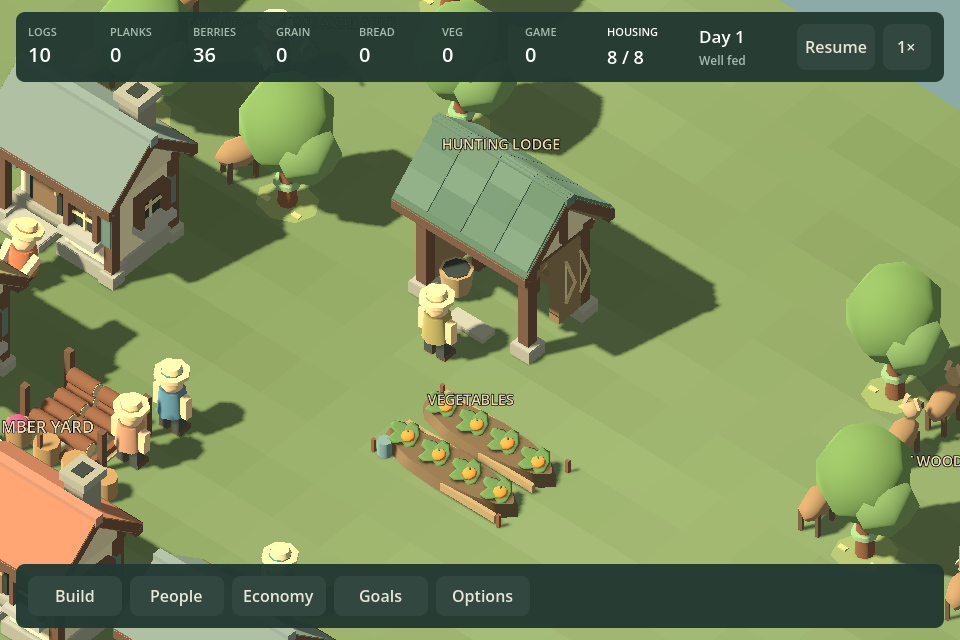
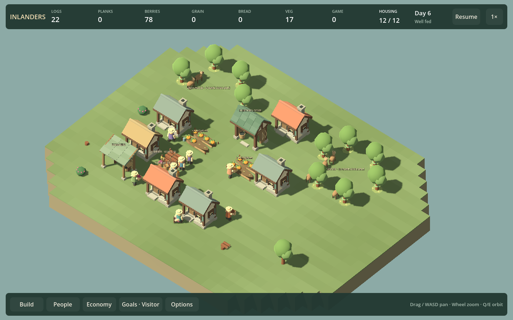
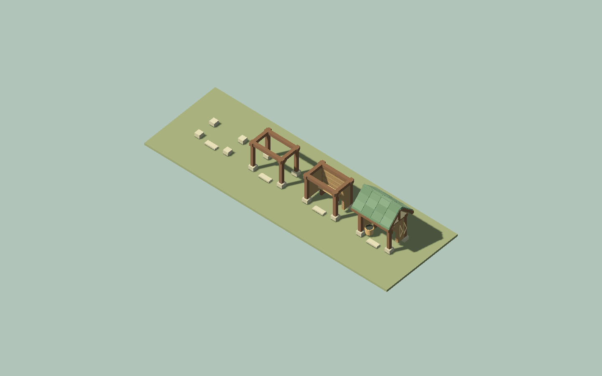
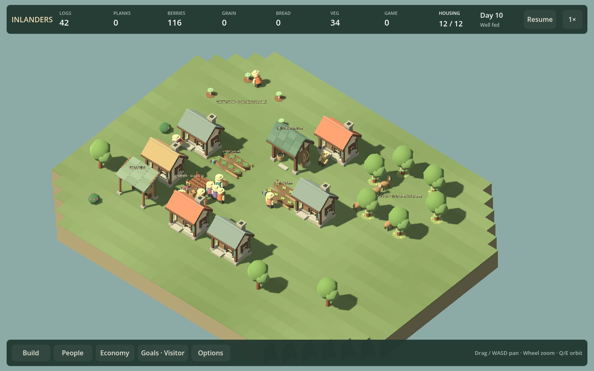

# F23b7 — woodland and hunting-lodge presentation

The hunting lodge now has a taller timber frame, log walls, a recessed open work bay, layered green roof courses, exposed end trusses and a side-mounted bow rack. An empty basket and workbench identify the craft without implying stored game. Separate feet and a small approach stone leave the entrance clear. Four construction stages reveal feet, frame, walls and finished roof/equipment. The catalog camera now fits the taller model.

Six-log cost, one hunter slot, footprints, entrances, production, growth and saves are unchanged.

## Matched comparison

Before:

After:

The close views use the same real construction/hunting fixture and camera. The first revision still looked like a roof slab and clipped the thumbnail; a second pass added visible shingle courses and corrected framing. Agent inspection finds stronger roof depth, supports and a more recognizable work building. Human visual preference remains open.

## Habitat consequences

Low leaf-cover patches sit on actual mature tree tiles, capped at twenty-four trees per habitat and batched into at most two mesh children. Cover disappears with felling and returns with mature trees, without adding obstacles or fictitious habitat. Tracking clearings remain open.

Decorative deer now follow **unclaimed game**, capped at four representative animals. No available game means no displayed deer, even if stock is reserved for an ongoing hunt. Labels explicitly say game available and use west/east wood names in Living woods. The survey remains the exact source for stock, reservations, tree support and recovery; decorative animals are not an exact count.

## Verification

- `Play.ps1 -WoodsArtSmokeTest`: regenerates the real campaign fixtures, builds/hunts/delivers in all four orientations, checks active-hunt reload and paused state, captures 960/1440 views and construction stages. Prepared, depleted, cleared, restoring and complete states verify bounded deer and forest-cover geometry.
- The campaign routes still complete at 300/360 simulated seconds for twelve/fourteen residents. Over-clearing recovery still completes at 840s; no balance changes.
- `Play.ps1 -WildlifeSmokeTest`: actual bow/cargo, selection, workplace/source controls, clearing-loss preview, inventory, pause/reload and normal village views pass. The existing 16-resident/36-decoration scene sampled 12.2ms median with wildlife, 12.0ms hidden, and 13.2ms in paused survey; nodes stayed stable over 600 paused frames. This is a current diagnostic, not a before/after performance claim or large-village benchmark.

## Roadmap review

F23b7's first pass is shipped. Next is F23b8 docks, bridges and shore connection; preserve its scope before pursuing the finale decision prototype. Further tree species, richer undergrowth, terrain painting and broader scenery remain optional follow-ups. This art pass does not establish campaign enjoyment or resolve the short competent routes documented in the campaign review.
