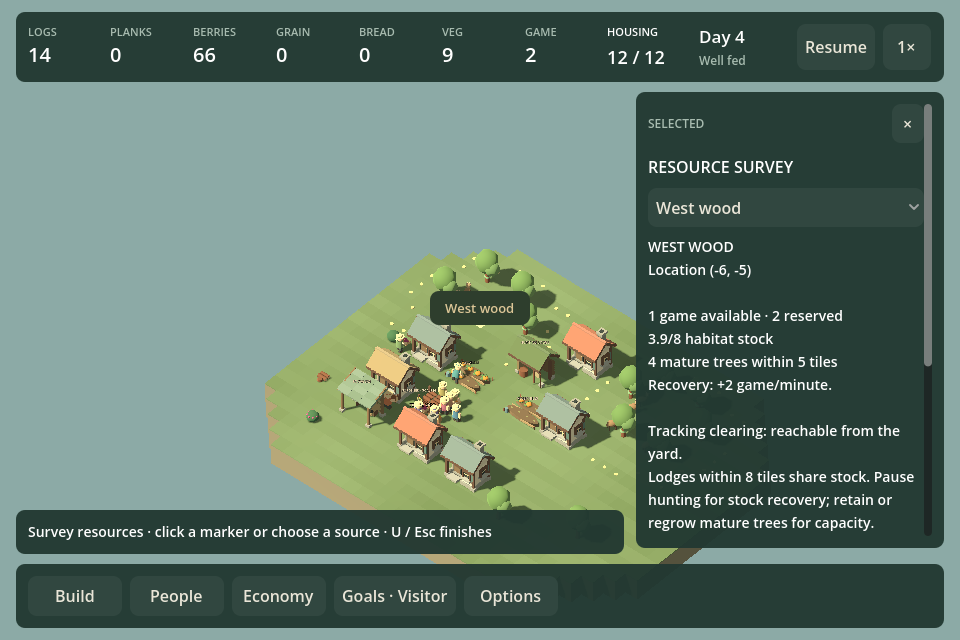
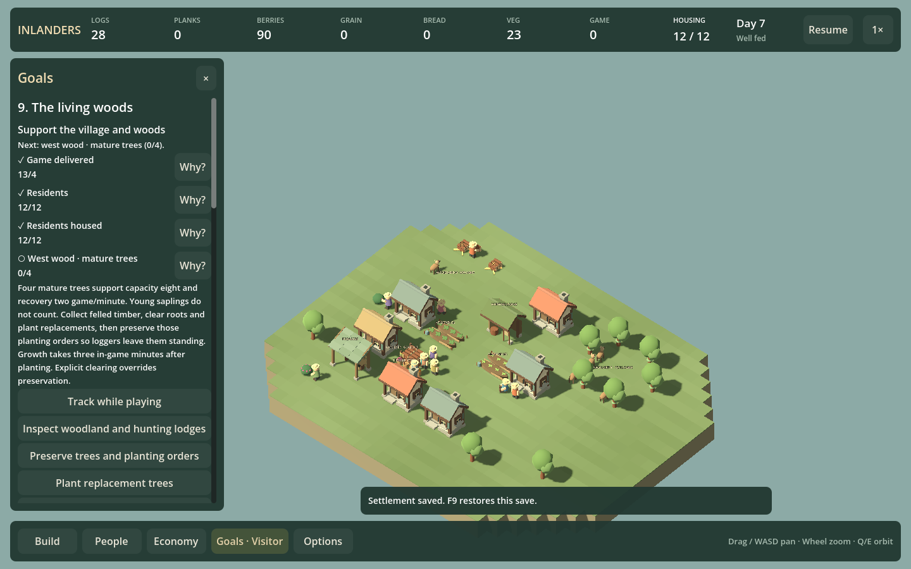

# F26c2b — The living woods

Implemented as level nine. The [original budget/map brief](LIVING_WOODS_F26C2.md) remains the starting-state reference. No new building costs, production rules, growth rates or need meters.

## Player experience

Bring four game to food storage, then choose when to prepare the enlarged village. That delivery milestone stays earned. Prepare at least twelve residents with assigned homes, four mature trees and two unclaimed game in each wood; begin assessment explicitly from Goals.

Assessment uses actual meal requests and fresh producer deliveries since its start, over the existing rolling three-minute window. Every current resident needs two closed requests, with no missed/skipped requests; deliveries must cover eating and demand. No compulsory final lodge count or diet share. Habitat and unclaimed stock remain current conditions. Extra arrivals must earn their own meal history and have homes; earlier residents do not prove it for them.

Goals links to the west/east source survey, related lodges and preservation, planting and clearing tools. Mature trees determine capacity and recovery; source stock includes reservations while the goal excludes them. The UI explains the two remedies separately: pause hunting when supported stock is low, or restore protected mature trees after habitat loss. Explicit clearing overrides preservation. Planting markers and saplings do not satisfy the mature-tree condition.

## Measured routes

All times are simulated seconds using real work, transport, food requests and construction. These are scripted diagnostics, not first-time human play durations.

| Strategy | Population | Assessment starts | Completes | Mature west/east trees |
| --- | --- | --- | --- | --- |
| Preserve both woods; two hunters | 12 | 145 | 300 | 6 / 6 |
| Preserve both woods; two hunters | 14 | 182 | 360 | 6 / 6 |
| Selective west clearing; garden plus hunter | 12 | 112 | 300 | 4 / 6 |
| Selective west clearing; garden plus hunter | 14 | 167 | 360 | 4 / 6 |

The mixed route initially failed with uninterrupted hunting: even at 2513s it had only one unclaimed west game and could not complete. Its successful response is to rest the lodge when available stock falls below two at 208s, while cultivation continues feeding the village. Broad preservation completes with hunting active. This is an environmental consequence and a staffing response, not a longer countdown.

Inviting another pair during assessment also completes with fourteen housed at 360s. The new residents must close their own requests; the original assessment start remains intact.

Clearing all remaining west trees during assessment reduces capacity and recovery to zero. Collecting timber, clearing roots, planting and protecting four replacements, then resting hunting, completes at 840s. A saved continuation retains the original assessment start. Stock-only recovery keeps six mature trees and completes at 300s without planting. The source-boundary test also checks fractional stock and existing hunter claims are excluded from the goal.

## Verification and visual review

`Test.ps1` includes the woodland routes, malformed-state rejection, exact phase saves/continuation and recovery alongside the full simulation suite. `Play.ps1 -WoodsCampaignSmokeTest` regenerates fixtures and exercises actual picker/phase actions, 960/1440 layout bounds, source and recovery-tool links, food evidence, completion, replay and restoration. The quarry UI check now expects a next settlement and uses the catalog's current level count.

Agent inspection finds the information readable at both sizes with intentional vertical scrolling. The woodland still looks sparse and the hunting lodge lacks the architectural strength of the revised homes and hall; this supports F23b7 as the next art slice.

## Roadmap decision

Ship the contrasting resource/recovery scenario, but keep campaign depth unresolved. Competent completion is five to six simulated minutes. The mixed route adds a response after initial construction, yet preservation still requires little adjustment after setup. Do not claim the requested longer, demanding campaign is solved or extend it with a timer. F11b5/F18b5 must prototype a second meaningful commitment in a later settlement. Next delivery is F23b7 woodland presentation, followed by docks/bridges; no new mandatory need is justified by this result.
